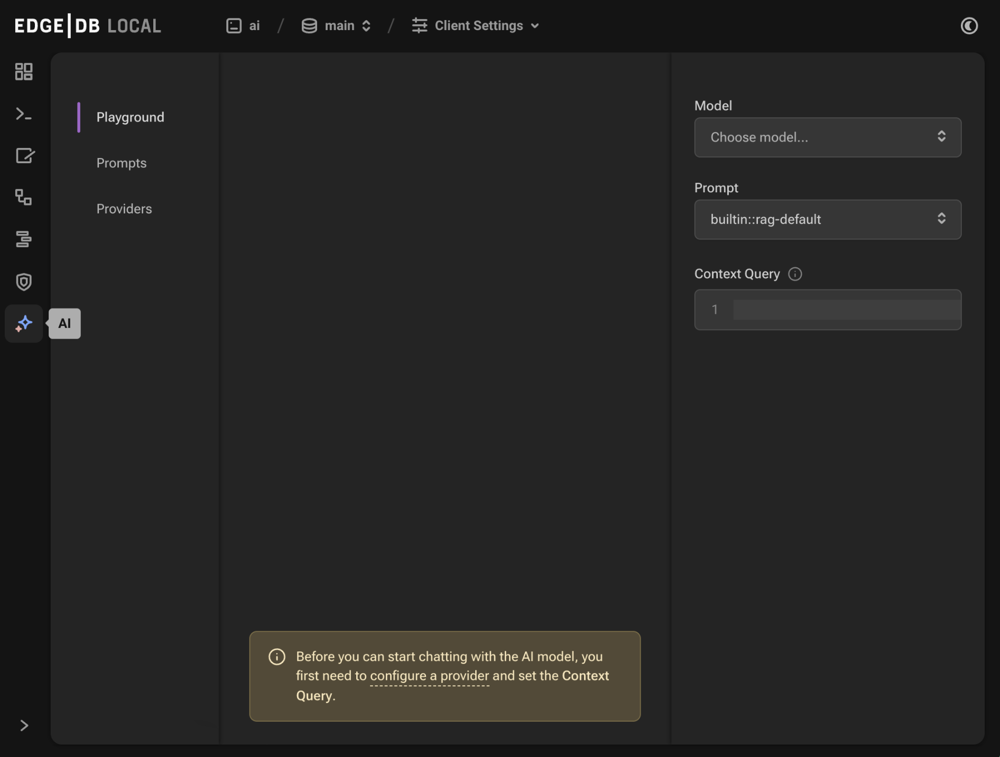
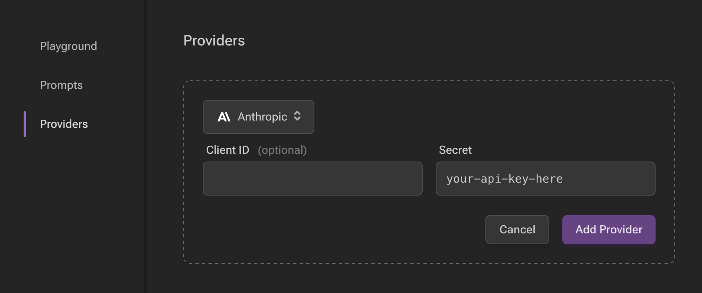

.. _ref_ai_overview:

==
AI
==

.. toctree::
    :hidden:
    :maxdepth: 3

    javascript
    python
    reference

:edb-alt-title: Using EdgeDB AI

EdgeDB AI allows you to ship AI-enabled apps with practically no effort. It
automatically generates embeddings for your data. Works with OpenAI, Mistral
AI, Anthropic, and any other provider with a compatible API.

Enable extension in your schema
===============================

AI is an EdgeDB extension. To enable it, you will need to add the extension
to your app’s schema:

.. code-block:: sdl

    using extension ai;

Extension configuration
=======================

The AI extension may be configured via our UI or via EdgeQL. To use the
built-in UI, access it by running ``edgedb ui``. If you have the extension
enabled in your schema as shown above and have migrated that schema change, you
will see the "AI Admin" icon in the left-hand toolbar.

          icon in the left-hand toolbar. The icon is two stars, one larger and
          one smaller, the smaller being a light pink color and the larger
          being a light blue when selected.
    :width: 100%

The default tab "Playground" allows you to test queries against your data after
you first configure the model, prompt, and context query in the right sidebar.

The "Prompts" tab allows you to configure prompts for use in the playground.
The "Providers" tab must be configured for the API you want to use for
embedding generation and querying. We currently support OpenAI, Mistral AI, and
Anthropic.

Configuring a provider
----------------------

To configure a provider, you will first need to obtain an API key for your
chosen provider, which you may do from their respective sites:

* `OpenAI API keys <https://platform.openai.com/account/api-keys>`__
* `Mistral API keys <https://console.mistral.ai/api-keys/>`__
* `Anthropic API keys <https://console.anthropic.com/settings/keys>`__

With your API key, you may now configure in the UI by clickin the "Add
Provider" button, selecting the appropriate API, and pasting your key in the
"Secret" field.

          On the left, the sidebar navigation for the view showing Playground,
          Prompts, and Providers options, with Provider selected (indicated
          with a purple border on the left). The main content area shows a
          heading Providers with a form under it. The form contains a dropdown
          to select the API. (Anthropic is currently selected.) The form
          contains two fields: an optional Client ID and a Secret. The Secret
          field is filled with your-api-key-here. Under the fields to the
          right, the form has a gray button to cancel and a purple Add Provider
          button.
    :width: 100%

You may alternatively configure a provider via EdgeQL:

.. code-block:: edgeql

    configure current database
    insert ext::ai::OpenAIProviderConfig {
      secret := 'sk-....',
    };

This object has other properties as well, including ``client_id`` and
``api_url``, which can be set as strings to override the defaults for the
chosen provider.

We have provider config types for each of the three supported APIs:

* ``OpenAIProviderConfig``
* ``MistralProviderConfig``
* ``AnthropicProviderConfig``

Usage
=====

Using EdgeDB AI requires some changes to your schema.

Add an index
------------

To start using EdgeDB AI on a type, create an index:

.. code-block:: sdl-diff

      module default {
        type Astronomy {
          content: str;
    +     deferred index ext::ai::index(embedding_model := 'text-embedding-3-small')
    +       on (.content);
        }
      };

In this example, we have added an AI index on the ``Astronomy`` type's
``content`` property using the ``text-embedding-3-small`` model. Once you have
the index in your schema, :ref:`create <ref_cli_edgedb_migration_create>` and
:ref:`apply <ref_cli_edgedb_migration_apply>` your migration, and you're ready
to start running queries!

.. note::

    The particular embedding model we've chosen here
    (``text-embedding-3-small``) is an OpenAI model, so it will require an
    OpenAI provider to be configured as described above.

    You may use any of :ref:`our pre-configured embedding generation models
    <ref_ai_reference_embedding_models>`.

You may want to include multiple properties in your AI index. Fortunately, you
can define an AI index on an expression:

.. code-block:: sdl

      module default {
        type Astronomy {
          climate: str;
          atmosphere: str;
          deferred index ext::ai::index(embedding_model := 'text-embedding-3-small')
            on (.climate ++ ' ' ++ .atmosphere);
        }
      };

.. note:: When AI indexes aren't working…

    If you find your queries are not returning the expected results, try
    inspecting your instance logs. On an EdgeDB Cloud instance, use the "Logs"
    tab in your instance dashboard. On local or :ref:`CLI-linked remote
    instances <ref_cli_edgedb_instance_link>`, use ``edgedb instance logs -I
    <instance-name>``. You may find the problem there.

    Providers impose rate limits on their APIs which can often be the source of
    AI index problems. If index creation hits a rate limit, EdgeDB will wait
    the ``indexer_naptime`` (see the docs on :ref:`ext::ai configuration
    <ref_ai_reference_config>`) and resume index creation.

    If your indexed property contains values that exceed the token limit for a
    single request, you may consider truncating the property value in your
    index expression. You can do this with a string by slicing it:

    .. code-block:: sdl

        module default {
          type Astronomy {
            content: str;
            deferred index ext::ai::index(embedding_model := 'text-embedding-3-small')
              on (.content[0:10000]);
          }
        };

    This example will slice the first 10,000 characters of the ``content``
    property for indexing.

    Tokens are not equivalent to characters. For OpenAI embedding generation,
    you may test values via `OpenAI's web-based tokenizer
    <https://platform.openai.com/tokenizer>`__. You may alternatively download
    the library OpenAI uses for tokenization from that same page if you prefer.
    By testing, you can get an idea how much of your content can be sent for
    indexing.

Run a semantic similarity query
-------------------------------

Once your index has been migrated, running a query against the embeddings is
super simple:

.. code-block:: edgeql

    select ext::ai::search(Astronomy, query)

Simple, but you'll still need to generate embeddings from your query or pass in
existing embeddings. If your ultimate goal is retrieval-augmented generation
(i.e., RAG), we've got you covered.

.. _ref_ai_overview_rag:

Use RAG via HTTP
----------------

By making an HTTP request to
``https://<edgedb-host>:<port>/branch/<branch-name>/ai/rag``, you can generate
text via the generative AI API of your choice within the context of a type with
a deferred embedding index.

.. note::

    Making HTTP requests to EdgeDB requires :ref:`authentication
    <ref_http_auth>`.

.. code-block:: bash

    $ curl --json '{
        "query": "What color is the sky on Mars?",
        "model": "gpt-4-turbo-preview",
        "context": {"query":"select Astronomy"}
      }' https://<edgedb-host>:<port>/branch/<branch-name>/ai/rag
    {"response": "The sky on Mars is red."}

Since LLMs are often slow, it may be useful to stream the response. To do this,
add ``"stream": true`` to your request JSON.

.. note::

    The particular text generation model we've chosen here
    (``gpt-4-turbo-preview``) is an OpenAI model, so it will require an OpenAI
    provider to be configured as described above.

    You may use any of our supported :ref:`text generation models
    <ref_ai_reference_text_generation_models>`.

Use RAG via JavaScript
----------------------

``@edgedb/ai`` offers a convenient wrapper around ``ext::ai``. Install it with
``npm install @edgedb/ai`` (or via your package manager of choice) and
implement it like this example:

.. code-block:: typescript

    import { createClient } from "edgedb";
    import { createAI } from "@edgedb/ai";

    const client = createClient();

    const gpt4AI = createAI(client, {
      model: "gpt-4-turbo-preview",
    });

    const blogAI = gpt4AI.withContext({
      query: "select Astronomy"
    });

    console.log(await blogAI.queryRag(
      "What color is the sky on Mars?"
    ));
