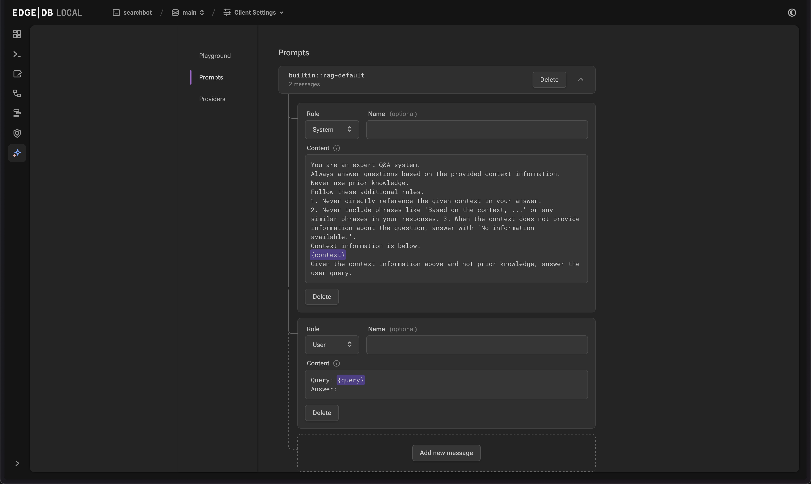

.. _ref_ai_extai_reference:

============
AI Extension
============

This reference documents the |Gel| AI extension's components, configuration
options, and APIs.

Enabling the Extension
======================

The AI extension can be enabled using the :ref:`extension <ref_datamodel_extensions>` mechanism:

.. code-block:: sdl

    using extension ai;

Configuration
=============

The AI extension can be configured using ``configure session`` or ``configure current branch``:

.. code-block:: edgeql

    configure current branch
    set ext::ai::Config::indexer_naptime := <duration>'PT30S';

Configuration Properties
------------------------

* ``indexer_naptime``: Duration
    Specifies minimum delay between deferred ``ext::ai::index`` indexer runs.

View current configuration:

.. code-block:: edgeql

    select cfg::Config.extensions[is ext::ai::Config]{*};

Reset configuration:

.. code-block:: edgeql

    configure current branch reset ext::ai::Config::indexer_naptime;

.. _ref_ai_extai_reference_ui:

UI
==

The AI section of the UI can be accessed via the sidebar after the extension
has been enabled in the schema. It provides ways to manage provider
configurations and RAG prompts, as well as try out different settings in the
playground.

Playground tab
--------------

Provides an interactive environment for testing and configuring the built-in
RAG.

Components:

* Message window: Displays conversation history between the user and the LLM.
* Model: Dropdown menu for selecting the text generation model.
* Prompt: Dropdown menu for selecting the RAG prompt template.
* Context Query: Input field for entering an EdgeQL expression returning a set of objects with AI indexes.

Prompts tab
-----------

Provides ways to manage system prompts used in the built-in RAG.

Providers tab
-------------

Enables management of API configurations for AI API providers.

.. _ref_ai_extai_reference_index:

Index
=====

The ``ext::ai::index`` creates a deferred semantic similarity index of an
expression on a type.

.. code-block:: sdl-diff

      module default {
        type Astronomy {
          content: str;
    +     deferred index ext::ai::index(embedding_model := 'text-embedding-3-small')
    +       on (.content);
        }
      };

Parameters:

* ``embedding_model``- The name of the model to use for embedding generation as
  a string.
* ``distance_function``- The function to use for determining semantic
  similarity. Default: ``ext::ai::DistanceFunction.Cosine``
* ``index_type``- The type of index to create. Currently the only option is the
  default: ``ext::ai::IndexType.HNSW``.
* ``index_parameters``- A named tuple of additional index parameters:

  * ``m``- The maximum number of edges of each node in the graph. Increasing
    can increase the accuracy of searches at the cost of index size. Default:
    ``32``
  * ``ef_construction``- Dictates the depth and width of the search when
    building the index. Higher values can lead to better connections and more
    accurate results at the cost of time and resource usage when building the
    index. Default: ``100``

* ``dimensions``: int64 (Optional) - Embedding dimensions
* ``truncate_to_max``: bool (Default: False)

Built-in resources
==================

.. _ref_ai_extai_reference_embedding_models:

Embedding models
----------------

OpenAI (`documentation <https://platform.openai.com/docs/guides/embeddings/embedding-models>`__)

* ``text-embedding-3-small``
* ``text-embedding-3-large``
* ``text-embedding-ada-002``

Mistral (`documentation <https://docs.mistral.ai/capabilities/embeddings/#mistral-embeddings-api>`__)

* ``mistral-embed``

.. _ref_ai_extai_reference_text_generation_models:

Text generation models
----------------------

OpenAI (`documentation <https://platform.openai.com/docs/guides/text-generation>`__)

* ``gpt-3.5-turbo``
* ``gpt-4-turbo-preview``

Mistral (`documentation <https://docs.mistral.ai/getting-started/models/>`__)

* ``mistral-small-latest``
* ``mistral-medium-latest``
* ``mistral-large-latest``

Anthropic (`documentation <https://docs.anthropic.com/claude/docs/models-overview>`__)

* ``claude-3-haiku-20240307``
* ``claude-3-sonnet-20240229``
* ``claude-3-opus-20240229``

Functions
=========

.. list-table::
    :class: funcoptable

    * - :eql:func:`ext::ai::to_context`
      - :eql:func-desc:`ext::ai::to_context`

    * - :eql:func:`ext::ai::search`
      - :eql:func-desc:`ext::ai::search`

------------

.. eql:function:: ext::ai::to_context(object: anyobject) -> str

    Returns the indexed expression value for an object with an ``ext::ai::index``.

    **Example**:

    Schema:

    .. code-block:: sdl

        module default {
          type Astronomy {
            topic: str;
            content: str;
            deferred index ext::ai::index(embedding_model := 'text-embedding-3-small')
              on (.topic ++ ' ' ++ .content);
          }
        };

    Data:

    .. code-block:: edgeql-repl

        db> insert Astronomy {
        ...   topic := 'Mars',
        ...   content := 'Skies on Mars are red.'
        ... }
        db> insert Astronomy {
        ...   topic := 'Earth',
        ...   content := 'Skies on Earth are blue.'
        ... }

    Results of calling ``to_context``:

    .. code-block:: edgeql-repl

        db> select ext::ai::to_context(Astronomy);

        {'Mars Skies on Mars are red.', 'Earth Skies on Earth are blue.'}

------------

.. eql:function:: ext::ai::search( \
                    object: anyobject, \
                    query: array<float32> \
                  ) -> optional tuple<object: anyobject, distance: float64>

    Searches objects using their :ref:`ai::index
    <ref_ai_extai_reference_index>`.

    Returns tuples of (object, distance).

    .. note::

        The ``query`` argument should *not* be a textual query but the
        embeddings generated *from* a textual query.

    .. code-block:: edgeql-repl

        db> with query := <array<float32>><json>$query
        ... select ext::ai::search(Knowledge, query);

        {
          (
            object := default::Knowledge {id: 9af0d0e8-0880-11ef-9b6b-4335855251c4},
            distance := 0.20410746335983276
          ),
          (
            object := default::Knowledge {id: eeacf638-07f6-11ef-b9e9-57078acfce39},
            distance := 0.7843298847773637
          ),
          (
            object := default::Knowledge {id: f70863c6-07f6-11ef-b9e9-3708318e69ee},
            distance := 0.8560434728860855
          ),
        }

Types
=====

Provider Configuration Types
----------------------------

.. list-table::
    :class: funcoptable

    * - :eql:type:`ext::ai::ProviderAPIStyle`
      - Enum defining supported API styles

    * - :eql:type:`ext::ai::ProviderConfig`
      - Abstract base configuration for AI providers.

Provider configurations are required for AI indexes and RAG functionality.

Example provider configuration:

.. code-block:: edgeql

    configure current database
    insert ext::ai::OpenAIProviderConfig {
      secret := 'sk-....',
    };

.. note::

    All provider types require the ``secret`` property be set with a string
    containing the secret provided by the AI vendor.

.. note::

    ``ext::ai::CustomProviderConfig requires an ``api_style`` property be set.

---------

.. eql:type:: ext::ai::ProviderAPIStyle

    Enum defining supported API styles:

    * ``OpenAI``
    * ``Anthropic``

---------

.. eql:type:: ext::ai::ProviderConfig

    Abstract base configuration for AI providers.

    Properties:

    * ``name``: str (Required) - Unique provider identifier
    * ``display_name``: str (Required) - Human-readable name
    * ``api_url``: str (Required) - Provider API endpoint
    * ``client_id``: str (Optional) - Provider-supplied client ID
    * ``secret``: str (Required) - Provider API secret
    * ``api_style``: ProviderAPIStyle (Required) - Provider's API style

    Provider-specific types:

    * ``ext::ai::OpenAIProviderConfig``
    * ``ext::ai::MistralProviderConfig``
    * ``ext::ai::AnthropicProviderConfig``
    * ``ext::ai::CustomProviderConfig``

    Each inherits from :eql:type:`ext::ai::ProviderConfig` with provider-specific defaults.

Model Types
-----------

.. list-table::
    :class: funcoptable

    * - :eql:type:`ext::ai::Model`
      - Abstract base type for AI models.

    * - :eql:type:`ext::ai::EmbeddingModel`
      - Abstract type for embedding models.

    * - :eql:type:`ext::ai::TextGenerationModel`
      - Abstract type for text generation models.

---------

.. eql:type:: ext::ai::Model

    Abstract base type for AI models.

    Annotations:
    * ``model_name`` - Model identifier
    * ``model_provider`` - Provider identifier

---------

.. eql:type:: ext::ai::EmbeddingModel

    Abstract type for embedding models.

    Annotations:
    * ``embedding_model_max_input_tokens`` - Maximum tokens per input
    * ``embedding_model_max_batch_tokens`` - Maximum tokens per batch
    * ``embedding_model_max_output_dimensions`` - Maximum embedding dimensions
    * ``embedding_model_supports_shortening`` - Input shortening support flag

---------

.. eql:type:: ext::ai::TextGenerationModel

    Abstract type for text generation models.

    Annotations:
    * ``text_gen_model_context_window`` - Model's context window size

Indexing Types
--------------

.. list-table::
    :class: funcoptable

    * - :eql:type:`ext::ai::DistanceFunction`
      - Enum for similarity metrics.

    * - :eql:type:`ext::ai::IndexType`
      - Enum for index implementations.

---------

.. eql:type:: ext::ai::DistanceFunction

    Enum for similarity metrics.

    * ``Cosine``
    * ``InnerProduct``
    * ``L2``

---------

.. eql:type:: ext::ai::IndexType

    Enum for index implementations.

    * ``HNSW``

Prompt Types
------------

.. list-table::
    :class: funcoptable

    * - :eql:type:`ext::ai::ChatParticipantRole`
      - Enum for chat roles.

    * - :eql:type:`ext::ai::ChatPromptMessage`
      - Type for chat prompt messages.

    * - :eql:type:`ext::ai::ChatPrompt`
      - Type for chat prompt configuration.

Example custom prompt configuration:

.. code-block:: edgeql

    insert ext::ai::ChatPrompt {
      name := 'test-prompt',
      messages := (
        insert ext::ai::ChatPromptMessage {
          participant_role := ext::ai::ChatParticipantRole.System,
          content := "Your message content"
        }
      )
    };

---------

.. eql:type:: ext::ai::ChatParticipantRole

    Enum for chat roles.

    * ``System``
    * ``User``
    * ``Assistant``
    * ``Tool``

---------

.. eql:type:: ext::ai::ChatPromptMessage

    Type for chat prompt messages.

    Properties:
    * ``participant_role``: ChatParticipantRole (Required)
    * ``participant_name``: str (Optional)
    * ``content``: str (Required)

---------

.. eql:type:: ext::ai::ChatPrompt

    Type for chat prompt configuration.

    Properties:
    * ``name``: str (Required)
    * ``messages``: set of ChatPromptMessage (Required)

