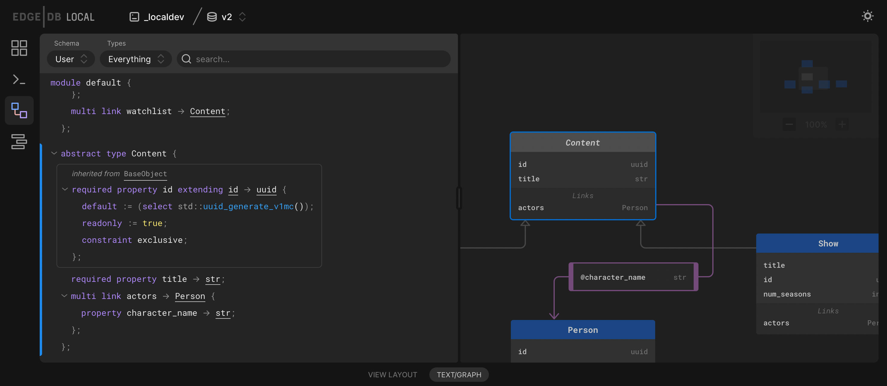

====
v2.0
====

:edb-alt-title: EdgeDB v2 (Sagittarius)

EdgeDB 2.0 was released on July 28th, 2022. Read the announcement
blog post `here <v2anno_>`_.

We would like to thank our community for reporting issues and contributing
fixes. You are awesome! ❤️

To play with the new features, install `the CLI
<https://www.edgedb.com/install>`_ and initialize a new project. For an
interesting schema with test data, check out the `MCU Sandbox
<https://github.com/edgedb/mcu-sandbox>`_ repo.

.. code-block:: bash

  $ edgedb project init

Upgrading
=========

**Local instances**

To upgrade a local project, run the following command inside the project
directory.

.. code-block:: bash

  $ edgedb project upgrade --to-latest

Alternatively, specify an instance name if you aren't using a project.

.. code-block:: bash

  $ edgedb project upgrade --to-latest -I my_instance

**Hosted instances**

To upgrade a remote (hosted) instance, we recommend the following
dump-and-restore process.

1. Spin up an empty 2.0 instance by following one of our :ref:`deployment
guides <ref_guide_deployment>`. These guides have been updated to 2.0. Keep
the DSN of the newly created instance handy.

2. Take your application offline, then dump your v1.x database with the CLI

   .. code-block:: bash

     $ edgedb dump --dsn <old dsn> --all my_database.dump/

   This will dump the schema and contents of your current database to a file
   on your local disk called ``my_database.dump``. The file name isn't
   important.

3. Restore the empty v2.x instance from the dump

   .. code-block:: bash

     $ edgedb restore --all my_database.dump/ --dsn <new dsn>

   Once the restore is complete, update your application to connect to the new
   instance.

.. note::

    If your Postgres cluster is also backing other versions of EdgeDB, make
    sure you start your new instance with the ``--ignore-other-tenants``
    option when bootstrapping your new instance.

This process will involve some downtime, specifically during steps 2 and 3. We
are working on an in-place upgrade workflow that will reduce the amount of
downtime involved and avoid the need to spin up a new instance. We'll publish
that soon; join the Discord for updates. Though for most applications the
dump-and-restore workflow will be simpler and less error-prone.

Client libraries
----------------

We've released new versions of our JavaScript and Python client libraries that
support all 2.0 features and implement the updated protocol. These versions
are backwards compatible with v1.x instances, so we encourage all users to
upgrade.

.. list-table::

  * - :ref:`TypeScript/JS <edgedb-js-intro>`
    - ``edgedb@0.21.0``
  * - :ref:`Python <edgedb-python-intro>`
    - ``edgedb@0.24.0``
  * - :ref:`Golang <edgedb-go-intro>`
    - ``edgedb@0.12.0``
  * - `Rust <https://github.com/edgedb/edgedb-rust>`_
    - ``edgedb-tokio@0.3.0``
  * - `.NET <https://github.com/quinchs/EdgeDB.Net>`_ (community-maintained)
    - ``EdgeDB.Net.Driver@0.3.0``
  * - `Elixir <https://github.com/nsidnev/edgedb-elixir>`_
      (community-maintained)
    - ``edgedb@0.4.0``

New features
============

Integrated admin UI
-------------------

All v2 instances ship with a built-in rich admin GUI. Access it by running
``edgedb ui`` inside any :ref:`EdgeDB project <ref_guide_using_projects>`, or
specify a local instance name with ``edgedb ui -I my_inst``. The
command opens the instance's admin UI using the default system browser.

The current iteration of the GUI has

- a data browser and editor
- a REPL for writing and executing EdgeQL queries
- a schema introspection tool with text-based and graphical visualizations of
  the instance's current schema

Analytical queries with ``GROUP``
---------------------------------

The new :ref:`GROUP <ref_eql_group>` expression can be used to partition
and aggregate data. The output of ``GROUP`` are :ref:`free objects
<ref_eql_select_free_objects>` representing each group, including the
grouping, the grouping *key*, and the set of elements.

.. code-block:: edgeql-repl

  db> group Movie { title } by .release_year;
  {
    {
      key: {release_year: 2017},
      grouping: {'release_year'},
      elements: {
        default::Movie {title: 'Guardians of the Galaxy Vol. 2'},
        default::Movie {title: 'Spider-Man: Homecoming'},
        default::Movie {title: 'Thor: Ragnarok'},
      },
    },
    {
      key: {release_year: 2013},
      grouping: {'release_year'},
      elements: {
        default::Movie {title: 'Iron Man 3'},
        default::Movie {title: 'Thor: The Dark World'},
      },
    },
    ...
  }

Browse the :ref:`docs <ref_eql_group>` for more details and examples, or refer
to the original `RFC 1009 <group_>`_.

Global variables
----------------

Your schema can now contain :ref:`global variables <ref_datamodel_globals>`.
These are contextual variables that are provided by the client and can be
referenced in your queries and schema.

.. code-block:: sdl

  global current_user -> uuid;

.. code-block:: edgeql

  select User filter .id = global current_user;

Client libraries have been updated to provide method for attaching global
variables to a ``Client`` instance; these values are sent along with all
queries originating from that ``Client``.

.. tabs::

  .. code-tab:: typescript

    import {createClient} from 'edgedb';

    const client = createClient().withGlobals({
      current_user: '2141a5b4-5634-4ccc-b835-437863534c51',
    });

    await client.query(`select global current_user;`);

  .. code-tab:: python

    from edgedb import create_client

    client = create_client().with_globals({
        'current_user': '580cc652-8ab8-4a20-8db9-4c79a4b1fd81'
    })

    result = client.query("""
        select global current_user;
    """)

  .. code-tab:: go

    package main

    import (
      "context"
      "fmt"
      "log"

      "github.com/edgedb/edgedb-go"
    )

    func main() {
      ctx := context.Background()
      client, err := edgedb.CreateClient(ctx, edgedb.Options{})
      if err != nil {
        log.Fatal(err)
      }
      defer client.Close()

      id, err := edgedb.ParseUUID("2141a5b4-5634-4ccc-b835-437863534c51")
      if err != nil {
        log.Fatal(err)
      }

      var result edgedb.UUID
      err = client.
        WithGlobals(map[string]interface{}{"current_user": id}).
        QuerySingle(ctx, "SELECT global current_user;", &result)
      if err != nil {
        log.Fatal(err)
      }

      fmt.Println(result)
    }

Globals are primarily intended as an enabling mechanism for object-level
security.

Object-level security
---------------------

Object types can now be augmented with object-level access policies. When
combined with global variables, access policies can be used to
push authorization logic into the database.

.. code-block:: sdl

  global current_user -> uuid;

  type User {
    required property email -> str { constraint exclusive; };
  }

  type BlogPost {
    required property title -> str;
    link author -> User;
    access policy own_posts allow all using (
      .author.id ?= global current_user
    )
  }

Refer to :ref:`the docs <ref_datamodel_access_policies>` or `RFC 1011
<acls_>`_ for full details.

Range types
-----------

EdgeDB now supports :ref:`range types <ref_std_range>` representing intervals
of values.

.. code-block:: edgeql-repl

  db> select range(1, 10);
  {range(1, 10, inc_lower := true, inc_upper := false)}
  db> select range_unpack(range(1, 10))
  {1, 2, 3, 4, 5, 6, 7, 8, 9}

The ``cal::date_duration`` type
-------------------------------

This release also introduces a new datatype :eql:type:`cal::date_duration` to
represent a span of *months/days*. It is nearly equivalent to the existing
:eql:type:`cal::relative_duration` but cannot represent sub-day durations.

This type is primarily intended to simplify :eql:type:`cal::local_date` logic.

.. code-block::

  db> select <cal::local_date>'2022-06-25' +
  ...   <cal::date_duration>'5 days';
  {<cal::local_date>'2022-06-30'}
  db> select <cal::local_date>'2022-06-30' -
  ...   <cal::local_date>'2022-06-25';
  {<cal::date_duration>'P5D'}

Source deletion policies
------------------------

Add deletion cascade functionality with ``on source delete``.

.. code-block:: sdl

  type BlogPost {
    property title -> str;
  }

  type Person {
    multi link posts -> BlogPost {
      on source delete delete target;
    }
  }

Under this policy, deleting a ``User`` will unconditionally delete its
``posts`` as well.

To avoid deleting a ``Post`` that is linked to by other schema entities,
append ``if orphan``.

.. code-block:: sdl-diff

    type Person {
      multi link posts -> BlogPost {
  -     on source delete delete target;
  +     on source delete delete target if orphan;
      }
    }

Additional changes
==================

EdgeQL
------

* Support additional operations on local date and time types,
  including :eql:func:`duration_get`,
  :eql:func:`cal::duration_normalize_hours`, and
  :eql:func:`cal::duration_normalize_days`. Per `RFC 1013 <dates_>`_.

* Support user-provided values for the ``id`` property when inserting objects
  (:eql:gh:`#3895`). This can be useful when migrating data from
  an existing database.

  .. code-block::

    insert User {
      id := <uuid>"5abf67cc-9f9f-4bbc-b009-d117d463a12e",
      email := "jayz@example.com"
    }

* Support partial constraints and indexes (:eql:gh:`#3949`,
  :ref:`docs <ref_datamodel_constraints_partial>`).

* Add the new :eql:func:`json_set` function (:eql:gh:`#4118`).

Server
------

* Support socket activation to reduce memory footprint on developer
  machines (:eql:gh:`#3899`).

* Introduce edgedb+http, a which tunnels the binary protocol over HTTP
  using JWT for authentication (:eql:gh:`#3979`).

* Support using JWT to authenticate to local instances (:eql:gh:`#3991`).

Bug fixes
---------

* Generate unique ``id`` fields for each free shape object,
  and don't use an actual in-database object to represent it,
  and make multiplicity inference understand free shapes better
  (:eql:gh:`#3631`, :eql:gh:`#3633`, :eql:gh:`#3634`).

* Fail if local Postgres cluster fails to start.

* Add ``cfg::memory`` to base types descriptor IDs table (:eql:gh:`#3882`).

* Fix a cross-type exclusive constraint bug that could allow exclusive
  constraints to be violated in some complex type hierarchies
  (:eql:gh:`#3887`).

* Fix issue where server might attempt to acquire one more connection
  than it is configured to permit (:eql:gh:`#3901`).

* Fix use of ``assert_exists`` on properties that are being directly output
  (:eql:gh:`#3911`).

* Fix a scope leakage that could cause a link referenced inside a computable
  to improperly correlate with something outside the computable
  (:eql:gh:`#3912`).

* Fix a number of issues with the floordiv (``//``) and modulus (``%``)
  operators where we could return incorrect values or produce spurious
  errors, especially on very large values (:eql:gh:`#3909`).

* Allow adding annotations to ``abstract annotation`` definitions
  (:eql:gh:`#3929`).

* Expose ``body`` and ``language`` fields on ``schema::Function``
  (:eql:gh:`#3944`).

* Make indexes extend from ``schema::InheritingObject`` (:eql:gh:`#3942`).

* Fix some mis-compilations of nested shapes inside calls to functions
  like ``assert_single`` (:eql:gh:`#3927`).

* Fix ``SET TYPE`` on properties with default values (:eql:gh:`#3954`).

* Fix ``describe``/``populate``/``describe`` sequence (:eql:gh:`#3959`).

* Upgrade many casts and functions from "Stable" to "Immutable"
  (:eql:gh:`#3975`).

* Fix link properties in type filtered shape links (:eql:gh:`#3987`).

* Allow DML statements in free shapes (:eql:gh:`#4002`).

* Allow customizing assertion messages in ``assert_exists`` and friends
  (:eql:gh:`#4019`).

Protocol overhaul
-----------------

* A new version of the protocol---version 1.0---has been introduced.
  It eliminates all server state associated with connections that
  do not use transactions.

* Support passing parameters to and returning values from multi-statement
  scripts.

2.1
===
* Fix global defaults with nontrivial computation
  (:eql:gh:`#4182`)

* Fix migration that removes policy using clause
  (:eql:gh:`#4183`)

* Support ELSE-less UNLESS CONFLICT on explicit id INSERT
  (:eql:gh:`#4185`)

* Don't create constraints on derived views when adding a pointer to a type
  (:eql:gh:`#4187`)

* Fix a bunch of missing source contexts in declarative
  (:eql:gh:`#4188`)

* Fix an ISE when a computed link is directly a property reference
  (:eql:gh:`#4193`)

* Fix an ISE when using an empty shape in some contexts
  (:eql:gh:`#4194`)

* Fix a number of error messages involving collection types in schemas
  (:eql:gh:`#4195`)

* Avoid doing semi-joins after a sequence of single links
  (:eql:gh:`#4196`)

* Make range() properly strict in its non-optional arguments
  (:eql:gh:`#4207`)

* Allow multiple FDs per socket in activation
  (:eql:gh:`#4189`)

* Add SCRAM authentication over HTTP
  (:eql:gh:`#4197`)

* Always arm auto-shutdown timer when it's greater than zero
  (:eql:gh:`#4214`)

* Fix json -> array<json> cast of '[]'
  (:eql:gh:`#4217`)

2.2
===
* Support UNLESS CONFLICT ON for pointers with DML in them
  (:eql:gh:`#4357`)

* Fix cardinality in CommandDataDescription
  (:eql:gh:`#4347`)

* Prevent access rule hidden ids from leaking when accessed directly
  (:eql:gh:`#4339`)

* Better messages for required links hidden by policies
  (:eql:gh:`#4338`)

* Fix access policies on DELETE of a UNION type
  (:eql:gh:`#4337`)

* Strip out all views from DML subjects when computing what tables to use
  (:eql:gh:`#4336`, :eql:gh:`#4333`)

* Fix interaction between access policies and omitted fields in insert
  (:eql:gh:`#4332`, :eql:gh:`#4219`)

* Fix a tracer issue with reverse links and IS
  (:eql:gh:`#4331`)

* Don't include union types in link triggers
  (:eql:gh:`#4329`, :eql:gh:`#4320`)

  If you encounter this issue, after upgrading to a version with this
  patch, it can be fixed by doing a dump/restore or by adding a new link
  to the affected type.

* Require ON for constraints on objects
  (:eql:gh:`#4324`, :eql:gh:`#4268`)

* Fix interaction between DETACHED and aliases/globals
  (:eql:gh:`#4321`, :eql:gh:`#4258`)

* Disable access policy rewrite when compiling constraints
  (:eql:gh:`#4248`, :eql:gh:`#4245`)

* Expose ``--admin-ui`` as an environment variable and document it
  (:eql:gh:`#4255`)

* Prevent ``HttpProtocol.close`` from crashing on closed client connection
  (:eql:gh:`#4238`)

* Fix permitted JSON null in nested array cast
  (:eql:gh:`#4221`)

* Fix ``range_unpack`` boundary bug.

  The ``range_unpack`` function was incorrectly excluding values close to
  boundary, especially when the boundary was not itself inclusive.
  (:eql:gh:`#4282`)

* UI: Allow selection of read-only properties in data editor
  (:eql:gh:`edgedb/edgedb-ui/#65`)

* UI: Hide subtype columns in data editor by default;
  add a toggle to show them.
  (:eql:gh:`edgedb/edgedb-ui/#43`)

* UI: Add "create example database" to the database selection
  screen.
  (:eql:gh:`edgedb/edgedb-ui/#61`)

* UI: Fix navigation from being reset on switching
  the UI panes.
  (:eql:gh:`edgedb/edgedb-ui/#61`)

* UI: Fix rendering of range types.
  (:eql:gh:`edgedb/edgedb-ui/#61`)

* UI: Fix the data editor UI to render types that have
  some properties or links masked by an access policy.
  (:eql:gh:`edgedb/edgedb-ui/#61`)

* UI: Implement login page for remote instances.
  (:eql:gh:`edgedb/edgedb-ui/#40`)

2.3
===

* Clarify error message when UI is not enabled
  (:eql:gh:`#4256`)

* Fix an issue with inherited computeds
  (:eql:gh:`#4371`)

* Fix bug in diamond pattern constraint inheritance
  (:eql:gh:`#4379`)

* When finding common parent for arrays, never use expr alias arrays
  (:eql:gh:`#4080`)

* Properly quote numeric names when in codegen
  (:eql:gh:`#4344`)

* Fix computed global scoping behavior
  (:eql:gh:`#4388`)

* Fix DDL performance issues on databases with lots of data
  (:eql:gh:`#4401`)

* Fix potentially missed constraints on DML
  (:eql:gh:`#4410`)

* Fix slicing with an empty set
  (:eql:gh:`#4404`)

* Fix slicing array of tuples
  (:eql:gh:`#4391`)

* Don't apply access policies when compiling indexes
  (:eql:gh:`#4420`)

* Fix slicing of tuple arrays with null inputs
  (:eql:gh:`#4421`)

* Propagate database creation and deletion events to adjacent servers
  (:eql:gh:`#4415`)

2.4
===

* Fix database initialization on hosted environments like Heroku.
  (:eql:gh:`#4432`)

* Prevent spurious errors when using backlinks on types that have
  properties with the same name but different types
  (:eql:gh:`#4443`)

* Fix some spurious errors when removing a link from the schema.
  (:eql:gh:`#4451`)

* For query_single, only check that the *last* query in a script is single.
  (:eql:gh:`#4453`)

* Catch when POPULATE MIGRATION generates incorrect DDL. This should prevent
  bugs where the schema can get into wedged states.
  (:eql:gh:`#4484`)

* workflows: Publish multiarch Docker images
  (:eql:gh:`#4486`)

* Make unused param insertion in the sql compiler more reliable
  (:eql:gh:`#4497`)

* Properly propagate creation and deletion of extensions

* Fix potential exclusive constraint violations when doing an UPDATE
  on a union
  (:eql:gh:`#4507`)

* Don't lose type from inheritance views when rebasing
  (:eql:gh:`#4509`)

* Make object type descriptor ids be derived from type name
  (:eql:gh:`#4503`)

* Check for invalid arrays arguments at the protocol level
  (:eql:gh:`#4511`)

* Fix SET REQUIRED on newly created properties with alias subtypes
  (:eql:gh:`#4513`)

* Make newly created link properties get added to the relevant alias types
  (:eql:gh:`#4512`)

* Fix handling of link properties named ``id``
  (:eql:gh:`#4514`)

* Disallow queries using conflict machinery on a link property. This
  prevents certain potential exclusive constraint violations that were
  not handled correctly.
  (:eql:gh:`#4515`)

* Fix performing multiple deletions at once in the UI
  (:eql:gh:`#4523`)

* Fix casting empty sets to built in enum types
  (:eql:gh:`#4532`)

* Produce better error messages when using ``enum`` incorrectly
  (:eql:gh:`#4527`)

* Make ``'\b'`` produce the correct value in string and bytes literals
  (:eql:gh:`#4535`)

2.5
===

* Properly infer cardinality of empty array as ONE
  (:eql:gh:`#4533`)

* Fix several issues that manifest when using GROUP BY
  (:eql:gh:`#4549`, :eql:gh:`#4439`)

* Fix migration scripts when combined with access policies
  (:eql:gh:`#4553`)

* Fix failure when a ``ALTER ... EXTENDING`` doesn't change the
  set of ancestors
  (:eql:gh:`#4554`)

* Fix ``UNLESS CONFLICT ON`` for a not-inserted property
  (:eql:gh:`#4556`)

* Fix access policies that use shapes internally
  (:eql:gh:`#4555`)

* Allow overloading ``__type__`` with a computed in shapes
  (:eql:gh:`#4557`)

2.6
===

Nonrecursive access policies and future behaviors
-------------------------------------------------

Starting with EdgeDB 3.0, access policy restrictions will **not** be applied
while evaluating other access policy expressions (:eql:gh:`#4574`).

It is possible (and recommended) to enable this :ref:`future
<ref_eql_sdl_future>` behavior in EdgeDB 2.6 by adding the
following to the schema: ``using future nonrecursive_access_policies;``

For more details, see :ref:`the docs <nonrecursive>`.

To enable opting in to this behavior, 2.6 adds a general mechanism
to opt into :ref:`future <ref_eql_sdl_future>` behavior changes
(:eql:gh:`#4574`, :eql:gh:`#4606`).

Other changes
-------------

* Fix passing zero dimensional array as arguments. This was a regression
  introduced in 2.4, and affected passing empty arrays from the the Rust
  bindings.
  (:eql:gh:`#4511`)

* Require that constraint expressions be immutable
  (:eql:gh:`#4593`)

* Only permit valid UUID-generation functions to be made the default value
  for ``id``
  (:eql:gh:`#4616`)

* UI: New mechanism for copying data in REPL and in Data Editor. Hover over
  a data line and click the context "COPY" button.

  .. image:: images/v2_ui_copy.jpg
    :width: 100%

* UI: "Disable Access Policies" and "Persist Query" options in REPL remember
  their state between page refreshes.

* UI: Basic autocomplete now works for ``INSERT``, ``UPDATE``, and ``DELETE``
  queries.

2.7
===

* Improve error messages when compiling pointer default
  (:eql:gh:`#4624`)

* Fix using WITH-bound DML from an UPDATE in an ELSE clause
  (:eql:gh:`#4641`)

* Allow WITH MODULE in ddl in CREATE MIGRATION
  (:eql:gh:`#4668`)

* Fix some broken casts from object types to JSON
  (:eql:gh:`#4663`)

* Fix putting a statement as the body of an access policy
  (:eql:gh:`#4667`)

* Loosen the rules on when we produce a "would change the
  interpretation" error. It is not only produced when a link is being
  used, not a property. (:eql:gh:`#4643`)

* Fix certain errors involving default values in access policies
  (:eql:gh:`#4679`)

* Avoid ISE when pickling DynamicRangeVar
  (:eql:gh:`#4681`)

* Fix ``max_ex_value`` constraint.
  (:eql:gh:`#4671`)

* Fix SET GLOBAL capabilities to no longer break in the CLI.
  (:eql:gh:`#4688`)

* Fix links to ``schema::ObjectType`` breaking DROP TYPE.  If you have
  a link in your schema to ``schema::ObjectType`` or one of its
  ancestors and you encounter internal server errors when trying to
  drop a type, it should be possible to repair your database by
  creating and then deleting a new link to ``schema::ObjectType``.
  (:eql:gh:`#4670`)

* Don't insert unnecessary ``assert_exists`` calls on required links
  inside access policies bodies in some cases.
  (:eql:gh:`#4695`)

2.8
===

* Fix DML access policies that use shapes internally
  (:eql:gh:`#4589`)

* Give a proper error message creating a migration with a USING that has DML
  (:eql:gh:`#4707`)

* Don't incorrectly evaluate DML access policies when elements are also DML.
  This fixes some cases in which policies would pass incorrectly.
  (:eql:gh:`#4745`)

* Fix direct use of ``__subject__`` from insert access policies
  (:eql:gh:`#4752`)

* Produce an error message on casts to and literal references of enum types
  from indexes and constraints. Currently we generate an internal server
  error. A real fix unfortunately must wait for 3.0 for technical reasons.
  (:eql:gh:`#4754`)

* Only apply filter cardinality inference to unique sets
  (:eql:gh:`#4763`)

* Fix changing a link to non-computed and single at the same time
  (:eql:gh:`#4764`)

* Fix error message for function calls on derived types
  (:eql:gh:`#4757`)

* Fix deleting certain complex aliases
  (:eql:gh:`#4777`)

* Fix link properties on inherited backlinks
  (:eql:gh:`#4788`)

* Fix using array/string/bytes/json subscripting inside of indexes and
  constraints.
  (:eql:gh:`#4760`)

* Fix apparent startup hangs due to a lock fd leaking into postgres
  (:eql:gh:`#4797`)

* Fix some migrations with tricky constraint/computed interactions
  (:eql:gh:`#4794`)

2.9
===

* Fix broken DROPs of pointers in some multiple-inheritance situations
  (:eql:gh:`#4809`)

* Properly execute function calls in UPDATE once per object
  (:eql:gh:`#4810`)

* Fix accessing tuple elements on link properties
  (:eql:gh:`#4811`)

* Fix ``assert_exists()`` not firing on some tuple values
  (:eql:gh:`#4812`)

* Fix GROUP on the result of enumerate
  (:eql:gh:`#4813`)

* Support more env vars in args.py, standardize docs
  (:eql:gh:`#4387`)

* Fix computed properties that just copy id
  (:eql:gh:`#4807`)

* Fix backlinks on derived union types
  (:eql:gh:`#4818`)

* Fix references to the enclosing type in schema-defined computeds
  (:eql:gh:`#4826`)

* UI: Fix regression introduced in 2.8 when editing empty string
  fields in data explorer

* UI: Improvements to handling of union link targets in schema and
  data explorer views

* UI: Fix loading indicators on tabs

2.10
====

* Fix mismatch in session state after a ``ROLLBACK``

* Fix ISE when doing set default on an abstract pointer
  (:eql:gh:`#4843`)

* Fix accesses to ``__type__`` from insert access policies
  (:eql:gh:`#4865`)

* Properly forbid aggregation in index expressions
  (:eql:gh:`#4869`)

* Fix ``grouping`` field when grouping by one key or nothing
  (:eql:gh:`#4906`)

* Fix two issues with mutation in free objects
  (:eql:gh:`#4902`)

* Only allow type names as the subject of an insert. (Previously dotted paths
  were allowed, with nonsensical behavior.)
  (:eql:gh:`#4922`)

* Fix array arguments in HTTP interface
  (:eql:gh:`#4956`)

* Support multi properties in ``UNLESS CONFLICT ON``
  (:eql:gh:`#4955`)

* Fix polymorphic type tests on result of update
  (:eql:gh:`#4954`)

* Optimize trivial ``WITH`` -bound ``GROUP`` uses
  (:eql:gh:`#4978`)

* Fix a category of confusing scoping related bugs in access policies
  (:eql:gh:`#4994`)

* Get rid of the "unused alias definition" error.
  (:eql:gh:`#4819`)

* Support mutation in ``USING`` expressions when changing a link to
  ``required`` or to ``single`` during a migration
  (:eql:gh:`#4873`)

* Fix custom function calls on the HTTP interface
  (:eql:gh:`#4998`)

* Avoid infinite recursion in some do-nothing intersection cases
  (:eql:gh:`#5007`)

* Don't mangle cast error messages when the cast value contains a type name
  (:eql:gh:`#5008`)

* Allow JWT token auth in binary protocol
  (:eql:gh:`#4830`)

* Use prepared statement cache in EdgeQL script execution
  (:eql:gh:`#4931`)

* Fix non-transactional commands like ``DROP DATABASE`` when using
  Postgres 14.7
  (:eql:gh:`#5026`)

* Update packaged Postgres to 14.7

* Fix ``set single`` on required properties
  (:eql:gh:`#5031`)

* Fix a ISE when using assert_exists and linkprops using query builder
  (:eql:gh:`#4961`)

2.11
====

* Fix adding a link property with a default value to an existing link
  (a regression in 2.10)
  (:eql:gh:`#5061`)

2.12
====

* Fix GROUP regression with some query-builder queries
  (a regression in 2.10)
  (:eql:gh:`#5073`)

2.13
====
* Implement a MIGRATION REWRITE system. This provides a mechanism for
  safely rewriting the migration history of a database while ensuring
  that the new history produces the same result as the old
  history. CLI tooling to take advantage of this feature is coming
  soon.
  (:eql:gh:`#4585`)

* Fix DigitalOcean support: allow its custom error in bootstrap
  (:eql:gh:`#5139`)

* Add a hint to the error message about link targets.
  (:eql:gh:`#5131`)

* Infer cardinality of ``required multi`` pointers as AT_LEAST_ONE
  (:eql:gh:`#5180`)

* Fix dump/restore of migrations with messages on them
  (:eql:gh:`#5171`)

* Fix interaction of link properties and ``assert_exists`` and similar
  (:eql:gh:`#5182`)

* Make ``assert_single`` and similar not lose track of values updated
  in an ``UPDATE`` in their argument.
  (:eql:gh:`#5088`)

* Add a test for assert_exists+assert_single+UPDATE
  (:eql:gh:`#5242`)

* Add support for new JWT layout
  (:eql:gh:`#5197`)

* Fix uses of volatile expressions in update write access policies
  (:eql:gh:`#5256`)

* Allow globals to be used in defaults
  (:eql:gh:`#5268`)

* Fix errmessage interpolation to not produce an internal server error on
  braces in a message. Allow ``{{`` and ``}}`` to be used to escape braces.
  (:eql:gh:`#5295`)

2.14
====

Schema repair on upgrades
-------------------------

Previously, certain bug fixes and changes (such as the fix to
cardinality inferenced of ``required multi`` pointers released in 2.13
(:eql:gh:`#5180`)), could cause schemas to enter an inconsistent state
from which many migrations were not possible.

The cause of this problem is that an incorrectly inferred value (such
as the cardinality of a computed property) may have been computed and
stored in a previous version. When a newer version is used, there will
be a mismatch between the correctly inferred value on the new version,
and the incorrectly stored value in the database's schema.

The most straightforward way to fix such problems was to perform a dump
and then a restore.

To fix this, we have introduced a schema repair mechanism that will
run when upgrading a database to 2.14. This repair mechanism will fix
any incorrectly inferred fields that are stored in the schema.

One particular hazard in this, however, is that the repair is not
easily reversible if you need to downgrade to an earlier version.
**We recommend performing a dump before upgrading to 2.14.**

These changes were made in (:eql:gh:`#5337`); more discussion of the issue
can be found in (:eql:gh:`#5321`).

Other changes
-------------

* Correctly display constraint errors on ``id``
  (:eql:gh:`#5344`)

* Fix adding certain computed links to a type with an alias
  (:eql:gh:`#5329`)

2.15
====
* In multi-server instances, properly reload schema after a restore
  (:eql:gh:`#5463`)

* Fix several bugs synchronizing configuration state

* Fix dropping a pointer's constraint and making it computed at the same time
  (:eql:gh:`#5411`)

* Don't claim that making a pointer computed is data-safe
  (:eql:gh:`#5412`)

* Prohibit NUL character in query source
  (:eql:gh:`#5414`)

* Fix migration that delete an link alias computed in a parent and child
  (:eql:gh:`#5428`)

* Fix GraphQL updates for multi links.
  (:eql:gh:`#4260`)

* Fix altering enum that is used in a tuple
  (:eql:gh:`#5445`)

* Fix changing cardinality of properties on types used in unions
  (:eql:gh:`#5457`)

* Enable GraphQL support for type unions.

* Fix making pointer non-computed and giving it an abstract base at the
  same time
  (:eql:gh:`#5458`)

* Make json casts of object arrays not include extra fields
  (:eql:gh:`#5484`)

* Make coalesce infer a union type
  (:eql:gh:`#5472`)

2.16
====
* Fix ISEs involving single link with only computed link properties
  (:eql:gh:`#5499`)

* Don't ISE on free shape in insert
  (:eql:gh:`#5438`)

* Always set cardinality of derived ``__tname__`` properties
  (:eql:gh:`#5508`)

* Work around mysterious postgres crashes on Digital Ocean
  (:eql:gh:`#5505`)

* Make reestablishing system postgres connections more resilient
  (:eql:gh:`#5511`)

* Fix graphql queries made against a freshly started server
  (:eql:gh:`#5456`)

* Support dumping databases with ``std::duration`` config vals
  (:eql:gh:`#5528`)

* Fix ISE for TypeExprs in function returns
  (:eql:gh:`#5540`)

* Support comparisons on durations in static eval

* Fix create database conflicts with name in schema
  (:eql:gh:`#5515`)

* Fix range and bytes output in json-lines/json-pretty mode
  (:eql:gh:`#5572`)

* Include source locations in more scoping error messages
  (:eql:gh:`#5573`)

* Fix an optional scoping bug with important access policy implications
  (:eql:gh:`#5575`)

.. lint-off

.. _group:
    https://github.com/edgedb/rfcs/blob/master/text/1009-group.rst
.. _globals:
    https://github.com/edgedb/rfcs/blob/master/text/1010-global-vars.rst
.. _acls:
    https://github.com/edgedb/rfcs/blob/master/text/1011-object-level-security.rst
.. _range:
    https://github.com/edgedb/rfcs/blob/master/text/1012-range-types.rst
.. _dates:
    https://github.com/edgedb/rfcs/blob/master/text/1013-datetime-arithmetic.rst
.. _v2anno:
    https://www.edgedb.com/blog/edgedb-2-0

.. lint-on

.. _v2anno:
    https://www.edgedb.com/blog/edgedb-2-0
