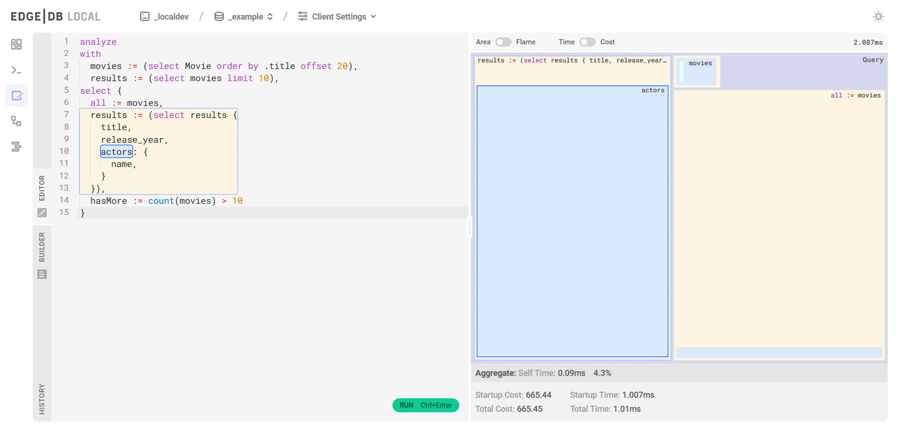
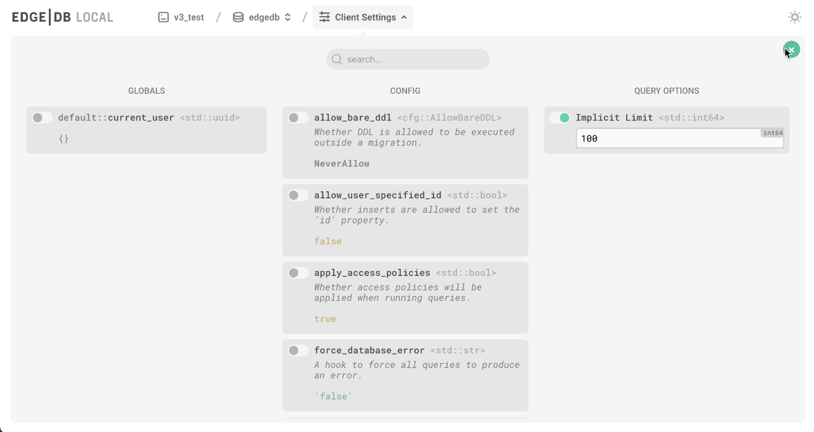
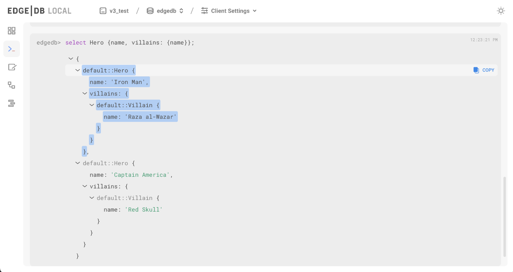
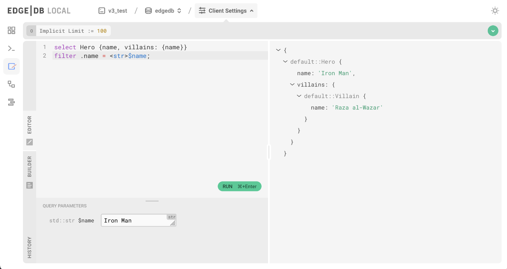
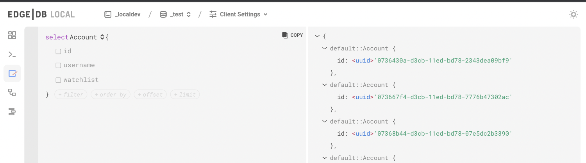

====
v3.0
====

:edb-alt-title: EdgeDB v3

EdgeDB 3.0 was released on June 22nd, 2023. Read the announcement
blog post `here <v3anno_>`_.

To play with the new features, install the CLI using `our installation guide
<https://www.edgedb.com/install>`_ and initialize a new project.

.. code-block:: bash

  $ edgedb project init

Upgrading
=========

**Local instances**

To upgrade a local project, first ensure that your CLI is up to date with
``edgedb cli upgrade``. Then run the following command inside the project
directory.

.. code-block:: bash

  $ edgedb project upgrade

Alternatively, specify an instance name if you aren't using a project.

.. code-block:: bash

  $ edgedb instance upgrade -I my_instance

The CLI will first check to see if your schema will migrate cleanly to EdgeDB
3.0.

.. note::

    EdgeDB 3.0 fixes a bug that will cause it to care about the ordering of
    your ancestors in multiple inheritence. This used to work before 3.0:

    .. code-block:: sdl

        type A;
        type B extending A;
        type C extending A, B;

    but as of 3.0, the order of ancestors must be changed to match the order of
    the bases:

    .. code-block:: sdl

        type A;
        type B extending A;
        type C extending B, A;

    This is a key instance where schemas may be incompatible with 3.0.

If the upgrade check finds any problems, it will report them back to you.
If you receive the following error, you will need to check the syntax of your
schema:

.. code-block::

    SchemaError: <some error>
    Schema incompatibilities found. Please fix the errors above to proceed.
    Hint: For faster feedback loop use:
        edgedb migration upgrade-check --watch

You might also receive a different error which indicates the issue is within
your migrations. In this case, the error can be fixed by squashing, as
indicated by the error:

.. code-block::

    The current schema is compatible. But some of the migrations are outdated.
    Please squash all migrations to fix the issue:
        edgedb migration create --squash

**Hosted instances**

To upgrade a remote (hosted) instance, we recommend the following
dump-and-restore process.

1. Spin up an empty 3.0 instance. You can use one of our :ref:`deployment
   guides <ref_guide_deployment>`, but you will need to modify some of the
   commands to use our testing channel and the beta release.

   Under Debian/Ubuntu, when adding the EdgeDB package repository, use this
   command instead:

   .. code-block:: bash

       $ echo deb [signed-by=/usr/local/share/keyrings/edgedb-keyring.gpg] \
           https://packages.edgedb.com/apt \
           $(grep "VERSION_CODENAME=" /etc/os-release | cut -d= -f2) main \
           | sudo tee /etc/apt/sources.list.d/edgedb.list

   Use this command for installation under Debian/Ubuntu:

   .. code-block:: bash

       $ sudo apt-get update && sudo apt-get install edgedb-3

   Under CentOS/RHEL, use this installation command:

   .. code-block:: bash

       $ sudo yum install edgedb-3

   In any required ``systemctl`` commands, replace ``edgedb-server-2`` with
   ``edgedb-server-3``.

   Under any Docker setups, supply the ``3.0`` tag.

2. Take your application offline, then dump your v2.x database with the CLI

   .. code-block:: bash

       $ edgedb dump --dsn <old dsn> --all --format dir my_database.dump/

   This will dump the schema and contents of your current database to a
   directory on your local disk called ``my_database.dump``. The directory name
   isn't important.

3. Restore the empty v3.x instance from the dump

   .. code-block:: bash

       $ edgedb restore --all my_database.dump/ --dsn <new dsn>

   Once the restore is complete, update your application to connect to the new
   instance.

   This process will involve some downtime, specifically during steps 2 and 3.

.. note::

    If your Postgres cluster is also backing other versions of EdgeDB, make
    sure you start your new instance with the ``--ignore-other-tenants``
    option when bootstrapping your new instance.

**Pre-1.0 Instances**

If you're still running pre-1.0 EdgeDB instances (e.g., 1.0-beta3) and want to
upgrade to 3.0, we recommend you upgrade to version 2.x first, followed by
another upgrade to 3.0, both using the same dump-and-restore process.

Client libraries
----------------

Many of the client libraries have gained code generation capabilities since our
2.0 release. Look for new releases of all of our client libraries soon which
will support all 3.0 features.

New features
============

Simplified SDL syntax
---------------------

As part of our commitment to delivering the best developer experience in
databases, we've made our schema definition language (or SDL) easier to use.
You're no longer required to use the ``property`` or ``link`` keywords for
non-computed properties and links. Also, we've replaced arrows with colons for
a cleaner look that's easier to type.

.. note::

    If you prefer the arrow syntax of pre-3.0, feel free to keep using it. That
    syntax is still fully supported.

This change paves the way for a future syntax for declaring ad-hoc types in
queries and functions. (Read more about it in `the free types RFC
<https://github.com/edgedb/rfcs/blob/master/text/1022-freetypes.rst>`_.)

That means that this type definition:

.. code-block:: sdl

    type User {
      required property email -> str;
      multi link friends -> User;
    }

could be replaced with this equivalent one in EdgeDB 3+:

.. code-block:: sdl

    type User {
      required email: str;
      multi friends: User;
    }

Selecting "v3" from the version dropdown in the sidebar will update SDL code in
versioned sections of the documentation to the new syntax.

Query performance analysis
--------------------------

.. edb:youtube-embed:: WoHJu0nq5z0

Among other improvements, the UI now includes a visual query analyzer to help
you tweak performance on your EdgeQL queries. Just drop the ``analyze`` keyword
in front of your query in the UI's "Query Editor" tab to see the query analyzer
in action.

Query analysis is available in the CLI REPL by prepending your query with
``analyze`` or using the ``\analyze`` backslash command, and in the CLI
directly using the ``edgedb analyze <query>`` command.

UI improvements
---------------

.. edb:youtube-embed:: iwnP_6tkKgc

The EdgeDB UI got a lot of love in this release. In addition to the visual
query planning shown above, you'll see a number of improvements.

New UI for setting globals and configuration
^^^^^^^^^^^^^^^^^^^^^^^^^^^^^^^^^^^^^^^^^^^^

We've made it easier to set your globals and change configuration.

New UI REPL
^^^^^^^^^^^

The UI's redesigned REPL makes it easy to drill into values and copy parts of
your query results to the clipboard.

Query editor and visual builder
^^^^^^^^^^^^^^^^^^^^^^^^^^^^^^^

The query editor has a great new on-demand UI for setting parameters.

It also comes with a visual query builder which makes it easy to write queries,
even when you're just learning EdgeQL.

``edgedb watch`` and a new development workflow
-----------------------------------------------

.. edb:youtube-embed:: _IUSPBm2xEA

The new ``edgedb watch`` CLI command starts a long-running process that watches
for changes in schema files in your project's ``dbschema`` directory and
applies those changes to your database in real time. This command opens up an
entirely new workflow for prototyping schema that will result in less migration
clutter in your repositories.

1. Start the ``watch`` command
^^^^^^^^^^^^^^^^^^^^^^^^^^^^^^

.. code-block:: bash

    $ edgedb watch
    Initialized. Monitoring "/projects/my-edgedb-project".

2. Write an initial schema
^^^^^^^^^^^^^^^^^^^^^^^^^^

Just start writing your schema in your ``default.esdl`` file in your project's
``dbschema`` directory. Once you save your initial schema, assuming it is
valid, the ``watch`` command will pick it up and apply it to your database.

3. Edit your schema files
^^^^^^^^^^^^^^^^^^^^^^^^^

As your application evolves, directly edit your schema files to reflect your
desired data model. When you save your changes, ``watch`` will immediately
begin applying your new schema to the database.

Once you have the schema the way you want it, you're ready to lock it in
by generating a migration.

4. Generate a migration
^^^^^^^^^^^^^^^^^^^^^^^

To generate a migration that reflects all your changes, run ``edgedb migration
create``.

.. code-block:: bash

  $ edgedb migration create

This "locks in" the changes you prototyped using the ``watch`` command. Now,
these are ready to commit and push to your remote to share with your team.

Triggers
--------

.. edb:youtube-embed:: ImgMfb_jCJQ?start=41

Our new triggers feature is one of the most anticipated 3.0 features! Triggers
allow you to define an expression to be executed whenever a given query type is
run on an object type. The original query will *trigger* your pre-defined
expression to run in a transaction along with the original query. These can be
defined in your schema.

.. code-block:: sdl

    type Person {
      required name: str;

      trigger log_insert after insert for each do (
        insert Log {
          action := 'insert',
          target_name := __new__.name
        }
      );
    }

The trigger above inserts a ``Log`` object any time a ``Person`` object is
inserted.

You can read more about our triggers implementation in `the triggers RFC
<https://github.com/edgedb/rfcs/blob/master/text/1020-triggers.rst>`_.

Mutation rewrites
-----------------

.. edb:youtube-embed:: ImgMfb_jCJQ?end=41

The mutation rewrites feature is the sibling, or at least the first cousin, of
triggers. Both are automatically invoked when a write operation occurs on the
type they're on, but triggers are not able to make changes to the object that
invoked them. Mutation rewrites are built to do just that!

.. code-block:: sdl

    type Post {
      required title: str;
      required body: str;
      modified: datetime {
        rewrite insert, update using (datetime_of_statement())
      }
    }

This shows one reason mutation rewrites is one of our most wanted features:
modified timestamps! When a user inserts or updates a ``Post``, the rewrite
will set the value of the ``modified`` property to that value of
``datetime_of_statement()``. There are tons of other uses too. Give them a try!

Learn about our mutation rewrites implementation in `the mutation rewrites RFC
<https://github.com/edgedb/rfcs/blob/master/text/1021-rewrites.rst>`_.

Splats
------

.. edb:youtube-embed:: 9-I1qjIp3KI

This is one of the most fun features in 3.0, both to say _and_ to use! With
splats, you can easily select all properties in your queries without typing all
of them out.

Before splats, you would have needed this query to select ``Movie`` objects
along with all their properties:

.. code-block:: edgeql

    select Movie {id, release_year, title, region, director, studio};

Now, you can simplify down to this query instead using a splat:

.. code-block:: edgeql

    select Movie {*};

If you wanted to select the movie and its characters before splats, you would
have needed this:

.. code-block:: edgeql

    select Movie {
      id,
      release_year,
      title,
      region,
      director: {id, name, birth_year},
      actors: {id, name, birth_year},
      characters: { id, name }
    };

Now, you can get it done with just a double-splat to select all the object's
properties and the properties of any linked objects nested a single layer
within it.

.. code-block:: edgeql-repl

    db> select Movie {**};

It's a super-handy way to quickly explore your data.

Read more about splats in `our splats RFC
<https://github.com/edgedb/rfcs/blob/master/text/1023-splats.rst>`_.

ext::pgvector
-------------

The new ``ext::pgvector`` extension can be used to efficiently store
and query vectors (commonly used to store so called text embeddings.)

Using the extension is quite straightforward and self-explanatory:

.. tabs::

  .. code-tab:: sdl
    :caption: In your schema

    using extension pgvector;

    module default {
      scalar type GPTEmbedding extending
        ext::pgvector::vector<1536>;

      type Document {
        required content: str;
        embedding: GPTEmbedding;

        index ext::pgvector::ivfflat_cosine(lists := 100)
          on (.embedding);
      }
    }

  .. code-tab:: edgeql
    :caption: In your queries

    with
      vec as module ext::pgvector,
      target := <GPTEmbedding>$target_embedding,
      threshold := <float64>$threshold

    select Document {
      *,
      dist := vec::cosine_distance(target, .embedding)
    }
    filter .dist < threshold
    order by .dist empty last
    limit 5

For more details about ``ext::pgvector``, please refer to :ref:`the dedicated
ext::pgvector documentation <ref_ext_pgvector>`.

SQL support
-----------

.. edb:youtube-embed:: 0KdY2MPb2oc

EdgeDB supports running read-only SQL queries via the Postgres protocol to
enable connecting EdgeDB to existing BI and analytics solutions. Any
Postgres-compatible client can connect to your EdgeDB database by using the
same port that is used for the EdgeDB protocol and the same database name,
username, and password you already use for your database.

.. code-block:: bash

    $ psql -h localhost -p 10701 -U edgedb -d edgedb

Our SQL support has been tested against a number of SQL tools:

- `pg_dump <https://www.postgresql.org/docs/13/app-pgdump.html>`_
- `Metabase <https://www.metabase.com/>`_
- `Cluvio <https://www.cluvio.com/>`_
- `Tableau <https://www.tableau.com/>`_
- `DataGrip <https://www.jetbrains.com/datagrip/>`_
- `Airbyte <https://airbyte.com/>`_
- `Fivetran <https://www.fivetran.com/>`_
- `Hevo <https://hevodata.com/>`_
- `Stitch <https://www.stitchdata.com/>`_
- `dbt <https://www.getdbt.com/>`_

Nested modules
--------------

You can now put a module inside another module to let you organize your schema
in any way that makes sense to you.

.. code-block:: sdl

    module momma_module {
      module baby_module {
        # <schema-declarations>
      }
    }

In EdgeQL, you can reference entities inside nested modules like this:
``momma_module::baby_module::<entity-name>``

Aside from giving you additional flexibility, it will also allow us to expand
our list of standard modules in a backwards-compatible way.

``intersect`` and ``except`` operators
--------------------------------------

Slice and dice your sets in new ways with the ``intersect`` and ``except``
operators. Use ``intersect`` to find common members between sets.

.. code-block:: edgeql-repl

    db> select {1, 2, 3, 4, 5} intersect {3, 4, 5, 6, 7};
    {3, 5, 4}

Use ``except`` to find members of the first set that are not in the second.

.. code-block:: edgeql-repl

    db> select {1, 2, 3, 4, 5} except {3, 4, 5, 6, 7};
    {1, 2}

These work with sets of anything, including sets of objects.

.. code-block:: edgeql-repl

    db> with big_cities := (select City filter .population > 1000000),
    ...   s_cities := (select City filter .name like 'S%')
    ... select (big_cities intersect s_cities) {name};
    {default::City {name: 'San Antonio'}, default::City {name: 'San Diego'}}
    db> with big_cities := (select City filter .population > 1000000),
    ...   s_cities := (select City filter .name like 'S%')
    ... select (big_cities except s_cities) {name};
    {
      default::City {name: 'New York'},
      default::City {name: 'Los Angeles'},
      default::City {name: 'Chicago'},
      default::City {name: 'Houston'},
      default::City {name: 'Phoenix'},
      default::City {name: 'Philadelphia'},
      default::City {name: 'Dallas'}
    }

``assert`` function
-------------------

The new ``assert`` function lets you do handy things like create powerful
constraints when paired with triggers:

.. code-block:: sdl

      type Person {
        required name: str;
        multi friends: Person;
        multi enemies: Person;

        trigger prohibit_frenemies after insert, update for each do (
          assert(
            not exists (__new__.friends intersect __new__.enemies),
            message := "Invalid frenemies",
          )
        )
      }

.. code-block:: edgeql-repl

    db> insert Person {name := 'Quincey Morris'};
    {default::Person {id: e4a55480-d2de-11ed-93bd-9f4224fc73af}}
    db> insert Person {name := 'Dracula'};
    {default::Person {id: e7f2cff0-d2de-11ed-93bd-279780478afb}}
    db> update Person
    ... filter .name = 'Quincey Morris'
    ... set {
    ...   enemies := (select detached Person filter .name = 'Dracula')
    ... };
    {default::Person {id: e4a55480-d2de-11ed-93bd-9f4224fc73af}}
    db> update Person
    ... filter .name = 'Quincey Morris'
    ... set {
    ...   friends := (select detached Person filter .name = 'Dracula')
    ... };
    edgedb error: EdgeDBError: Invalid frenemies

You can use it in other contexts too — any time you want to throw an error when
things don't go as planned.

Additional changes
==================

EdgeQL
------

* Support custom user-defined error messages for access policies
  (:eql:gh:`#4529`)

  .. code-block:: sdl

    type User {
      required email: str { constraint exclusive; };
      required is_admin: bool { default := false };
      access policy admin_only
        allow all
        using (global current_user.is_admin ?? false) {
          errmessage := 'Only admins may query Users'
        };
    }

* Support casting a UUID to a type (:eql:gh:`#4469`). This is a handy way to
  select an object, assuming the type you cast into has an object with the UUID
  being cast.

  .. code-block:: edgeql-repl

      db> select <Hero><uuid>'01d9cc22-b776-11ed-8bef-73f84c7e91e7';
      {default::Hero {id: 01d9cc22-b776-11ed-8bef-73f84c7e91e7}}

* Add the :eql:func:`json_object_pack` function to construct JSON from an array
  of key/value tuples. (:eql:gh:`#4474`)

  .. code-block:: edgeql-repl

      db> select json_object_pack({("hello", <json>"world")});
      {Json("{\"hello\": \"world\"}")}

* Support tuples as query arguments (:eql:gh:`#4489`)

  .. code-block:: edgeql

      select <tuple<str, bool>>$var;
      select <optional tuple<str, bool>>$var;
      select <tuple<name: str, flag: bool>>$var;
      select <optional tuple<name: str, flag: bool>>$var;
      select <array<tuple<int64, str>>>$var;
      select <optional array<tuple<int64, str>>>$var;

* Add the syntax for abstract indexes (:eql:gh:`#4691`)

  Exposes some Postgres indexes that you can use in your schemas. These are
  exposed through the ``pg`` module.

  * ``pg::hash``- Index based on a 32-bit hash derived from the indexed value

  * ``pg::btree``- B-tree index can be used to retrieve data in sorted order

  * ``pg::gin``- GIN is an "inverted index" appropriate for data values that
    contain multiple elements, such as arrays and JSON

  * ``pg::gist``- GIST index can be used to optimize searches involving ranges

  * ``pg::spgist``- SP-GIST index can be used to optimize searches involving
    ranges and strings

  * ``pg::brin``- BRIN (Block Range INdex) index works with summaries about the
    values stored in consecutive physical block ranges in the database

  Learn more about the index types we expose `in the Postgres documentation
  <https://www.postgresql.org/docs/current/indexes-types.html>`_.

  You can use them like this:

  .. code-block:: sdl

      type User {
        required name: str;
        index pg::spgist on (.name);
      };

* Implement migration rewrites (:eql:gh:`#4585`)

* Implement schema reset (:eql:gh:`#4714`)

* Support link properties on computed backlinks (:eql:gh:`#5227`)

CLI
---

* Add the ``edgedb migration upgrade-check`` command

  Checks your schema against the new EdgeDB version. You can add ``--to-version
  <version>``, ``--to-testing``, ``--to-nightly``, or ``--to-channel
  <channel>`` to check against a specific version.

* Add the ``--squash`` option to the ``edgedb migration create`` command

  This squashes all your migrations into a single migration.

* Change the backslash command ``\d object <name>`` to ``\d <name>``

* Add the ``edgedb migration edit`` command (:ref:`docs
  <ref_cli_edgedb_migration_edit>`; released in 2.1)

* Add the ``--get`` option to the ``edgedb info`` command (released in 2.1)

  Adding the ``--get`` option followed by a name of one of the info values —
  ``config-dir``, ``cache-dir``, ``data-dir``, or ``service-dir`` — returns
  only the requested path. This makes scripting with the ``edgedb info``
  command more convenient.

Bug fixes
---------

.. edb:collapsed::

* Fix crash on cycle between defaults in insert (:eql:gh:`#5355`)

* Improvements to top-level server error reporting (:eql:gh:`#5349`)

* Forbid ranges of user-defined scalars (:eql:gh:`#5345`)

* Forbid DML in non-scalar function args (:eql:gh:`#5310`)

* Don't let "owned" affect how we calculate backlinks (:eql:gh:`#5306`)

* Require inheritance order to be consistent with the specified base order
  (:eql:gh:`#5276`)

* Support using non-strict functions in simple expressions (:eql:gh:`#5271`)

* Don't duplicate the computation of single links with link properties
  (:eql:gh:`#5264`)

* Properly rebase computed links when changing their definition
  (:eql:gh:`#5222`)

* Fix 3-way unions of certain types with policies (:eql:gh:`#5205`)

* Fix simultaneous deletion of objects related by multi links (:eql:gh:`#5201`)

* Respect ``enforce_access_policies := false``
  inside functions (:eql:gh:`#5199`)

* Fix inferred link/property kind when extending abstract link
  (:eql:gh:`#5196`)

* Forbid ``on target delete deferred restrict`` on required links.
  (:eql:gh:`#5189`)

* Make uuidgen properly set versions in uuid4/uuid5 (:eql:gh:`#5188`)

* Disallow variadic arguments with optional types in user code.
  (:eql:gh:`#5110`)

* Support casting between scalars with a common concrete base (:eql:gh:`#5108`)

* Fix GROUP regression with some query-builder queries (:eql:gh:`#5071`)

* Fix a ISE when using ``assert_exists`` and linkprops using query builder
  (:eql:gh:`#5036`)

* Fix bug that dropping non-existing db leaves with unaccessible state
  (:eql:gh:`#5032`)

* Fix non-transactional errors in Postgres 14.7 (:eql:gh:`#5028`)

* Properly cast to containers of enums when loading from the schema
  (:eql:gh:`#4988`)

* Implement manual error override configuration (:eql:gh:`#4974`)

* Fix protocol state confusion after rollback
  (:eql:gh:`#4970`), (:eql:gh:`#4953`)

* Support disabling dynamic configuration of system config
  (:eql:gh:`#5425`)

* In multi-server instances, properly reload schema after a restore
  (:eql:gh:`#5463`)

* Fix several bugs synchronizing configuration state

* Fix dropping a pointer's constraint and making it computed at the same time
  (:eql:gh:`#5411`)

* Don't claim that making a pointer computed is data-safe
  (:eql:gh:`#5412`)

* Prohibit NUL character in query source
  (:eql:gh:`#5414`)

* Fix migration that delete an link alias computed in a parent and child
  (:eql:gh:`#5428`)

* Fix GraphQL updates for multi links.
  (:eql:gh:`#4260`)

* Fix altering enum that is used in a tuple
  (:eql:gh:`#5445`)

* Fix changing cardinality of properties on types used in unions
  (:eql:gh:`#5457`)

* Enable GraphQL support for type unions.

* Fix making pointer non-computed and giving it an abstract base at the
  same time
  (:eql:gh:`#5458`)

* Make json casts of object arrays not include extra fields
  (:eql:gh:`#5484`)

* Make coalesce infer a union type
  (:eql:gh:`#5472`)

* Fix graphql queries made against a freshly started server
  (:eql:gh:`#5456`)

* Fix version for project init
  (:eql:gh:`#5460`)

* Produce a proper error for too many constraint args
  (:eql:gh:`#5454`)

* Prevent using leading dot notation in inserts
  (:eql:gh:`#5142`)

* Fix operations on single link with only computable link properties
  (:eql:gh:`#5499`)

* Don't ISE on free shape in insert
  (:eql:gh:`#5438`)

* Work around postgres server crashes on Digital Ocean during edgedb setup
  (:eql:gh:`#5505`)

* Always set cardinality of derived ``__tname__`` and ``__tid__`` pointers
  (:eql:gh:`#5508`)

* Make failovers more resilient
  (:eql:gh:`#5511`)

* Fix support for Postgres 15
  (:eql:gh:`#5534`)

* Fix constraints with zero references to the table

* Add a read-only mode
  (:eql:gh:`#5543`)

* Improve error messages for GraphQL
  (:eql:gh:`#3816`)

* Allow creating databases that share names with standard library functions
  (:eql:gh:`#5515`)

* Fix error messages for invalid constraint parameters
  (:eql:gh:`#5525`)

* Support comparisons on durations in static eval

* Do not allow link property on properties
  (:eql:gh:`#5537`)

* Fix ISE for TypeExprs in function returns
  (:eql:gh:`#5540`)

* Support dumping databases with ``std::duration`` config vals
  (:eql:gh:`#5528`)

* Type unions should not appear when computing the source of a back link
  (:eql:gh:`#5533`)

* Fix range and bytes output in json-lines/json-pretty mode
  (:eql:gh:`#5572`)

* Include source locations in more scoping error messages
  (:eql:gh:`#5573`)

* Fix an optional scoping bug with important access policy implications
  (:eql:gh:`#5575`)

* Fix several ordering issues in schema loading
  (:eql:gh:`#5565`)

* Produce proper error messages when creating a migration that drops
  an object but not all of its uses
  (:eql:gh:`#5579`)

* Sort composite type display names consistently
  (:eql:gh:`#5580`)

* Make stdlib objects immutable
  (:eql:gh:`#5599`)

* Slightly improve generated SQL around parameter uses
  (:eql:gh:`#5605`)

* Fix coalesce with type intersection
  (:eql:gh:`#5600`)

* Do not corrupt cardinality inference results when doing group analysis
  (:eql:gh:`#5611`)

* Fix some obscure optional bugs in the presence of tuple projections
  (:eql:gh:`#5610`)

* Fix casts from json to custom scalars
  (:eql:gh:`#5624`)

* Fix ``pg_namespace`` emulation in SQL layer
  (:eql:gh:`#5594`)

* Fix json output of arrays of ranges
  (:eql:gh:`#5629`)

* Fix ISE when using ``__subject__`` in default
  (:eql:gh:`#5633`)

* Make default expressions in the schema always compiled
  as ``detached``
  (:eql:gh:`#5606`)

* Bump ``max_locks_per_transaction`` to 1024
  (:eql:gh:`#5636`)

* Disallow partial paths in the defaults of link properties
  (:eql:gh:`#5560`)

* Expose the ``maintenance_work_mem`` database configuration variable.
  This may need to be tuned in order to build large pgvector indexes

* Add an ``ADMINISTER reindex(...)`` function to reindex objects.
  ``ADMINISTER reindex(Obj)`` will reindex all indexes on the table
  backing ``Obj`` while ``ADMINISTER reindex(Obj.ptr)`` will reindex
  any indexes referencing ``ptr``.
  (:eql:gh:`#5659`)

* Fix referring to ``__source__`` in defaults
  (:eql:gh:`#5667`)

* Fix constraints on custom abstract scalars
  (:eql:gh:`#5666`)

* Ensure changing scalar base types throws appropriately
  (:eql:gh:`#5664`)

Deprecations
------------

The support of version pre-1.0 binary protocol is deprecated in EdgeDB 3.0, and
will be completely dropped in EdgeDB 4.0. If you're still using a deprecated
version of the binary protocol or any client libraries that *only* support the
pre-1.0 binary protocol as listed below, please consider upgrading to a newer
version.

* edgedb-js / edgedb-deno v0.20 or lower
* edgedb-python v0.23 or lower
* edgedb-go v0.10 or lower
* edgedb-tokio (Rust) v0.2 or lower
* EdgeDB.NET v0.2 or lower
* edgedb-elixir v0.3 or lower

New release schedule
====================

Unfortunately, the 3.0 release will not include full-text search. We have many
requirements for this new API (see `the FTS RFC
<https://github.com/edgedb/rfcs/blob/master/text/1015-full-text-search.rst>`_
for details), and, while we’ve made significant progress, we have unfortunately
run out of time to be 100% sure that it is ready for prime time.

We don’t want this delay to hold back the release of EdgeDB 3.0, which includes
many other exciting features that are ready for you to start using right now.
That’s why we’ve decided to delay only the FTS feature rather than delaying the
entire 3.0 release.

That said we’re working hard to get FTS ready as soon as possible. After the
release of 3.0, we'll be moving to a much more frequent release cycle so that
features like FTS can be in your hands as soon as they're ready.

Going forward, expect EdgeDB releases every four months. These releases will
naturally incorporate fewer features than our past releases, but we think the
more predictable cadence will be worth it. Every third release starting with
3.0 will be a long-term support (LTS) release. These releases will continue to
receive support for a year and a half after their initial release.

.. _v3anno:
    https://www.edgedb.com/blog/edgedb-3-0

3.1
===

* Add support for "offline" readiness state
  (:eql:gh:`#5730`)

* Bump ``max_pred_locks_per_transaction`` to 1024
  (:eql:gh:`#5694`)

* Be more permissive about differing postgres versions when using
  remote compiler pool
  (:eql:gh:`#5698`)

* Do not lose constraint ``errmessage`` when a constraint is ALTERed
  (:eql:gh:`#5701`)

* Properly track implicit dependance on ``__type__`` in function calls
  (:eql:gh:`#5715`)

* Avoid very slow error formatting in non-error cases
  (:eql:gh:`#5706`)

* Push Docker images to ghcr.io also
  (:eql:gh:`#5700`)

* Fix tuple derefencing and top-level casting in exclusive constraints
  (:eql:gh:`#5724`)

* Add support for statement variants of prepared statement comands in
  SQL mode
  (:eql:gh:`#5685`)

* Respect ``cfg::`` annotations on object configuration
  (:eql:gh:`#5746`)

* Avoid leaking database existence information to unauthenticated users
  (:eql:gh:`#5744`)

3.2
===
* Fix empty queries in the SQL layer
  (:eql:gh:`#5776`)

* Expand list of supported SQL range functions
  (:eql:gh:`#5777`)

* Fix psql ``\dt``
  (:eql:gh:`#5779`)

* Fix bugs in casting between ranges and json on empty set inputs
  (:eql:gh:`#5792`)

* Fix globals of scalar types defined later in the schema
  (:eql:gh:`#5764`)

* Fix moving access policy from child to parent
  (:eql:gh:`#5786`)

* Modestly speed up type creation in large schemas
  (:eql:gh:`#5814`)

3.3
===
* Fix creating roles in transactions
  (:eql:gh:`#5925`)

* Fix database check in JWT authentication
  (:eql:gh:`#5928`)

* Create extensions conditionally
  (:eql:gh:`#5894`)

* Stop putting deletes of self before alters of self in when making schema
  deltas
  (:eql:gh:`#5897`)

* Fix dropping of extensions with nontrivial schemas
  (:eql:gh:`#5897`)

* Fix healthchecks on single-database instances
  (:eql:gh:`#5900`)

* Fix a bug in SQL name resolving
  (:eql:gh:`#5860`)

* Add hacky support for pgadmin
  (:eql:gh:`#5877`)

* Fix some issues with nontrivial function parameter defaults
  (:eql:gh:`#5970`)

* Fix named-tuple params that also appear in the schema
  (:eql:gh:`#5964`)

* Disallow more broken sorts of function overloads
  (:eql:gh:`#5992`)

* Prevent user modifications to extension modules
  (:eql:gh:`#5993`)

* Fix use of certain empty sets from multiple optional arguments
  (:eql:gh:`#5990`)

* Fix a casting bug.

* Do not stack overflow on long arrays and similar
  (:eql:gh:`#6004`)

* Fix collisions between function parameters named id and the property
  (:eql:gh:`#6000`)

* Fix an infinite recursion when casting object->json in some cases
  (:eql:gh:`#6007`)

* Fix object to json casts inside functions
  (:eql:gh:`#6016`)

* Produce better errors on compiler stack overflows and properly interpret
  errors raised from SQL when using HTTP protocols
  (:eql:gh:`#6005`)

3.4
===

* Repair instances created with rc1/rc2 to fix an issue that can
  prevent creating migrations.

* GraphQL: Fix bug with objects without editable fields.
  (:eql:gh:`#6039`)

* GraphQL: Fix issues with deeply nested modules.
  (:eql:gh:`#6039`)

* GraphQL: Fix ``__typename`` for non-default modules.
  (:eql:gh:`#5985`)

* GraphQL: Fix fragments on types from non-default module.
  (:eql:gh:`#5985`)

* GraphQL: Handle ``__typename`` in mutations.
  (:eql:gh:`#5985`)

* Make ``SET default`` of trivial values much faster
  (:eql:gh:`#6134`)

* Fix DELETE/UPDATE on parent types with children that have no policies
  (:eql:gh:`#6136`)

* Skip generating updates on abstract types, as a minor optimization
  (:eql:gh:`#6135`)

* Fix cast of empty set to type with access policy
  (:eql:gh:`#6151`)

* Fix ``group`` on backlinks in some situations
  (:eql:gh:`#6152`)

* Support using query parameters in ``SET GLOBAL`` commands
  (:eql:gh:`#5670`)

* Make using globals as defaults work
  (:eql:gh:`#6153`)

* Fix schema ordering bugs with rewrites
  (:eql:gh:`#6154`)

* Fix function params whose name collide with SQL type names
  (:eql:gh:`#6150`)

* Fix schema confusion with objects that shadow std objects
  (:eql:gh:`#6155`)

* Fix migration incomplete issues with functions that use multiple globals
  (:eql:gh:`#6157`)

* Fix several bugs in ``analyze``
  (:eql:gh:`#5758`)

* Fix spurious compiler cache misses when duration config values
  are set in a session
  (:eql:gh:`#6168`)

* Properly reject indexes on non-immutable computeds
  (:eql:gh:`#6170`)

3.5
===
* Fix migrations modifying WHEN clauses on access policies

* Produce proper error messages when defining a field twice
  (:eql:gh:`#5785`)

* Fix a protocol bug involving ``CONFIGURE INSTANCE``
  (:eql:gh:`#6258`)

* Fix some regressions involving property defaults
  (:eql:gh:`#6265`)

* Fix scope bugs in ``SET ... USING`` statements
  (:eql:gh:`#6267`)

* Handle decimal params in edgeql_http protocol without loss of
  precision
  (:eql:gh:`#5848`)

* Mark md5 as not being used for security, allowing use of EdgeDB
  in a FIPS-complaint environment.
  (:eql:gh:`#6268`)

* Fix compilation of explicit ids in inserts that can be empty
  (:eql:gh:`#6281`)

* Fix some migration crashes due to missing source contexts
  (:eql:gh:`#6288`)

* Fix unused WITH DML when body is an INSERT
  (:eql:gh:`#6287`)

* Fix configuring effective_io_concurrency
  (:eql:gh:`#6289`)

* Fix type name injection on computed backlinks without a shape
  (:eql:gh:`#6290`)

* Fix renames of types with rewrites on them
  (:eql:gh:`#6293`)

* Fix renames of properties that have computeds aliasing them
  (:eql:gh:`#6294`)

* Fix use of UNLESS CONFLICT in triggers
  (:eql:gh:`#6297`)

* Fix uuid->object casts in access policies in nested INSERTs
  (:eql:gh:`#6313`)

* Make 'reference to a non-existent schema item <id>' an ISE.
  It's always a bug, and that should be made clear to users.
  (:eql:gh:`#6314`)

* Make edgedb+http tunneled protocol not leak db existance before auth
  (:eql:gh:`#6350`)

* Substantially speed up restoring of dumps with large schemas
  (:eql:gh:`#6362`)

* Make migration deadlocks less likely in some common cases
  (:eql:gh:`#6379`)

* Support calling functions that use globals in property/link defaults
  (:eql:gh:`#6381`)

* Correctly update functions when globals/aliases/computeds they depend on
  change
  (:eql:gh:`#6382`)

3.6
===
* Fix UPDATE with rewrites on tuples
  (:eql:gh:`#6337`)

* Fix DML with constraints on abstract types
  (:eql:gh:`#6421`)

* Fix some interactions between FOR and optional values
  (:eql:gh:`#6526`)

* Fix inserts silently failing when a json->array cast handles 'null'
  (:eql:gh:`#6544`)

* Fix tracing of enums in type expressions
  (:eql:gh:`#6548`)

* Allow indexes that use user-defined functions to actually get hit
  (:eql:gh:`#6551`)

* Fix schema delta for RESET EXPRESSION
  (:eql:gh:`#6463`)

* Fix changing a pointer to be computed when there is a subtype
  (:eql:gh:`#6565`)

* Fix migrating between aliased and non-aliased computeds
  (:eql:gh:`#6566`)

* Fix some bugs involving union and coalescing of optional values
  (:eql:gh:`#6590`)
