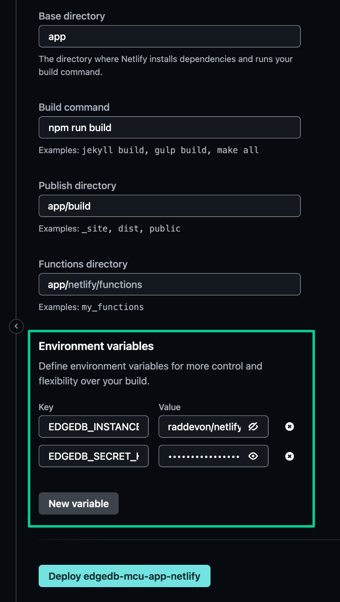

.. _ref_guide_cloud_deploy_netlify:

=======
Netlify
=======

:edb-alt-title: Deploying applications built on EdgeDB Cloud to Netlify

.. note::

    This guide assumes the Git deployment method on Netlify, but you may also
    deploy your site using other methods. Just make sure the EdgeDB Cloud
    environment variables are set, and your app should have connectivity to
    your instance.

1. Push project to GitHub or some other Git remote repository
2. Create and make note of a secret key for your EdgeDB Cloud instance
3. On your Netlify Team Overview view under Sites, click Import from Git
4. Import your project's repository
5. Configure the build settings appropriately for your app
6. Click the Add environment variable button
7. Use the New variable button to add two variables:

   - ``EDGEDB_INSTANCE`` containing your EdgeDB Cloud instance name (in
     ``<org>/<instance-name>`` format)
   - ``EDGEDB_SECRET_KEY`` containing the secret key you created and noted
     previously.

8. Click Deploy

          highlighting the environment variables section where a user will
          need to set the necessary variables for EdgeDB Cloud instance
          connection.
