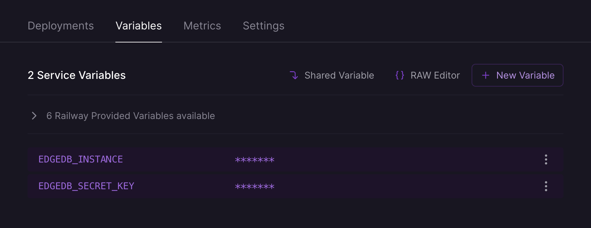

.. _ref_guide_cloud_deploy_railway:

=======
Railway
=======

:edb-alt-title: Deploying applications built on EdgeDB Cloud to Railway

1. Push project to GitHub or some other Git remote repository
2. Create and make note of a secret key for your EdgeDB Cloud instance
3. From Railway's dashboard, click the "New Project" button
4. Select the repository you want to deploy
5. Click the "Add variables" button to add the following environment variables:

   - ``EDGEDB_INSTANCE`` containing your EdgeDB Cloud instance name (in
     ``<org>/<instance-name>`` format)
   - ``EDGEDB_SECRET_KEY`` containing the secret key you created and noted
     previously.

6. Click "Deploy"

          highlighting the environment variables section where a user will 
          need to set the necessary variables for EdgeDB Cloud instance 
          connection.
