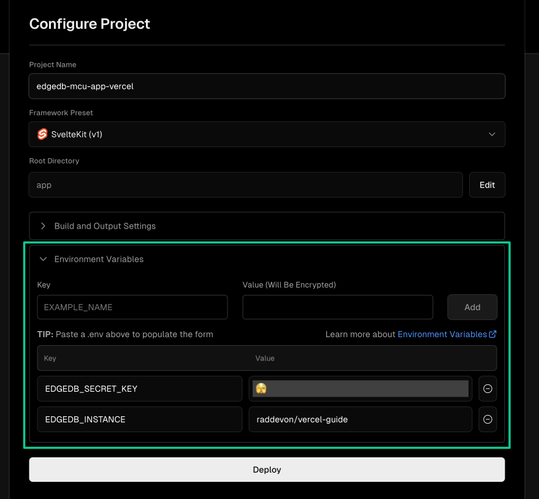

.. _ref_guide_cloud_deploy_vercel:

======
Vercel
======

:edb-alt-title: Deploying applications built on Gel Cloud to Vercel

1. Push project to GitHub or some other Git remote repository
2. Create and make note of a secret key for your Gel Cloud instance
3. From Vercel's Overview tab, click Add New > Project
4. Import your project's repository
5. In "Configure Project," expand "Environment Variables" to add two variables:

   - :gelenv:`INSTANCE` containing your Gel Cloud instance name (in
     ``<org>/<instance-name>`` format)
   - :gelenv:`SECRET_KEY` containing the secret key you created and noted
     previously.

6. Click Deploy

          the environment variables section where a user will need to set the
          necessary variables for |Gel| Cloud instance connection.
