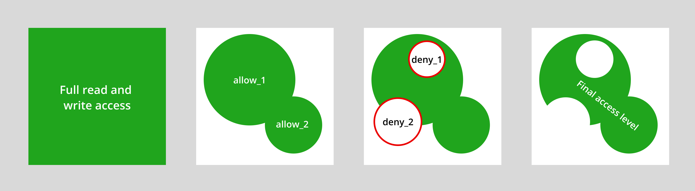

.. versionadded:: 2.0

.. _ref_datamodel_access_policies:

===============
Access Policies
===============

Object types can contain security policies that restrict the set of objects
that can be selected, inserted, updated, or deleted by a particular query.
This is known as *object-level security* and it is similar in function to SQL's
row-level security.

Let's start with a simple schema for a blog without any access policies.

.. code-block:: sdl
    :version-lt: 3.0

    type User {
      required property email -> str { constraint exclusive; }
    }

    type BlogPost {
      required property title -> str;
      required link author -> User;
    }

.. code-block:: sdl

    type User {
      required email: str { constraint exclusive; }
    }

    type BlogPost {
      required title: str;
      required author: User;
    }

When no access policies are defined, object-level security is not activated.
Any properly authenticated client can carry out any operation on any object
in the database. At the moment, we would need to ensure that the app handles
the logic to restrict users from accessing other users' posts. Access
policies allow us to ensure that the database itself handles this logic,
thereby freeing us up from implementing access control in each and every
piece of software that accesses the data.

.. warning::

    Once a policy is added to a particular object type, **all operations**
    (``select``, ``insert``, ``delete``, ``update``, etc.) on any object of
    that type are now *disallowed by default* unless specifically allowed by an
    access policy! See the subsection on resolution order below for details.

Defining a global
^^^^^^^^^^^^^^^^^

Global variables are the a convenient way to provide the context needed to
determine what sort of access should be allowed for a given object, as they
can be set and reset by the application as needed.

To start, we'll add two global variables to our schema. We'll use one global
``uuid`` to represent the identity of the user executing the query, and an
enum for the other to represent the type of country that the user is currently
in. The enum represents three types of countries: those where the service has
not been rolled out, those with read-only access, and those with full access.
A global makes sense in this case because a user's current country is
context-specific: the same user who can access certain content in one country
might not be able to in another country due to different legal frameworks
(such as copyright length).

.. code-block:: sdl-diff
    :version-lt: 3.0

    +   scalar type Country extending enum<Full, ReadOnly, None>;
    +   global current_user -> uuid;
    +   required global current_country -> Country {
    +     default := Country.None
    +   }

        type User {
          required property email -> str { constraint exclusive; }
        }

        type BlogPost {
          required property title -> str;
          required link author -> User;
        }

.. code-block:: sdl-diff

    +   scalar type Country extending enum<Full, ReadOnly, None>;
    +   global current_user: uuid;
    +   required global current_country: Country {
    +     default := Country.None
    +   }

        type User {
          required email: str { constraint exclusive; }
        }

        type BlogPost {
          required title: str;
          required author: User;
        }

The value of these global variables is attached to the *client* you use to
execute queries. The exact API depends on which client library you're using:

.. tabs::

  .. code-tab:: typescript

    import createClient from 'edgedb';

    const client = createClient().withGlobals({
      current_user: '2141a5b4-5634-4ccc-b835-437863534c51',
    });

    await client.query(`select global current_user;`);

  .. code-tab:: python

    from edgedb import create_client

    client = create_client().with_globals({
        'current_user': '580cc652-8ab8-4a20-8db9-4c79a4b1fd81'
    })

    result = client.query("""
        select global current_user;
    """)

  .. code-tab:: go

    package main

    import (
      "context"
      "fmt"
      "log"

      "github.com/edgedb/edgedb-go"
    )

    func main() {
      ctx := context.Background()
      client, err := edgedb.CreateClient(ctx, edgedb.Options{})
      if err != nil {
        log.Fatal(err)
      }
      defer client.Close()

      id, err := edgedb.ParseUUID("2141a5b4-5634-4ccc-b835-437863534c51")
      if err != nil {
        log.Fatal(err)
      }

      var result edgedb.UUID
      err = client.
        WithGlobals(map[string]interface{}{"current_user": id}).
        QuerySingle(ctx, "SELECT global current_user;", &result)
      if err != nil {
        log.Fatal(err)
      }

      fmt.Println(result)
    }

  .. code-tab:: rust

    use edgedb_protocol::{
      model::Uuid,
      value::EnumValue
    };

    let client = edgedb_tokio::create_client()
        .await
        .expect("Client should init")
        .with_globals_fn(|c| {
            c.set(
                "current_user",
                Value::Uuid(
                    Uuid::parse_str("2141a5b4-5634-4ccc-b835-437863534c51")
                        .expect("Uuid should have parsed"),
                ),
            );
            c.set(
                "current_country",
                Value::Enum(EnumValue::from("Full"))
            );
        });
    client
        .query_required_single::<Uuid, _>("select global current_user;", &())
        .await
        .expect("Returning value");

Defining a policy
^^^^^^^^^^^^^^^^^

Let's add two policies to our sample schema.

.. code-block:: sdl-diff
    :version-lt: 3.0

        global current_user -> uuid;
        required global current_country -> Country {
          default := Country.None
        }
        scalar type Country extending enum<Full, ReadOnly, None>;

        type User {
          required property email -> str { constraint exclusive; }
        }

        type BlogPost {
          required property title -> str;
          required link author -> User;

    +     access policy author_has_full_access
    +       allow all
    +       using (global current_user    ?= .author.id
    +         and  global current_country ?= Country.Full) {
    +        errmessage := "User does not have full access";
    +       }
    +      access policy author_has_read_access
    +        allow select
    +        using (global current_user    ?= .author.id 
    +          and  global current_country ?= Country.ReadOnly);
        }

.. code-block:: sdl-diff

        global current_user: uuid;
        required global current_country: Country {
          default := Country.None
        }
        scalar type Country extending enum<Full, ReadOnly, None>;

        type User {
          required email: str { constraint exclusive; }
        }

        type BlogPost {
          required title: str;
          required author: User;

    +     access policy author_has_full_access
    +       allow all
    +       using (global current_user    ?= .author.id
    +         and  global current_country ?= Country.Full) {
    +        errmessage := "User does not have full access";
    +       }
    +      access policy author_has_read_access
    +        allow select
    +        using (global current_user    ?= .author.id 
    +          and  global current_country ?= Country.ReadOnly);
        }

Let's break down the access policy syntax piece-by-piece. These policies grant
full read-write access (``all``) to the ``author`` of each ``BlogPost``, if
the author is in a country that allows full access to the service. Otherwise,
the same author will be restricted to either read-only access or no access at
all, depending on the country.

.. note::

  We're using the *coalescing equality* operator ``?=`` because it returns
  ``false`` even if one of its arguments is an empty set.

- ``access policy``: The keyword used to declare a policy inside an object
  type.
- ``author_has_full_access`` and ``author_has_read_access``: The names of these
  policies; could be any string.
- ``allow``: The kind of policy; could be ``allow`` or ``deny``
- ``all``: The set of operations being allowed/denied; a comma-separated list
  of any number of the following: ``all``, ``select``, ``insert``, ``delete``,
  ``update``, ``update read``, and ``update write``.
- ``using (<expr>)``: A boolean expression. Think of this as a ``filter``
  expression that defines the set of objects to which the policy applies.
- ``errmessage``: Here we have added an error message that will be shown in
  case the policy expression returns ``false``. We could have added other
  annotations of our own inside this code block instead of, or in addition
  to ``errmessage``.

Let's do some experiments.

.. code-block:: edgeql-repl

  db> insert User { email := "test@edgedb.com" };
  {default::User {id: be44b326-03db-11ed-b346-7f1594474966}}
  db> set global current_user := 
  ...   <uuid>"be44b326-03db-11ed-b346-7f1594474966";
  OK: SET GLOBAL
  db> set global current_country := Country.Full;
  OK: SET GLOBAL
  db> insert BlogPost {
  ...    title := "My post",
  ...    author := (select User filter .id = global current_user)
  ...  };
  {default::BlogPost {id: e76afeae-03db-11ed-b346-fbb81f537ca6}}

We've created a ``User``, set the value of ``current_user`` to its ``id``, the
country to ``Country.Full``, and created a new ``BlogPost``. When we try to
select all ``BlogPost`` objects, we'll see the post we just created.

.. code-block:: edgeql-repl

  db> select BlogPost;
  {default::BlogPost {id: e76afeae-03db-11ed-b346-fbb81f537ca6}}
  db> select count(BlogPost);
  {1}

Next, let's test what happens when the same user is in two other countries:
one that allows read-only access to our app, and another where we haven't
yet been given permission to roll out our service.

.. code-block:: edgeql-repl

  db> set global current_country := Country.ReadOnly;
  OK: SET GLOBAL
  db> select BlogPost;
  {default::BlogPost {id: dd274432-94ff-11ee-953e-0752e8ad3010}}
  db> insert BlogPost {
  ...    title := "My second post",
  ...    author := (select User filter .id = global current_user)
  ...  };
  edgedb error: AccessPolicyError: access policy violation on 
  insert of default::BlogPost (User does not have full access)
  db> set global current_country := Country.None;
  OK: SET GLOBAL
  db> select BlogPost;
  {}

Note that for a ``select`` operation, the access policy works as a filter
by simply returning an empty set. Meanwhile, when attempting an ``insert``
operation, the operation may or may not work and thus we have provided a
helpful error message in the access policy to give users a heads up on what
went wrong.

Now let's move back to a country with full access, but set the 
``global current_user`` to some other id: a new user that has yet to write
any blog posts. Now the number of ``BlogPost`` objects returned via
the ``count`` function is zero:

.. code-block:: edgeql-repl

  db> set global current_country := Country.Full;
  OK: SET GLOBAL
  db> set global current_user :=
  ...   <uuid>'d1c64b84-8e3c-11ee-86f0-d7ddecf3e9bd';
  OK: SET GLOBAL
  db> select count(BlogPost);
  {0}

Finally, let's unset ``current_user`` and see how many blog posts are returned
when we count them.

.. code-block:: edgeql-repl

  db> set global current_user := {};
  OK: SET GLOBAL
  db> select BlogPost;
  {}
  db> select count(BlogPost);
  {0}

``select BlogPost`` returns zero results in this case as well. We can only
``select`` the *posts* written by the *user* specified by ``current_user``.
When ``current_user`` has no value or has a different value from the
``.author.id`` of any existing ``BlogPost`` objects, we can't read any posts.
But thanks to ``Country`` being set to ``Country.Full``, this user will be
able to write a new blog post.

The access policies use global variables to define a "subgraph" of data that
is visible to a particular query.

Policy types
^^^^^^^^^^^^

For the most part, the policy types correspond to EdgeQL's *statement types*:

- ``select``: Applies to all queries; objects without a ``select`` permission
  cannot be modified either.
- ``insert``: Applies to insert queries; executed *post-insert*. If an
  inserted object violates the policy, the query will fail.
- ``delete``: Applies to delete queries.
- ``update``: Applies to update queries.

Additionally, the ``update`` operation can be broken down into two
sub-policies: ``update read`` and ``update write``.

- ``update read``: This policy restricts *which* objects can be updated. It
  runs *pre-update*; that is, this policy is executed before the updates have
  been applied. As a result, an empty set is returned on an ``update read``
  when a query lacks access to perform the operation.
- ``update write``: This policy restricts *how* you update the objects; you
  can think of it as a *post-update* validity check. As a result, an error
  is returned on an ``update write`` when a query lacks access to perform
  the operation. Preventing a ``User`` from transferring a ``BlogPost`` to
  another ``User`` is one example of an ``update write`` access policy.

Finally, there's an umbrella policy that can be used as a shorthand for all
the others.

- ``all``: A shorthand policy that can be used to allow or deny full read/
  write permissions. Exactly equivalent to ``select, insert, update, delete``.

Resolution order
^^^^^^^^^^^^^^^^

An object type can contain an arbitrary number of access policies, including
several conflicting ``allow`` and ``deny`` policies. EdgeDB uses a particular
algorithm for resolving these policies.

  The access policy resolution algorithm, explained with Venn diagrams.

1. When no policies are defined on a given object type, all objects of that
   type can be read or modified by any appropriately authenticated connection.

2. EdgeDB then applies all ``allow`` policies. Each policy grants a
   *permission* that is scoped to a particular *set of objects* as defined by
   the ``using`` clause. Conceptually, these permissions are merged with
   the ``union`` / ``or`` operator to determine the set of allowable actions.

3. After the ``allow`` policies are resolved, the ``deny`` policies can be
   used to carve out exceptions to the ``allow`` rules. Deny rules *supersede*
   allow rules! As before, the set of objects targeted by the policy is
   defined by the ``using`` clause.

4. This results in the final access level: a set of objects targetable by each
   of ``select``, ``insert``, ``update read``, ``update write``, and
   ``delete``.

Currently, by default the access policies affect the values visible
in expressions of *other* access
policies. This means that they can affect each other in various ways. Because
of this, great care needs to be taken when creating access policies based on
objects other than the ones they are defined on. For example:

.. code-block:: sdl
    :version-lt: 3.0

    global current_user_id -> uuid;
    global current_user := (
      select User filter .id = global current_user_id
    );

    type User {
      required property email -> str { constraint exclusive; }
      required property is_admin -> bool { default := false };

      access policy admin_only
        allow all
        using (global current_user.is_admin ?? false);
    }

    type BlogPost {
      required property title -> str;
      link author -> User;

      access policy author_has_full_access
        allow all
        using (global current_user ?= .author.id);
    }

.. code-block:: sdl

    global current_user_id: uuid;
    global current_user := (
      select User filter .id = global current_user_id
    );

    type User {
      required email: str { constraint exclusive; }
      required is_admin: bool { default := false };

      access policy admin_only
        allow all
        using (global current_user.is_admin ?? false);
    }

    type BlogPost {
      required title: str;
      author: User;

      access policy author_has_full_access
        allow all
        using (global current_user ?= .author.id);
    }

In the above schema only the admin will see a non-empty ``author`` link,
because only the admin can see any user objects at all. This means that
instead of making ``BlogPost`` visible to its author, all non-admin authors
won't be able to see their own posts. The above issue can be remedied by
making the current user able to see their own ``User`` record.

.. _ref_datamodel_access_policies_nonrecursive:
.. _nonrecursive:

.. note::

    Starting with EdgeDB 3.0, access policy restrictions will **not** apply to
    any access policy expression. This means that when reasoning about access
    policies it is no longer necessary to take other policies into account.
    Instead, all data is visible for the purpose of *defining* an access
    policy.

    This change is being made to simplify reasoning about access policies and
    to allow certain patterns to be express efficiently. Since those who have
    access to modifying the schema can remove unwanted access policies, no
    additional security is provided by applying access policies to each
    other's expressions.

    It is possible (and recommended) to enable this :ref:`future
    <ref_eql_sdl_future>` behavior in EdgeDB 2.6 and later by adding the
    following to the schema: ``using future nonrecursive_access_policies;``

Custom error messages
^^^^^^^^^^^^^^^^^^^^^

.. versionadded:: 3.0

When you run a query that attempts a write and is restricted by an access
policy, you will get a generic error message.

.. code-block::

    edgedb error: AccessPolicyError: access policy violation on insert of
    <type>

.. note::

    Restricted access is represented either as an error message or an empty
    set, depending on the filtering order of the operation. The operations
    ``select``, ``delete``, or ``update read`` filter up front, and thus you
    simply won't get the data that is being restricted. Other operations
    (``insert`` and ``update write``) will return an error message.

If you have multiple access policies, it can be useful to know which policy is
restricting your query and provide a friendly error message. You can do this
by adding a custom error message to your policy.

.. code-block:: sdl-diff

      global current_user_id: uuid;
      global current_user := (
        select User filter .id = global current_user_id
      );

      type User {
        required email: str { constraint exclusive; };
        required is_admin: bool { default := false };

        access policy admin_only
          allow all
    +     using (global current_user.is_admin ?? false) {
    +       errmessage := 'Only admins may query Users'
    +     };
      }

      type BlogPost {
        required title: str;
        author: User;

        access policy author_has_full_access
          allow all
    +     using (global current_user ?= .author) {
    +       errmessage := 'BlogPosts may only be queried by their authors'
    +     };
      }

Now if you attempt, for example, a ``User`` insert as a non-admin user, you
will receive this error:

.. code-block::

    edgedb error: AccessPolicyError: access policy violation on insert of
    default::User (Only admins may query Users)

Disabling policies
^^^^^^^^^^^^^^^^^^

You may disable all access policies by setting the ``apply_access_policies``
:ref:`configuration parameter <ref_std_cfg>` to ``false``.

You may also toggle access policies using the "Disable Access Policies"
checkbox in the "Config" dropdown in the EdgeDB UI (accessible by running
the CLI command ``edgedb ui`` from inside your project). This is the most
convenient way to temporarily disable access policies since it applies only to
your UI session.

Examples
^^^^^^^^

Blog posts are publicly visible if ``published`` but only writable by the
author.

.. code-block:: sdl-diff
    :version-lt: 3.0

      global current_user -> uuid;

      type User {
        required property email -> str { constraint exclusive; }
      }

      type BlogPost {
        required property title -> str;
        required link author -> User;
    +   required property published -> bool { default := false };

        access policy author_has_full_access
          allow all
          using (global current_user ?= .author.id);
    +   access policy visible_if_published
    +     allow select
    +     using (.published);
      }

.. code-block:: sdl-diff

      global current_user: uuid;

      type User {
        required email: str { constraint exclusive; }
      }

      type BlogPost {
        required title: str;
        required author: User;
    +   required published: bool { default := false };

        access policy author_has_full_access
          allow all
          using (global current_user ?= .author.id);
    +   access policy visible_if_published
    +     allow select
    +     using (.published);
      }

Blog posts are visible to friends but only modifiable by the author.

.. code-block:: sdl-diff
    :version-lt: 3.0

      global current_user -> uuid;

      type User {
        required property email -> str { constraint exclusive; }
    +   multi link friends -> User;
      }

      type BlogPost {
        required property title -> str;
        required link author -> User;

        access policy author_has_full_access
          allow all
          using (global current_user ?= .author.id);
    +   access policy friends_can_read
    +     allow select
    +     using ((global current_user in .author.friends.id) ?? false);
      }

.. code-block:: sdl-diff

      global current_user: uuid;

      type User {
        required email: str { constraint exclusive; }
    +   multi friends: User;
      }

      type BlogPost {
        required title: str;
        required author: User;

        access policy author_has_full_access
          allow all
          using (global current_user ?= .author.id);
    +   access policy friends_can_read
    +     allow select
    +     using ((global current_user in .author.friends.id) ?? false);
      }

Blog posts are publicly visible except to users that have been ``blocked`` by
the author.

.. code-block:: sdl-diff
    :version-lt: 3.0

      type User {
        required property email -> str { constraint exclusive; }
    +   multi link blocked -> User;
      }

      type BlogPost {
        required property title -> str;
        required link author -> User;

        access policy author_has_full_access
          allow all
          using (global current_user ?= .author.id);
    +   access policy anyone_can_read
    +     allow select;
    +   access policy exclude_blocked
    +     deny select
    +     using ((global current_user in .author.blocked.id) ?? false);
      }

.. code-block:: sdl-diff

      type User {
        required email: str { constraint exclusive; }
    +   multi blocked: User;
      }

      type BlogPost {
        required title: str;
        required author: User;

        access policy author_has_full_access
          allow all
          using (global current_user ?= .author.id);
    +   access policy anyone_can_read
    +     allow select;
    +   access policy exclude_blocked
    +     deny select
    +     using ((global current_user in .author.blocked.id) ?? false);
      }

"Disappearing" posts that become invisible after 24 hours.

.. code-block:: sdl-diff
    :version-lt: 3.0

      type User {
        required property email -> str { constraint exclusive; }
      }

      type BlogPost {
        required property title -> str;
        required link author -> User;
    +   required property created_at -> datetime {
    +     default := datetime_of_statement() # non-volatile
    +   }

        access policy author_has_full_access
          allow all
          using (global current_user ?= .author.id);
    +   access policy hide_after_24hrs
    +     allow select
    +     using (datetime_of_statement() - .created_at < <duration>'24 hours');
      }

.. code-block:: sdl-diff

      type User {
        required email: str { constraint exclusive; }
      }

      type BlogPost {
        required title: str;
        required author: User;
    +   required created_at: datetime {
    +     default := datetime_of_statement() # non-volatile
    +   }

        access policy author_has_full_access
          allow all
          using (global current_user ?= .author.id);
    +   access policy hide_after_24hrs
    +     allow select
    +     using (datetime_of_statement() - .created_at < <duration>'24 hours');
      }

Super constraints
*****************

Access policies support arbitrary EdgeQL and can be used to define "super
constraints". Policies on ``insert`` and ``update write`` can
be thought of as post-write "validity checks"; if the check fails, the write
will be rolled back.

.. note::

  Due to an underlying Postgres limitation, :ref:`constraints on object types
  <ref_datamodel_constraints_objects>` can only reference properties, not
  links.

Here's a policy that limits the number of blog posts a ``User`` can post.

.. code-block:: sdl-diff
    :version-lt: 3.0

      type User {
        required property email -> str { constraint exclusive; }
    +   multi link posts := .<author[is BlogPost]
      }

      type BlogPost {
        required property title -> str;
        required link author -> User;

        access policy author_has_full_access
          allow all
          using (global current_user ?= .author.id);
    +   access policy max_posts_limit
    +     deny insert
    +     using (count(.author.posts) > 500);
      }

.. code-block:: sdl-diff
    :version-lt: 4.0

      type User {
        required email: str { constraint exclusive; }
    +   multi link posts := .<author[is BlogPost]
      }

      type BlogPost {
        required title: str;
        required author: User;

        access policy author_has_full_access
          allow all
          using (global current_user ?= .author.id);
    +   access policy max_posts_limit
    +     deny insert
    +     using (count(.author.posts) > 500);
      }

.. code-block:: sdl-diff

      type User {
        required email: str { constraint exclusive; }
    +   multi posts := .<author[is BlogPost]
      }

      type BlogPost {
        required title: str;
        required author: User;

        access policy author_has_full_access
          allow all
          using (global current_user ?= .author.id);
    +   access policy max_posts_limit
    +     deny insert
    +     using (count(.author.posts) > 500);
      }

.. list-table::
  :class: seealso

  * - **See also**
  * - :ref:`SDL > Access policies <ref_eql_sdl_access_policies>`
  * - :ref:`DDL > Access policies <ref_eql_ddl_access_policies>`
