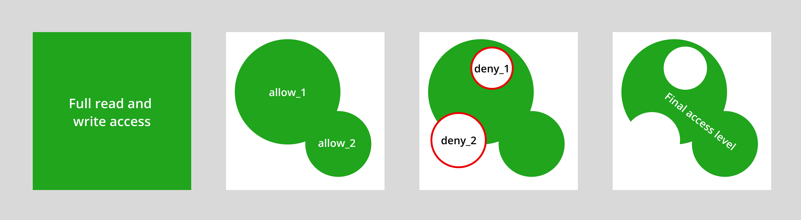

.. _ref_datamodel_ols:

===============
Access Policies
===============

.. note::

  ⚠️ Only available in EdgeDB 2.0 or later.

Object types can contain security policies that restrict the set of objects
that can be selected, inserted, updated, or deleted by a particular query.
This is known as *object-level security*.

Let's start with a simple schema.

.. code-block:: sdl

  type User {
    required property email -> str { constraint exclusive; };
  }

  type BlogPost {
    required property title -> str;
    link author -> User;
  }

When no access policies are defined, object-level security is not activated.
Any properly authenticated query can select or modify any object in the
database. Once a policy is added to a particular object type, object-level
security is activated; all operations on that type (``select``, ``insert``,
etc.) are *disallowed by default* except those specifically permitted by its
access policies.

Defining a policy
^^^^^^^^^^^^^^^^^

Let's add a policy to our sample schema.

.. code-block:: sdl-diff

  +   global current_user -> uuid;

      type User {
        required property email -> str { constraint exclusive; };
      }

      type BlogPost {
        required property title -> str;
        link author -> User;
  +     access policy own_posts allow all using (
  +       .author.id ?= global current_user
  +     )
      }

First: we've added a global variable called ``current_user``. Global
variables are a mechanism for providing context to a query; you set their
value when you first initialize your client. The exact API depends on which
client library you're using; refer to the :ref:`Global Variables
<ref_datamodel_globals>` page for complete documentation.

.. tabs::

  .. code-tab:: typescript

    import createClient from 'edgedb';

    const client = createClient().withGlobals({
      current_user: '2141a5b4-5634-4ccc-b835-437863534c51',
    });

    await client.query(`select global current_user;`);

  .. code-tab:: python

    from edgedb import create_client

    client = create_client().with_globals({
        'current_user': '580cc652-8ab8-4a20-8db9-4c79a4b1fd81'
    })

    result = client.query("""
        select global current_user;
    """)

Now let's break down the access policy syntax piece-by-piece.

.. code-block::

  access policy own_posts allow all using (
    .author.id ?= global current_user
  )

This policy grants full read-write access (``all``) to the ``author`` of each
``BlogPost``. It also implicitly *denies* access to everyone else.

.. note::

  We're using the *coalescing equality* operator ``?=`` which returns
  ``false`` even if one of its arguments is an empty set.

- ``access policy``: The keyword used to declare a policy inside an object
  type.
- ``own_posts``: The name of this policy; could be any string.
- ``allow``: The kind of policy; could be ``allow`` or ``deny``
- ``all``: The set of operations being allowed/denied; a comma-separated list
  of the following: ``all``, ``select``, ``insert``, ``delete``, ``update``,
  ``update read``, ``update write``.
- ``using (<expr>)``: A boolean expression. Think of this as a ``filter``
  expression that defined the set of objects to which the policy applies.

Let's do some experiments.

.. code-block:: edgeql-repl

  db> insert User { email := "test@edgedb.com" };
  {default::User {id: be44b326-03db-11ed-b346-7f1594474966}}
  db> set global current_user := <uuid>"be44b326-03db-11ed-b346-7f1594474966";
  OK: SET GLOBAL
  db> insert BlogPost {
  ...    title := "My post",
  ...    author := (select User filter .id = global current_user)
  ...  };
  {default::BlogPost {id: e76afeae-03db-11ed-b346-fbb81f537ca6}}

We've created a ``User``, set the value of ``current_user`` to its ``id``, and
created a new ``BlogPost``. When we try to select all ``BlogPost`` objects,
we'll see the post we just created.

.. code-block:: edgeql-repl

  db> select BlogPost;
  {default::BlogPost {id: e76afeae-03db-11ed-b346-fbb81f537ca6}}
  db> select count(BlogPost);
  {1}

Now let's unset ``current_user`` and see what happens.

.. code-block:: edgeql-repl

  db> set global current_user := {};
  OK: SET GLOBAL
  db> select BlogPost;
  {}
  db> select count(BlogPost);
  {0}

Now ``select BlogPost`` returns zero results. We can only ``select`` the
*posts* written by the *user* specified by ``current_user``. When
``current_user`` has no value, we can't read any posts.

The access policies use global variables to define a "subgraph" of data that
is visible to a particular query.

Policy types
^^^^^^^^^^^^

For the most part, the policy types correspond to EdgeQL's *statement types*:

- ``select``: Applies to all queries; objects without a ``select`` permission
  cannot be modified either.
- ``insert``: Applies to insert queries; executed *post-insert*. If an
  inserted object violates the policy, the query will fail.
- ``delete``: Applies to delete queries.
- ``update``: Applies to update queries.

Additionally, the ``update`` operation can broken down into two sub-policies:
``update read`` and ``update write``.

- ``update read``: This policy restricts *which* objects can be updated. It
  runs *pre-update*; that is, this policy is executed before the updates have
  been applied.
- ``update write``: This policy restricts *how* you update the objects; you
  can think of it as a *post-update* validity check. This could be used to
  prevent a ``User`` from transferring a ``BlogPost`` to another ``User``.

Finally, there's an umbrella policy that can be used as a shorthand for all
the others.

- ``all``: A shorthand policy that can be used to allow or deny full read/
  write permissions. Exactly equivalent to ``select, insert, update, delete``.

The ``when`` clause
^^^^^^^^^^^^^^^^^^^

For readability, access policies can include a ``when`` clause.

.. code-block:: sdl

  type BlogPost {
    required property title -> str;
    link author -> User;
    access policy own_posts
      when ( .title[0] = "A" )
      allow all
      using ( .author.id ?= global current_user )
  }

Conceptually, you can think of the ``when`` clause as defining the *set of
objects* to which the policy applies while the ``using`` clause represents the
*access check* (likely referencing a global). Logically, the ``when`` and
``using`` expressions are combined with ``and`` together to determine the
scope of the policy.

In practice, any policy can be expressed with just ``when``, just ``using``,
or split across the two; this syntax is intended to enhance readability and
maintainability. We can re-write the policy above without the ``when`` clause.

.. code-block:: sdl-diff

    type BlogPost {
      required property title -> str;
      link author -> User;
      access policy own_posts
  -     when ( .title[0] = "A" )
        allow all
  -     using( .author.id ?= global current_user)
  +     using( .author.id ?= global current_user and .title[0] = "A" )
    }

Resolution order
^^^^^^^^^^^^^^^^

An object type can contain an arbitrary number of access policies, including
several conflicting ``allow`` and ``deny`` policies. EdgeDB uses a particular
algorithm for resolving these policies.

  The access policy resolution algorithm, explained with Venn diagrams.

1. When no policies are defined on a given object type, object-level security
   is all objects of that type can be read or modified by any appropriately
   authenticated connection.

2. EdgeDB then applies all ``allow`` policies. Each policy grants a
   *permission* that is scoped to a particular *set of objects* as defined by
   the ``when/using`` clauses. Conceptually, these permissions are merged with
   the ``union`` / ``or`` operator to determine the set of allowable actions.

3. After the ``allow`` policies are resolved, the ``deny`` policies can be
   used to carve out exceptions to the ``allow`` rules. Deny rules *supersede*
   allow rules! As before, the set of objects targeted by the policy is
   defined by the ``when/using`` clause.

4. This results in the final access level: a set of objects targetable by each
   of ``select``, ``insert``, ``update read``, ``update write``, and
   ``delete``.

Examples
^^^^^^^^

Blog posts are visible to friends but only modifiable by the author.

.. code-block:: sdl

  global current_user -> uuid;

  type User {
    required property email -> str { constraint exclusive; };
    multi link friends -> User;
  }

  type BlogPost {
    required property title -> str;
    link author -> User;
    access policy self_and_friends_can_read allow select using (
      global current_user ?= {.author.id, .author.friends.id}
    );
    access policy self_can_modify allow update, insert, delete using (
      global current_user ?= .author.id
    );
  }

Blog posts are publicly visible except to users that have been ``blocked`` by
the author.

.. code-block::

  type User {
    required property email -> str { constraint exclusive; };
    multi link friends -> User;
    multi link blocked -> User;
  }

  type BlogPost {
    required property title -> str;
    link author -> User;

    access policy author_can_modify allow all using (
      global current_user ?= .author.id
    );
    access policy anyone_can_read allow select using (true);
    access policy exclude_blocked deny select using (
      global current_user ?= .author.blocked.id
    );
  }

.. .. list-table::
..   :class: seealso

..   * - **See also**
..   * - :ref:`SDL > Object types <ref_eql_sdl_object_types>`
..   * - :ref:`DDL > Object-level security <ref_eql_ddl_acl>`
..   * - :ref:`Introspection > Object types
  <ref_eql_introspection_object_types>`
..   * - :ref:`Cheatsheets > Object types <ref_cheatsheet_object_types>`
