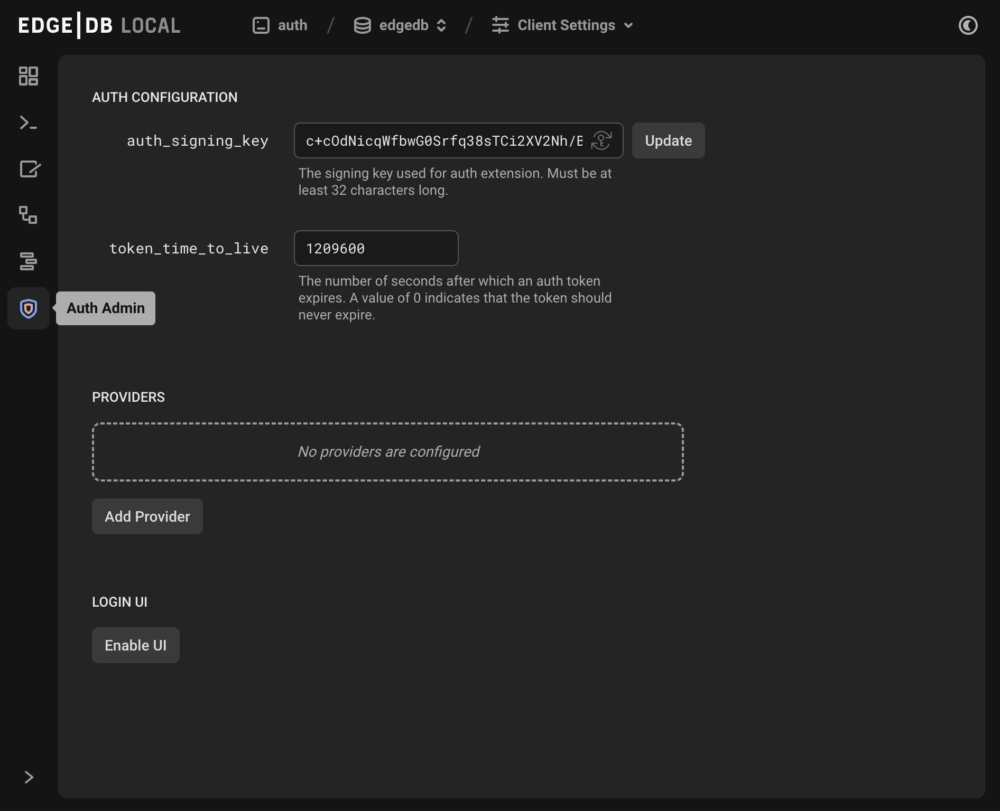

.. _ref_guide_auth:

====
Auth
====

.. toctree::
    :hidden:
    :maxdepth: 3

    built_in_ui
    email_password
    oauth
    magic_link
    webauthn

:edb-alt-title: Using EdgeDB Auth

EdgeDB Auth is a batteries-included authentication solution for your app built
into the EdgeDB server. Here's how you can integrate it with your app.

Enable extension in your schema
===============================

Auth is an EdgeDB extension. To enable it, you will need to add the extension
to your app’s schema:

.. code-block:: sdl

    using extension auth;

Extension configuration
=======================

The best and easiest way to configure the extension for your database is
to use the built-in UI. To access it, run ``edgedb ui``. If you have the
extension enabled in your schema as shown above and have migrated that
schema change, you will see the "Auth Admin" icon in the left-hand toolbar.

          icon in the left-hand toolbar. The icon is two nested shield
          outlines, the inner being a light pink color and the outer being
          a light blue when selected.
    :width: 100%

The auth admin UI exposes these values:

app_name
--------

The name of your application to be shown on the login screen when using the
built-in UI.

logo_url
--------

A URL to an image of your logo. This is also used to customize the built-in UI.

logo_url
--------

A URL to an image of your logo for use with a dark theme. This is also used to
customize the built-in UI.

brand_color
-----------

Your brand color as a hex string. This will be used as the accent color in the
built-in UI.

auth_signing_key
----------------

The extension uses JSON Web Tokens (JWTs) internally for many operations.
``auth_signing_key`` is the value that is used as a symmetric key for signing
the JWTs. At the moment, the JWTs are not considered “public” API, so there is
no need to save this value for your own application use. It is exposed mainly
to allow rotation.

To configure via query or script:

.. lint-off

.. code-block:: edgeql

    CONFIGURE CURRENT BRANCH SET
    ext::auth::AuthConfig::auth_signing_key := 'F2KHaJfHi9Dzd8+6DI7FB9IFIoJXnhz2rzG/UzCRE7jTtYxqgTHHydc8xnN6emDB3tlR99FvPsyJfcVLVcQ5odSQpceDXplBOP+N14+EBy2mV6rA/7W7azIEKebtr9TVKrpBTMTOLAXo08ZnA6lvjn0VMs95za6Pta7VW62hjcb8jy6yxulvvU5SWnwa0x2z401K0pLK7byDD5eNqgTl40YaeOGoQ0iCkSmGxvLxyQgCIz2IU0zUbBwC9bQsTDORvflunruJznHuMxwbfYo/czQIIGuawU0H+G3GJZ3hecZLQlvwYCyLF37PFQVrcNMtUuGyDy2OyYtYHru2GW5B7Q';

.. lint-on

token_time_to_live
------------------

This value controls the expiration time on the authentication token’s
JSON Web Token. This is effectively the “session” time.

To configure via query or script:

.. code-block:: edgeql

    CONFIGURE CURRENT BRANCH SET
    ext::auth::AuthConfig::token_time_to_live := <duration>"336 hours";

allowed_redirect_urls
---------------------

This value is a set of strings that we use to ensure we only redirect to
domains that are under the control of the application using the Auth extension.
We compare any ``redirect_to`` URLs against this list. A URL is considered a
"match" if the URL is exactly the same as one on the list, or is a sub-path of
a URL on the list.

For example, if the set includes ``https://example.com/myapp``:

.. list-table::
   :header-rows: 1

   * - URL
     - Match
   * - ``https://example.com/myapp``
     - ✅
   * - ``https://example.com/myapp/auth``
     - ✅
   * - ``https://example.com/myapp/auth/verify``
     - ✅
   * - ``https://example.com/myapp/somewhere/else``
     - ✅
   * - ``http://example.com/myapp``
     - Does not match the protocol
   * - ``https://example.com:443/myapp``
     - Does not match the port
   * - ``https://auth.example.com/myapp``
     - Does not match the subdomain
   * - ``https://example.com/different/subpath``
     - Does not match the pathname or extend it

.. note::

    💡 We always allow redirects to the auth extension itself, so you do not
    need to add it explicitly if, for instance, you are always using the
    built-in UI.

To configure via query or script:

.. code-block:: edgeql

    CONFIGURE CURRENT BRANCH SET
    ext::auth::AuthConfig::allowed_redirect_urls := {
        'https://example.com',
        'https://example.com/auth',
        'https://localhost:3000',
        'https://localhost:3000/auth'
    };

Configuring webhooks
====================

The auth extension supports sending webhooks for a variety of auth events. You
can use these webhooks to, for instance, send a fully customized email for
email verification, or password reset instead of our built-in email
verification and password reset emails. You could also use them to trigger
analytics events, start an email drip campaign, create an audit log, or
trigger other side effects in your application.

.. note::

  We send webhooks with no durability or reliability guarantees, so you should
  always provide a mechanism for retrying delivery of any critical events,
  such as email verification and password reset. We detail how to resend these
  events in the relevant sections on the various authentication flows.

Here are the webhooks that are currently supported:

.. list-table::
   :header-rows: 1
   :widths: 30 70

   * - Event
     - Payload
   * - ``IdentityCreated``
     - | - ``event_type``: ``"IdentityCreated"`` (``str``)
       | - ``event_id``: Unique event identifier (``str``)
       | - ``timestamp``: ISO 8601 timestamp (``datetime``)
       | - ``identity_id``: ID of created identity (``str``)
   * - ``IdentityAuthenticated``
     - | - ``event_type``: ``"IdentityAuthenticated"`` (``str``)
       | - ``event_id``: Unique event identifier (``str``)
       | - ``timestamp``: ISO 8601 timestamp (``datetime``)
       | - ``identity_id``: ID of authenticated identity (``str``)
   * - ``EmailFactorCreated``
     - | - ``event_type``: ``"EmailFactorCreated"`` (``str``)
       | - ``event_id``: Unique event identifier (``str``)
       | - ``timestamp``: ISO 8601 timestamp (``datetime``)
       | - ``identity_id``: Associated identity ID (``str``)
       | - ``email_factor_id``: ID of created email factor (``str``)
   * - ``EmailVerified``
     - | - ``event_type``: ``"EmailVerified"`` (``str``)
       | - ``event_id``: Unique event identifier (``str``)
       | - ``timestamp``: ISO 8601 timestamp (``datetime``)
       | - ``identity_id``: Associated identity ID (``str``)
       | - ``email_factor_id``: ID of verified email factor (``str``)
   * - ``EmailVerificationRequested``
     - | - ``event_type``: ``"EmailVerificationRequested"`` (``str``)
       | - ``event_id``: Unique event identifier (``str``)
       | - ``timestamp``: ISO 8601 timestamp (``datetime``)
       | - ``identity_id``: Associated identity ID (``str``)
       | - ``email_factor_id``: ID of email factor to verify (``str``)
       | - ``verification_token``: Token for verification (``str``)
   * - ``PasswordResetRequested``
     - | - ``event_type``: ``"PasswordResetRequested"`` (``str``)
       | - ``event_id``: Unique event identifier (``str``)
       | - ``timestamp``: ISO 8601 timestamp (``datetime``)
       | - ``identity_id``: Associated identity ID (``str``)
       | - ``email_factor_id``: ID of email factor (``str``)
       | - ``reset_token``: Token for password reset (``str``)
   * - ``MagicLinkRequested``
     - | - ``event_type``: ``"MagicLinkRequested"`` (``str``)
       | - ``event_id``: Unique event identifier (``str``)
       | - ``timestamp``: ISO 8601 timestamp (``datetime``)
       | - ``identity_id``: Associated identity ID (``str``)
       | - ``email_factor_id``: ID of email factor (``str``)
       | - ``magic_link_token``: Token for magic link (``str``)
       | - ``magic_link_url``: Complete URL for magic link (``str``)

You can configure webhooks with the UI or via query.

.. code-block:: edgeql

    CONFIGURE CURRENT BRANCH INSERT
    ext::auth::WebhookConfig {
        url := 'https://example.com/auth/webhook',
        events := {
            ext::auth::WebhookEvent.EmailVerificationRequested,
            ext::auth::WebhookEvent.PasswordResetRequested,
        }
    };

.. note::

  URLs must be unique across all webhooks configured for each branch. If you want
  to send multiple events to the same URL, you can do so by adding multiple
  ``ext::auth::WebhookEvent`` values to the ``events`` set.

Configuring SMTP
================

For email-based factors, you can configure SMTP to allow the extension to send
emails on your behalf. You should either configure SMTP, or webhooks for the
relevant events.

Here is an example of configuring SMTP for local development, using something
like `Mailpit <https://mailpit.axllent.org/docs/>`__.

.. code-block:: edgeql

    CONFIGURE CURRENT BRANCH INSERT cfg::SMTPProviderConfig {
        sender := 'hello@example.com',
        host := 'localhost',
        port := <int32>1025,
        security := 'STARTTLSOrPlainText',
        validate_certs := false,
    };

Enabling authentication providers
=================================

In order to use the auth extension, you’ll need to enable at least one of these
authentication providers. Providers can be added from the "Providers" section
of the admin auth UI by clicking "Add Provider." This will add a form to the UI
allowing for selection of the provider and configuration of the values
described below.

You can also enable providers via query. We'll demonstrate how in each section
below.

.. _ref_guide_auth_overview_email_password:

Email and password
------------------

-  ``require_verification``: (Default: ``true``) If ``true``, your application
   will not be able to retrieve an authentication token until the user
   has verified their email. If ``false``, your application can retrieve an
   authentication token, but a verification email will still be sent.
   Regardless of this setting, you can always decide to limit access or
   specific features in your application by testing if
   ``ext::auth::EmailPasswordFactor.verified_at`` is set to a date in
   the past on the ``ext::auth::LocalIdentity``.

To enable via query or script:

.. code-block:: edgeql

    CONFIGURE CURRENT BRANCH
    INSERT ext::auth::EmailPasswordProviderConfig {
        require_verification := false,
    };

.. note::

    ``require_verification`` defaults to ``true``.

If you use the Email and Password provider, in addition to the
``require_verification`` configuration, you’ll need to configure SMTP to allow
EdgeDB to send email verification and password reset emails on your behalf or
set up webhooks for the relevant events:

- ``ext::auth::WebhookEvent.EmailVerificationRequested``
- ``ext::auth::WebhookEvent.PasswordResetRequested``

Here is an example of setting a local SMTP server, in this case using a
product called `Mailpit <https://mailpit.axllent.org/docs/>`__ which is
great for testing in development:

.. code-block:: edgeql

    CONFIGURE CURRENT BRANCH INSERT cfg::SMTPProviderConfig {
        sender := 'hello@example.com',
        host := 'localhost',
        port := <int32>1025,
        security := 'STARTTLSOrPlainText',
        validate_certs := false,
    };

Here is an example of setting up webhooks for the email verification and
password reset events:

.. code-block:: edgeql

    CONFIGURE CURRENT BRANCH INSERT ext::auth::WebhookConfig {
        url := 'https://example.com/auth/webhook',
        events := {
            ext::auth::WebhookEvent.EmailVerificationRequested,
            ext::auth::WebhookEvent.PasswordResetRequested,
        }
    };

OAuth
-----

We currently support six different OAuth providers:

.. lint-off

-  `Apple <https://developer.apple.com/documentation/sign_in_with_apple/sign_in_with_apple_rest_api/authenticating_users_with_sign_in_with_apple>`__
-  `Azure
   (Microsoft) <https://learn.microsoft.com/en-us/entra/identity-platform/v2-protocols-oidc>`__
-  `GitHub <https://docs.github.com/en/apps/creating-github-apps/registering-a-github-app/registering-a-github-app>`__
-  `Google <https://developers.google.com/identity/protocols/oauth2>`__
-  `Discord <https://discord.com/developers/docs/topics/oauth2>`__
-  `Slack <https://api.slack.com/authentication/sign-in-with-slack>`__

.. lint-on

The instructions for creating an app for each provider can be found on
each provider’s developer documentation website, which is linked above.
The important things you’ll need to find and make note of for your
configuration are the **client ID** and **secret**.

Once you select the OAuth provider in the configuration UI, you will need to
provide those values and the ``additional_scope``:

-  ``client_id`` This is assigned to you by the Identity Provider when
   you create an app with them.
-  ``secret`` This is created by the Identity Provider when you create
   an app with them.
-  ``additional_scope`` We request certain scope from the Identity
   Provider to fulfill our minimal data needs. You can pass additional
   scope here in a space-separated string and we will request that
   additional scope when getting the authentication token from the
   Identity Provider.

   .. note::

        We return this authentication token with this scope from the Identity
        Provider when we return our own authentication token.

You’ll also need to set a callback URL in each provider’s interface. To build
this callback URL, you will need the hostname, port, and branch name of your
database. The branch name is ``main`` by default. The hostname and port can
be found running this CLI command:

.. code-block:: bash

   $ edgedb instance credentials

This will output a table that includes the hostnames and ports of all your
instances. Grab those from the row corresponding to the correct instance for
use in your callback URL, which takes on this format:

.. code-block::

    http[s]://{edgedb_host}[:port]/db/{db_name}/ext/auth/callback

To enable the Azure OAuth provider via query or script:

.. code-block:: edgeql

    CONFIGURE CURRENT BRANCH
    INSERT ext::auth::AzureOAuthProvider {
        secret := 'cccccccccccccccccccccccccccccccc',
        client_id := '1597b3fc-b67d-4d2b-b38f-acc256341dbc',
        additional_scope := 'offline_access',
    };

To enable any of the others, change ``AzureOAuthProvider`` in the example above
to one of the other providers:

- ``AppleOAuthProvider``
- ``DiscordOAuthProvider``
- ``GitHubOAuthProvider``
- ``GoogleOAuthProvider``
- ``SlackOAuthProvider``

Generic OpenID Connect providers
--------------------------------

.. versionadded:: 6.0

Generic OpenID Connect providers are now supported. In order to use them,
you will need to insert an ``ext::auth::OpenIDConnectProvider`` configuration
object with a few additional properties:

- ``name``: A unique string identifying the provider.
- ``display_name``: A human-readable name for the provider.
- ``issuer_url``: The issuer URL of the provider. This must be the domain of
  the provider's authorization server and will be used to drive the OpenID
  Connect flow.
- ``logo_url``: (optional) A URL to an image of the provider's logo. This is
  used in the built-in UI to display the correct logo.

Inherited from ``ext::auth::OAuthProviderConfig``:

- ``client_id``: The client ID of the provider.
- ``secret``: The client secret of the provider.
- ``additional_scope``: (optional) A space-separated string of additional
  scopes to request from the provider.

Here is an example of enabling the Google OpenID Connect provider (note, for
Google, you can simply use the existing Google provider, but this is for
illustration purposes):

.. lint-off

.. code-block:: edgeql

    CONFIGURE CURRENT BRANCH
    INSERT ext::auth::OpenIDConnectProvider {
        name := 'google',
        display_name := 'Google',
        issuer_url := 'https://accounts.google.com',
        logo_url := 'https://www.google.com/images/branding/googlelogo/1x/googlelogo_color_272x92dp.png',
        client_id := '1234567890',
        secret := '1234567890',
    };

.. lint-on

Magic link
----------

Magic link offers only one setting: ``token_time_to_live``. This determines how
long after sending the magic link is valid.

Since magic links rely on email, you must also configure SMTP or webhooks. For
local testing, you can use the same method used for SMTP previously for
:ref:`the email and password provider <ref_guide_auth_overview_email_password>`.

Here is an example of setting a local SMTP server, in this case using a
product called `Mailpit <https://mailpit.axllent.org/docs/>`__ which is
great for testing in development:

.. code-block:: edgeql

    CONFIGURE CURRENT BRANCH INSERT cfg::SMTPProviderConfig {
        sender := 'hello@example.com',
        host := 'localhost',
        port := <int32>1025,
        security := 'STARTTLSOrPlainText',
        validate_certs := false,
    };

Here is an example of setting up webhooks for the magic link events:

.. code-block:: edgeql

    CONFIGURE CURRENT BRANCH INSERT ext::auth::WebhookConfig {
        url := 'https://example.com/auth/webhook',
        events := {
            ext::auth::WebhookEvent.MagicLinkRequested,
        }
    };

WebAuthn
--------

-  ``relying_party_origin``: This is the URL of the web application handling
   the WebAuthn request. If you're using the built-in UI, it's the origin of
   the EdgeDB web server.

-  ``require_verification``: (Default: ``true``) If ``true``, your application
   will not be able to retrieve an authentication token until the user has
   verified their email. If ``false``, your application can retrieve an
   authentication token, but a verification email will still be sent.
   Regardless of this setting, you can always decide to limit access or
   specific features in your application by testing if
   ``ext::auth::WebAuthnFactor.verified_at`` is set to a date in the past on
   the ``ext::auth::LocalIdentity``.

.. note::

    You will need to configure SMTP or webhooks. For local testing, you can use
    Mailpit as described in :ref:`the email/password section
    <ref_guide_auth_overview_email_password>`.

.. note::

    You will need to configure CORS to allow the client-side script to call the
    EdgeDB Auth extension's endpoints from the web browser. You can do this by
    updating the ``cors_allow_origins`` configuration in the EdgeDB server
    configuration.

Here is an example of setting a local SMTP server, in this case using a
product called `Mailpit <https://mailpit.axllent.org/docs/>`__ which is
great for testing in development:

.. code-block:: edgeql

    CONFIGURE CURRENT BRANCH INSERT cfg::SMTPProviderConfig {
        sender := 'hello@example.com',
        host := 'localhost',
        port := <int32>1025,
        security := 'STARTTLSOrPlainText',
        validate_certs := false,
    };

Here is an example of setting up webhooks for the WebAuthn events:

.. code-block:: edgeql

    CONFIGURE CURRENT BRANCH INSERT ext::auth::WebhookConfig {
        url := 'https://example.com/auth/webhook',
        events := {
            ext::auth::WebhookEvent.EmailVerificationRequested,
        }
    };

Integrating your application
============================

In the end, what we want to end up with is an authentication token
created by EdgeDB that we can set as a global in any authenticated
queries executed from our application, which will set a computed global linked
to an ``ext::auth::Identity``.

.. note::

    💡 If you want your own ``User`` type that contains application specific
    information like name, preferences, etc, you can link to this
    ``ext::auth::Identity`` to do so.

You can then use the ``ext::auth::Identity`` (or custom ``User`` type)
to define access policies and make authenticated queries.

Select your method for detailed configuration:

.. toctree::
    :maxdepth: 3

    built_in_ui
    email_password
    oauth
    magic_link
    webauthn

Example usage
=============

Here’s an example schema that we can use to show how you would use the
``auth_token`` you get back from EdgeDB to make queries against a
protected resource, in this case being able to insert a ``Post``.

.. code-block:: sdl

   using extension auth;

   module default {
     global current_user := (
       assert_single((
         select User
         filter .identity = global ext::auth::ClientTokenIdentity
       ))
     );

     type User {
       required name: str;
       required identity: ext::auth::Identity;
     }

     type Post {
       required text: str;
       required author: User;

       access policy author_has_full_access
         allow all
         using (.author ?= global current_user);

       access policy others_read_only
         allow select;
     }
   }

Let’s now insert a ``Post``.

.. lint-off

.. code-block:: tsx

   const client = createClient().withGlobals({
     "ext::auth::client_token": auth_token,
   });

   const inserted = await client.querySingle(
     `
     insert Post {
       text := <str>$text,
       author := global current_user,
     }`,
     {
       text: 'if your grave doesnt say "rest in peace" on it you are automatically drafted into the skeleton war'
     }
   );

.. lint-on

I can even delete it, since I have access through the global:

.. code-block:: tsx

    await client.query(`delete Post filter .id = <str>$id`, {
      id: inserted.id
    });
