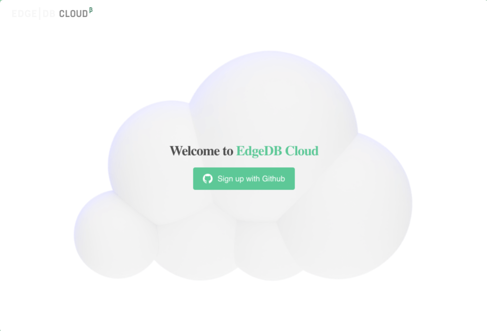
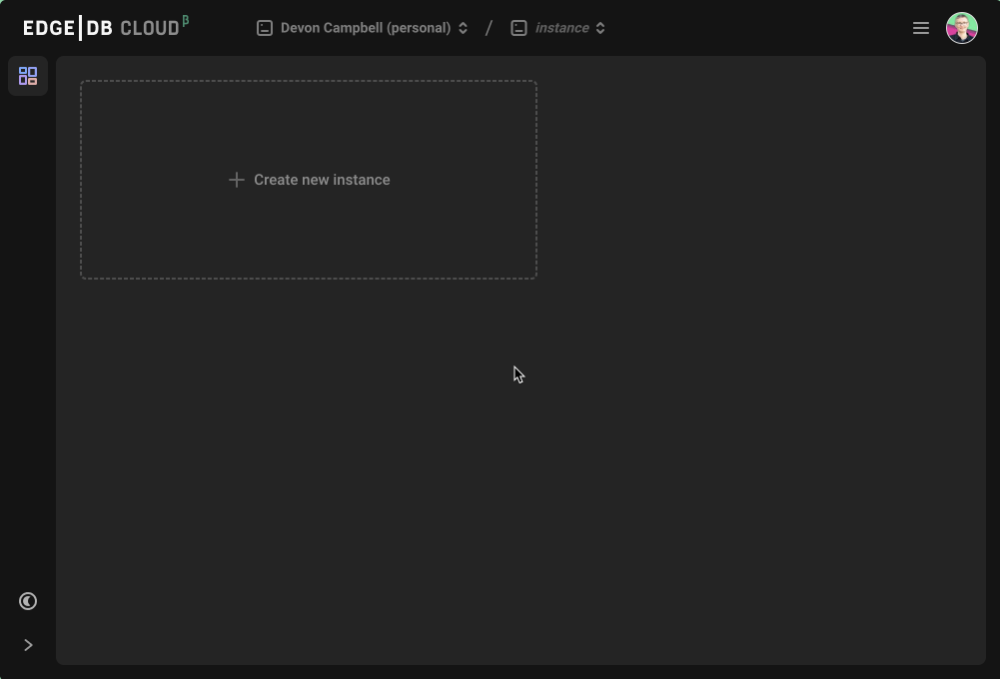
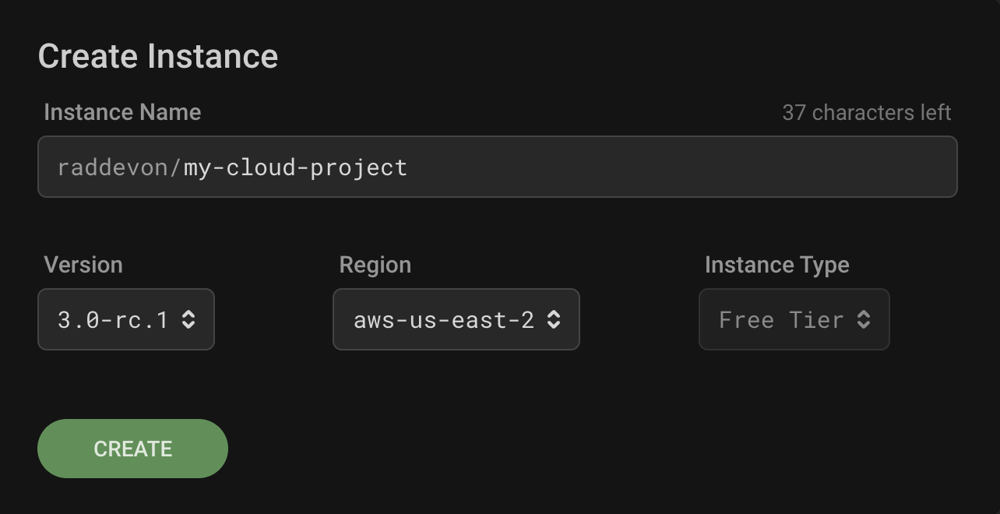
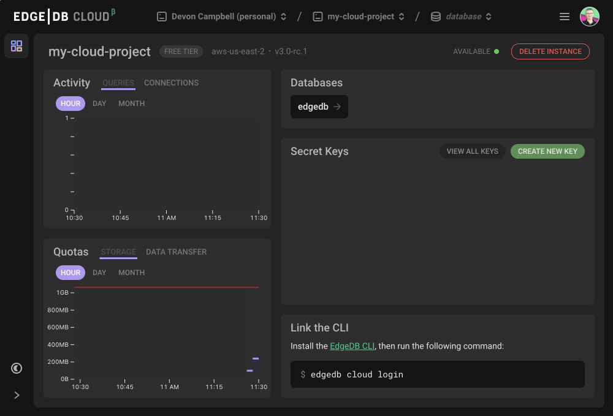
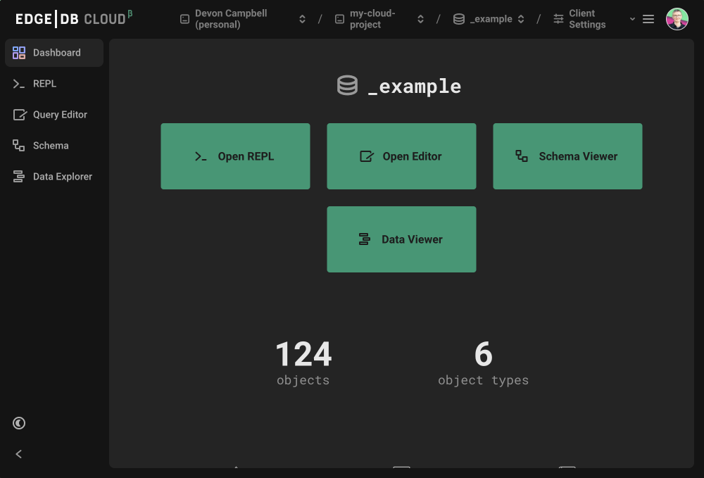
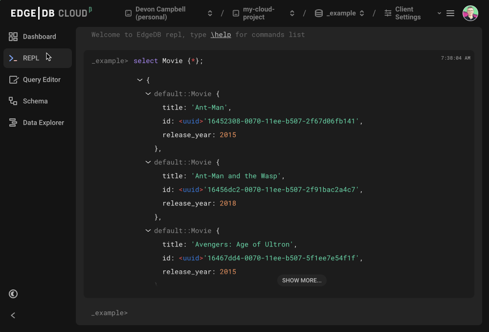
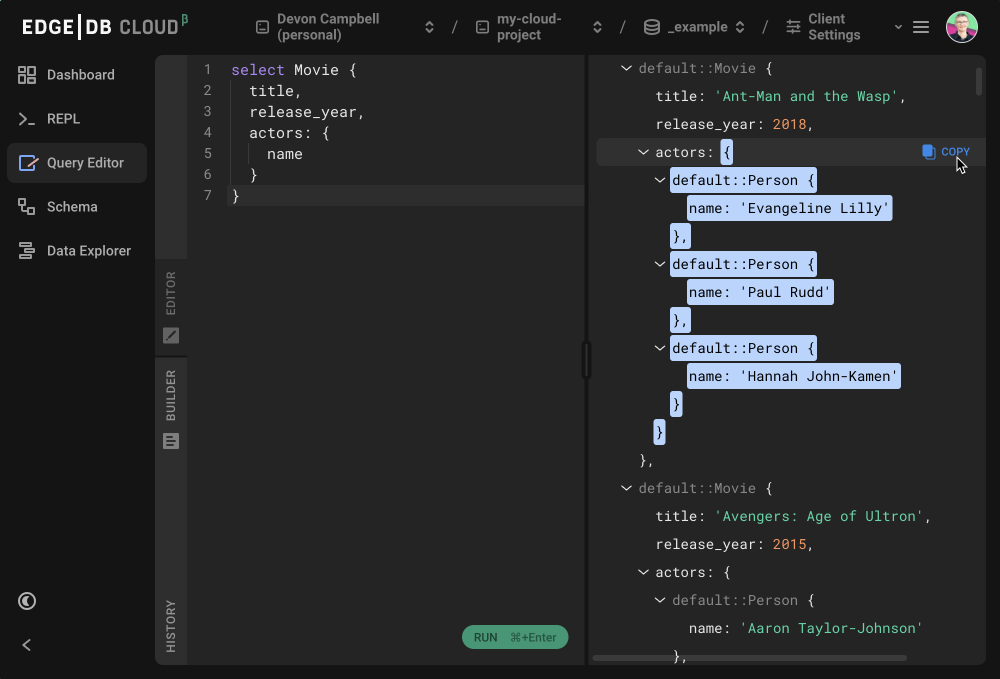
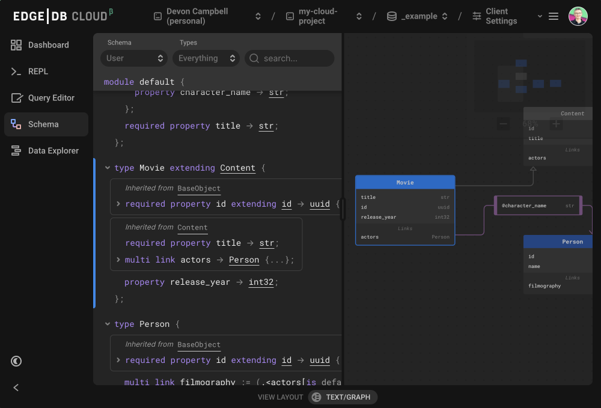
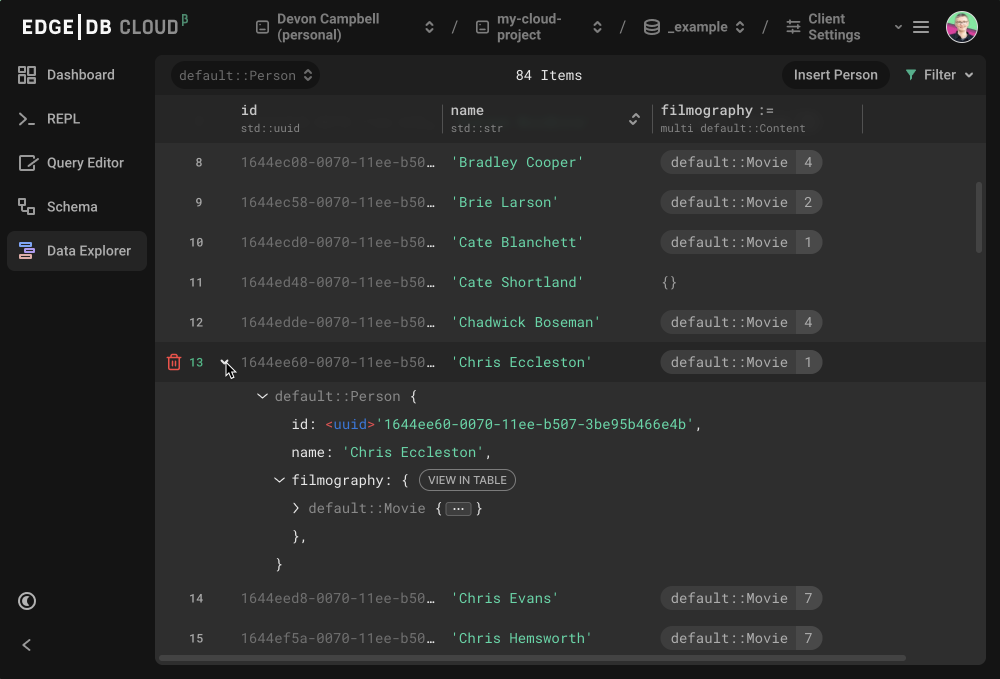

.. _ref_guide_cloud:

=====
Cloud
=====

:edb-alt-title: Using EdgeDB Cloud (Beta)

.. warning::

    EdgeDB Cloud is currently in beta. This guide will not work unless you have
    access. To request access, `join the waitlist </p/cloud-waitlist>`_ or join
    `our Discord <https://discord.gg/umUueND6ag>`_ and request access there.

EdgeDB Cloud is the easiest way to host your EdgeDB instance. We offer two ways
to interact with EdgeDB Cloud: via our CLI or through a graphical web
interface.

CLI Cloud Interface
===================

To use Cloud via the CLI, first log in using :ref:`ref_cli_edgedb_cloud_login`.
Once your login is successful, you will be able to create an instance using
either :ref:`ref_cli_edgedb_instance_create` or
:ref:`ref_cli_edgedb_project_init`, depending on whether you also want to
create a local project linked to your instance.

In either case, you will pass an instance name matching the EdgeDB Cloud
instance name format: ``<github-username>/<instance-name>``

To use ``edgedb instance create``:

.. code-block:: bash

    $ edgedb instance create <github-username>/<instance-name>

To use ``edgedb project init``:

.. code-block:: bash

    $ edgedb project init \
      --server-instance <github-username>/<instance-name>

Alternatively, you can run ``edgedb project init`` *without* the
``--server-instance`` option and enter an instance name in the
``<github-username>/<instance-name>`` format when prompted interactively.

Web Cloud Interface
===================

If you'd prefer, you can also manage your account via `the EdgeDB Cloud
web-based GUI <https://cloud.edgedb.com/>`_.

The first time you access the web UI, you will be prompted to log in.

Once you log in with your GitHub account, you'll see your instance list.

If this is your first time accessing EdgeDB Cloud, this list will be empty. To
create an instance, click "Create new instance." This will pop up a modal
allowing you to name your instance and specify the version of EdgeDB and the
region for the instance.

Once the instance has been created, you'll see the instance dashboard which
allows you to monitor your instance, navigate to the database management page,
and create secret keys.

You'll also see instructions in the bottom-right for linking your EdgeDB CLI to
your EdgeDB Cloud account. You do this by running the CLI command ``edgedb
cloud login``. This will make all of your EdgeDB Cloud instances accessible via
the CLI. You can manage them just as you would other remote EdgeDB instances.

If you want to manage your database, click through on its name from the top
right of the instance dashboard. If you just created your database, the
database management view will be mostly empty except for a button offering to
create a sample database. Once you have a schema created and some data in a
database, this view will offer you similar tools to those in our new 3.0 local
UI.

You'll be able to access a REPL, edit complex queries or build them
graphically, inspect your schema, and browse your data.

Find bugs? Have Questions?
==========================

Thank you for helping us make the best way to host your EdgeDB instances even
better! Please join us on `our Discord <https://discord.gg/umUueND6ag>`_ to ask
questions and report any bugs you find.
