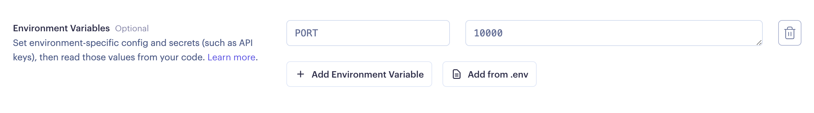

.. _ref_guide_cloud_deploy_render:

======
Render
======

:edb-alt-title: Deploying applications built on EdgeDB Cloud to Render

1. Push project to GitHub or some other Git remote repository
2. Create and make note of a secret key for your EdgeDB Cloud instance
3. From Render's dashboard, click "New > Web Service"
4. Import your project's repository
5. In the setup page, scroll down to the "Environment Variables" section and 
   add the following environment variables:

   - ``EDGEDB_INSTANCE`` containing your EdgeDB Cloud instance name (in
     ``<org>/<instance-name>`` format)
   - ``EDGEDB_SECRET_KEY`` containing the secret key you created and noted
     previously.

6. Click Deploy

          highlighting the environment variables section where a user 
          will need to set the necessary variables for EdgeDB Cloud instance 
          connection.
