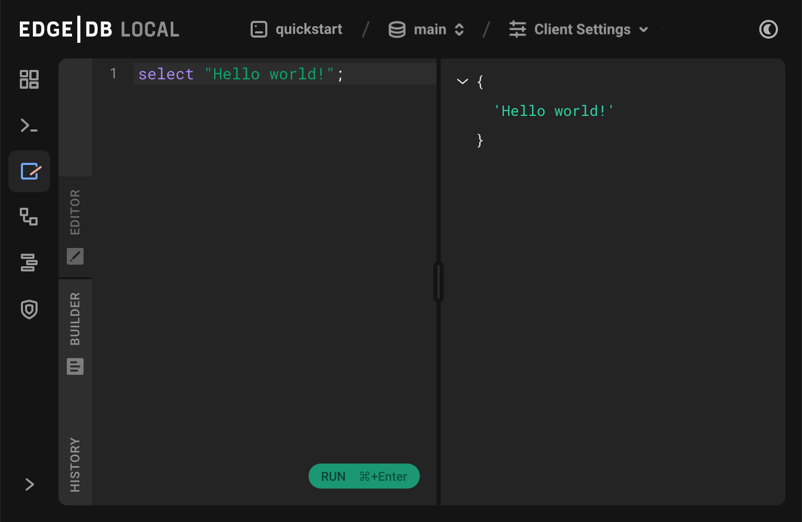

.. _ref_quickstart:

==========
Quickstart
==========

Welcome to EdgeDB!

This quickstart will walk you through the entire process of creating a simple
EdgeDB-powered application: installation, defining your schema, adding some
data, and writing your first query. Let's jump in!

.. _ref_quickstart_install:

1. Installation
===============

First let's install the EdgeDB CLI. Open a terminal and run the appropriate
command below.

**macOS/Linux**

.. code-block:: bash

  $ curl https://sh.edgedb.com --proto '=https' -sSf1 | sh

**Windows**

.. code-block::

  # in Powershell
  PS> iwr https://ps1.edgedb.com -useb | iex

This command downloads and executes a bash script that installs the ``edgedb``
CLI on your machine. You may be asked for your password. Once the installation
completes, you may need to **restart your terminal** before you can use the
``edgedb`` command.

Now let's set up your EdgeDB project.

.. _ref_quickstart_createdb:

2. Initialize a project
=======================

In a terminal, create a new directory and ``cd`` into it.

.. code-block:: bash

  $ mkdir quickstart
  $ cd quickstart

Then initialize your EdgeDB project:

.. code-block:: bash

  $ edgedb project init

This starts an interactive tool that walks you through the process of setting
up your first EdgeDB instance. You should see something like this:

.. code-block:: bash

  $ edgedb project init
  No `edgedb.toml` found in `/path/to/quickstart` or above
  Do you want to initialize a new project? [Y/n]
  > Y
  Specify the name of EdgeDB instance to use with this project [quickstart]:
  > quickstart
  Checking EdgeDB versions...
  Specify the version of EdgeDB to use with this project [default: 2.x]:
  > 2.x
  ┌─────────────────────┬───────────────────────────────────────────────┐
  │ Project directory   │ ~/path/to/quickstart                          │
  │ Project config      │ ~/path/to/quickstart/edgedb.toml              │
  │ Schema dir (empty)  │ ~/path/to/quickstart/dbschema                 │
  │ Installation method │ portable package                              │
  │ Version             │ 2.x+c21decd                                   │
  │ Instance name       │ quickstart                                    │
  └─────────────────────┴───────────────────────────────────────────────┘
  Downloading package...
  00:00:01 [====================] 32.98MiB/32.98MiB 32.89MiB/s | ETA: 0s
  Successfully installed 2.x+c21decd
  Initializing EdgeDB instance...
  Applying migrations...
  Everything is up to date. Revision initial
  Project initialized.
  To connect to quickstart, run `edgedb`

This did a couple things.

1. First, it scaffolded your project by creating an ``edgedb.toml`` config
   file and a schema file ``dbschema/default.esdl``. In the next section,
   you'll define a schema in ``default.esdl``.

2. Second, it spun up an EdgeDB instance called ``quickstart`` and "linked" it
   to the current directory. As long as you're inside the project
   directory, all CLI commands will be executed against this
   instance. For more details on how EdgeDB projects work, check out the
   :ref:`Managing instances <ref_intro_instances>` guide.

.. note::

  Quick note! You can have several **instances** of EdgeDB running on your
  computer simultaneously. Each instance contains several **databases**. Each
  database may contain several **modules** (though commonly your schema
  will be entirely defined inside the ``default`` module).

Let's connect to our new instance! Run ``edgedb`` in your terminal to open an interactive REPL to your instance. You're now connected to a live EdgeDB instance running on your computer! Try executing a simple query:

.. code-block:: edgeql-repl

  db> select 1 + 1;
  {2}

Run ``\q`` to exit the REPL. More interesting queries are coming soon,
promise! But first we need to set up a schema.

.. _ref_quickstart_createdb_sdl:

3. Set up your schema
=====================

Open the ``quickstart`` directory in your IDE or editor of choice. You should
see the following file structure.

.. code-block::

  /path/to/quickstart
  ├── edgedb.toml
  ├── dbschema
  │   ├── default.esdl
  │   ├── migrations

EdgeDB schemas are defined with a dedicated schema description language called
(predictably) EdgeDB SDL (or just **SDL** for short). It's an elegant,
declarative way to define your data model.

SDL lives inside ``.esdl`` files. Commonly, your entire schema will be
declared in a file called ``default.esdl`` but you can split your schema
across several ``.esdl`` files if you prefer.

.. note::

  Syntax-highlighter packages/extensions for ``.esdl`` files are available
  for
  `Visual Studio Code <https://marketplace.visualstudio.com/
  itemdetails?itemName=magicstack.edgedb>`_,
  `Sublime Text <https://packagecontrol.io/packages/EdgeDB>`_,
  `Atom <https://atom.io/packages/edgedb>`_,
  and `Vim <https://github.com/edgedb/edgedb-vim>`_.

Let's build a simple movie database. We'll need to define two **object types**
(equivalent to a *table* in SQL): Movie and Person. Open
``dbschema/default.esdl`` in your editor of choice and paste the following:

.. code-block:: sdl

  module default {
    type Person {
      required property name -> str;
    }

    type Movie {
      property title -> str;
      multi link actors -> Person;
    }
  };

A few things to note here.

- Our types don't contain an ``id`` property; EdgeDB automatically
  creates this property and assigned a unique UUID to every object inserted
  into the database.
- The ``Movie`` type also includes two **links**: ``actors`` and ``director``.
  In EdgeDB, links are used to represent relationships between object types.
  They eliminate the need for foreign keys; later, you'll see just how easy it
  is to write "deep" queries without JOINs.
- The object types are inside a ``module`` called ``default``. You can split
  up your schema into logical subunits called modules, though it's common to
  define the entire schema in a single module called ``default``.

Now we're ready to run a migration to apply this schema to the database.

4. Run a migration
==================

Generate a migration file with ``edgedb migration create``. This command
gathers up our ``*.esdl`` files and sends them to the database. The *database
itself* parses these files, compares them against it's current schema, and
generates a migration plan! Then the database sends this plan back to the CLI,
which creates a migration file.

.. code-block:: bash

  $ edgedb migration create
  Created ./dbschema/migrations/00001.edgeql, id: m1la5u4qi...

.. note::

  If you're interested, open this migration file to see what's inside! It's
  a simple EdgeQL script consisting of :ref:`DDL <ref_eql_sdl>` commands like
  ``create type``, ``alter type``, and ``create property``.

The migration file has been *created* but we haven't *applied it* against the database. Let's do that.

.. code-block:: bash

  $ edgedb migrate
  Applied m1k54jubcs62wlzfebn3pxwwngajvlbf6c6qfslsuagkylg2fzv2lq (00001.edgeql)

Looking good! Let's make sure that worked by running ``edgedb list types`` on
the command line. This will print a table containing all currently-defined
object types.

.. code-block:: bash

  $ edgedb list types
  ┌─────────────────┬──────────────────────────────┐
  │      Name       │          Extending           │
  ├─────────────────┼──────────────────────────────┤
  │ default::Movie  │ std::BaseObject, std::Object │
  │ default::Person │ std::BaseObject, std::Object │
  └─────────────────┴──────────────────────────────┘

.. _ref_quickstart_migrations:

.. _Migrate your schema:

Before we procede, let's try making a small change to our schema: making the ``title`` property of ``Movie`` required. First, update the schema file:

.. code-block:: sdl-diff

      type Movie {
  -     property title -> str;
  +     required property title -> str;
        multi link actors -> Person;
      }

Then create another migration. Because this isn't the initial migration, we see something a little different than before.

.. code-block:: bash

  $ edgedb migration create
  did you make property 'title' of object type 'default::Movie' required? [y,n,l,c,b,s,q,?]
  >

As before, EdgeDB parses the schema files and compared them against its current internal schema. It correctly detects the change we made, and prompts us to confirm it. This interactive process lets you sanity check every change and provide guidance when a migration is ambiguous (e.g. when a property is renamed).

Enter ``y`` to confirm the change.

.. code-block:: bash

  $ edgedb migration create
  did you make property 'title' of object type 'default::Movie' required? [y,n,l,c,b,s,q,?]
  > y
  Please specify an expression to populate existing objects in order to make property 'title' of object type 'default::Movie' required:
  fill_expr>

Hm, now we're seeing another prompt. Because ``title`` is changing from *optional* to *required*, EdgeDB is asking us what to do for all the ``Movie`` objects that don't currently have a value for ``title`` defined. We'll just specify a placeholder value: ``"Untitled"``.

.. code-block::

  fill_expr> "Untitled"
  Created dbschema/migrations/00002.edgeql, id: m1rd2ikgwdtlj5ws7ll6rwzvyiui2xbrkzig4adsvwy2sje7kxeh3a

If we look at the generated migration file, we see it contains the following lines:

.. code-block:: edgeql

  ALTER TYPE default::Movie {
    ALTER PROPERTY title {
      SET REQUIRED USING ("Untitled");
    };
  };

Let's wrap up by applying the new migration.

.. code-block:: bash

  $ edgedb migrate
  Applied m1rd2ikgwdtlj5ws7ll6rwzvyiui2xbrkzig4adsvwy2sje7kxeh3a (00002.edgeql)

.. _ref_quickstart_insert_data:

.. _Insert data:

.. _Run some queries:

5. Write some queries
=====================

Let's write some simple queries via *EdgeDB UI*, the admin dashboard baked into every EdgeDB instance (v2.0+ only). To open the dashboard:

.. code-block:: bash

  $ edgedb ui
  Opening URL in browser:
  http://localhost:107xx/ui?authToken=<jwt token>

You should see a simple landing page, as below. You'll see a card for each database running on your instance—remember: each instance can contain multiple databases!

.. image:: images/ui_landing.jpg
  :width: 100%

Currently, there's only one database, which is simply called ``edgedb`` by default. Click the ``edgedb`` card.

.. image:: images/ui_db.jpg
  :width: 100%

Then click ``Open REPL`` so we can start writing some queries. We'll start simple: ``select "Hello world!"``. Click ``RUN`` to execute the query.

The query should appear in the "query notebook" on the right, along with the result of the query. The result  This column contains a history of executed queries in reverse chronological order.

Now let's actually ``insert`` an object into our database. Copy the following query into the query textarea and hit ``Run``.

.. code-block:: edgeql

  insert Movie {
    title := "Dune"
  };

Nice! You've officially inserted the first object into your database! Let's add a couple cast members with an ``update`` query.

.. code-block:: edgeql

  update Movie
  filter .title = "Dune"
  set {
    actors := {
      (insert Person { name := "Timothee Chalamet" }),
      (insert Person { name := "Zendaya" })
    }
  };

Finally, we can run a ``select`` query to fetch all the data we just inserted.

.. code-block:: edgeql

  select Movie {
    title,
    actors: {
      name
    }
  };

Click "COPY AS JSON" to copy the result of this query to your clipboard. It will look something like this:

.. code-block:: json

  [
    {
      "title": "Dune",
      "actors": [
        { "name": "Timothee Chalamet" },
        { "name": "Zendaya" }
      ]
    }
  ]

5. Write some queries
=====================

EdgeDB UI is a good way to play around with queries. In practice, though, you'll likely be using one of EdgeDB's *client libraries* to execute queries from your application code.

EdgeDB provides official libraries for `JavaScript/TypeScript <https://github.com/edgedb/edgedb-js>`__, `Go <https://github.com/edgedb/edgedb-go>`__, `Python <https://github.com/edgedb/edgedb-python>`__, and `Rust <https://github.com/edgedb/edgedb-rust>`_. Let's walk through the process of using these libaries.

First install your library of choice.

.. tabs::

  .. code-tab:: bash#js

    $ npm install edgedb

  .. code-tab:: bash

    $ cargo install edgedb-tokio

Open the REPL:

.. code-block:: bash

  $ edgedb

Inserting objects
-----------------

Now, let's add Denis Villeneuve to the database with a simple EdgeQL query:

.. code-block:: edgeql-repl

  db> insert Person {
  ...     first_name := 'Denis',
  ...     last_name := 'Villeneuve',
  ... };
  {default::Person {id: 86d0eb18-b7ff-11eb-ba80-7b8e9facf817}}

As you can see, EdgeQL differs from SQL in some important ways. It
uses curly braces and the assignment operator (``:=``) to make queries
**explicit** and **intuitive** for the people who write them: programmers.
It's also completely **composable**, so subqueries are easy; let's try a
nested insert.

The query below contains a :ref:`query parameter <ref_eql_params>`
``$director_id``. After executing the query in the REPL, we'll be prompted to
provide a value for it. Copy and paste the UUID for Denis Villeneuve from the
previous query.

.. code-block:: edgeql-repl

  db> with director_id := <uuid>$director_id
  ... insert Movie {
  ...   title := 'Blade Runnr 2049', # typo is intentional 🙃
  ...   release_year := 2017,
  ...   director := (
  ...     select Person
  ...     filter .id = director_id
  ...   ),
  ...   actors := {
  ...     (insert Person {
  ...       first_name := 'Harrison',
  ...       last_name := 'Ford',
  ...     }),
  ...     (insert Person {
  ...       first_name := 'Ana',
  ...       last_name := 'de Armas',
  ...     }),
  ...   }
  ... };
  Parameter <uuid>$director_id: 86d0eb18-b7ff-11eb-ba80-7b8e9facf817
  {default::Movie {id: 4d0c8ddc-54d4-11e9-8c54-7776f6130e05}}

Updating objects
----------------

Oops, we misspelled "Runner". Let's fix that with an :ref:`update
<ref_eql_update>` query.

.. code-block:: edgeql-repl

  db> update Movie
  ... filter .title = 'Blade Runnr 2049'
  ... set {
  ...   title := "Blade Runner 2049",
  ... };
  {default::Movie {id: 4d0c8ddc-54d4-11e9-8c54-7776f6130e05}}

Now for something a little more interesting; let's add Ryan Gosling to the
cast.

.. code-block:: edgeql-repl

  db> update Movie
  ... filter .title = 'Blade Runner 2049'
  ... set {
  ...   actors += (
  ...     insert Person {
  ...       first_name := "Ryan",
  ...       last_name := "Gosling"
  ...     }
  ...   )
  ... };
  {default::Movie {id: 4d0c8ddc-54d4-11e9-8c54-7776f6130e05}}

This query uses the ``+=`` operator to assign an additional item to the
``actors`` link without overwriting the existing contents. By contrast, ``-=``
unlinks elements and ``:=`` overwrites the link entirely.

Our database is still a little sparse. Let's quickly add a couple more movies.

.. code-block:: edgeql-repl

  db> insert Movie { title := "Dune" };
  {default::Movie {id: 64d024dc-54d5-11e9-8c54-a3f59e1d995e}}
  db> insert Movie {
  ...   title := "Arrival",
  ...   release_year := 2016
  ... };
  {default::Movie {id: ca69776e-40df-11ec-b1b8-b7c909ac034a}}

.. _ref_quickstart_queries:

6. Run queries with a client library
====================================

Let's write some basic queries:

.. code-block:: edgeql-repl

  db> select Movie;
  {
    default::Movie {id: 4d0c8ddc-54d4-11e9-8c54-7776f6130e05},
    default::Movie {id: 64d024dc-54d5-11e9-8c54-a3f59e1d995e},
    default::Movie {id: ca69776e-40df-11ec-b1b8-b7c909ac034a}
  }

This query simply returns all the ``Movie`` objects in the database. By
default, only the ``id`` property is returned for each result. To specify
which properties to select, add a :ref:`shape <ref_reference_shapes>`:

.. code-block:: edgeql-repl

  db> select Movie {
  ...   title,
  ...   release_year
  ... };
  {
    default::Movie {title: 'Blade Runner 2049', release_year: 2017},
    default::Movie {title: 'Dune', release_year: {}},
    default::Movie {title: 'Arrival', release_year: 2016}
  }

This time, the results contain ``title`` and ``release_year`` as requested in
the query **shape**. Note that the ``release_year`` for Dune is given as
``{}`` (the empty set). This is the equivalent of a ``null`` value in SQL.

Let's retrieve some information about Blade Runner 2049.

.. code-block:: edgeql-repl

  db> select Movie {
  ...   title,
  ...   release_year,
  ...   actors: {
  ...     first_name,
  ...     last_name
  ...   }
  ... }
  ... filter .title = "Blade Runner 2049";
  {
    default::Movie {
      title: 'Blade Runner 2049',
      release_year: 2017,
      director: default::Person {first_name: 'Denis', last_name: 'Villeneuve'},
      actors: {
        default::Person {first_name: 'Harrison', last_name: 'Ford'},
        default::Person {first_name: 'Ana', last_name: 'de Armas'},
        default::Person {first_name: 'Ryan', last_name: 'Gosling'},
      },
    },
  }

Nice and easy! We're able to fetch the movie and its related objects by
nesting shapes (similar to GraphQL).

.. _ref_quickstart_onwards:

.. _Computeds:

8. Onwards and upwards
======================

You now know the basics of EdgeDB! You've installed the CLI and database, set
up a local project, run a couple migrations, inserted and queried some data, and used a client library.

- For a more in-depth exploration of each topic covered here, continue reading
  the other pages in the Getting Started section.

- For guided tours of major concepts, check out the
  showcase pages for `Data Modeling </showcase/data-modeling>`_,
  `EdgeQL </showcase/edgeql>`_, and `Migrations </showcase/migrations>`_.

- For a deep dive into the EdgeQL query language, check out the
  `Interactive Tutorial </tutorial>`_.

- For an immersive, comprehensive walkthrough of EdgeDB concepts, check out
  our illustrated e-book `Easy EdgeDB </easy-edgedb>`_; it's designed to walk a
  total beginner through EdgeDB, from the basics all the way through advanced
  concepts.

- To start building an application using the language of your choice, check
  out our client libraries for
  `JavaScript/TypeScript </docs/clients/01_js/index>`__,
  `Python </docs/clients/00_python/index>`__, and
  `Go </docs/clients/02_go/index>`__.

- Or just jump into the :ref:`docs <index_toplevel>`!
