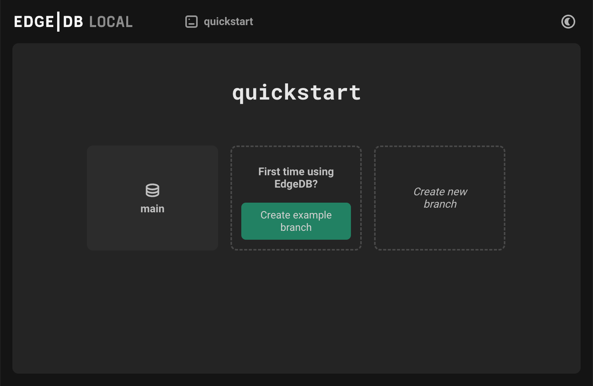

.. _ref_quickstart:

==========
Quickstart
==========

Welcome to EdgeDB!

This quickstart will walk you through the entire process of creating a simple
EdgeDB-powered application: installation, defining your schema, adding some
data, and writing your first query. Let's jump in!

.. _ref_quickstart_install:

1. Installation
===============

First let's install the EdgeDB CLI. Open a terminal and run the appropriate
command below.

.. note:: Great news for Node users!

    Skip installing and start using the EdgeDB CLI right away! Just prepend
    :ref:`any CLI command <ref_cli_overview>` with ``npx`` or your package
    manager's equivalent. For example, to create a new project, you can use
    ``npx edgedb project init``.

Linux
-----

.. tabs::

    .. code-tab:: bash
        :caption: Script

        $ curl https://sh.edgedb.com --proto '=https' -sSf1 | sh

    .. code-tab:: bash
        :caption: APT

        $ # Import the EdgeDB packaging key
        $ sudo mkdir -p /usr/local/share/keyrings && \
          sudo curl --proto '=https' --tlsv1.2 -sSf \
            -o /usr/local/share/keyrings/edgedb-keyring.gpg \
            https://packages.edgedb.com/keys/edgedb-keyring.gpg && \
        $ # Add the EdgeDB package repository
        $ echo deb [signed-by=/usr/local/share/keyrings/edgedb-keyring.gpg]\
            https://packages.edgedb.com/apt \
            $(grep "VERSION_CODENAME=" /etc/os-release | cut -d= -f2) main \
            | sudo tee /etc/apt/sources.list.d/edgedb.list
        $ # Install the EdgeDB package
        $ sudo apt-get update && sudo apt-get install edgedb-5

    .. code-tab:: bash
        :caption: YUM

        $ # Add the EdgeDB package repository
        $ sudo curl --proto '=https' --tlsv1.2 -sSfL \
            https://packages.edgedb.com/rpm/edgedb-rhel.repo \
            > /etc/yum.repos.d/edgedb.repo
        $ # Install the EdgeDB package
        $ sudo yum install edgedb-5

macOS
-----

.. tabs::

    .. code-tab:: bash
        :caption: Script

        $ curl https://sh.edgedb.com --proto '=https' -sSf1 | sh

    .. code-tab:: bash
        :caption: Homebrew

        $ # Add the EdgeDB tap to your Homebrew
        $ brew tap edgedb/tap
        $ # Install EdgeDB CLI
        $ brew install edgedb-cli

Windows (Powershell)
--------------------

.. note::

    EdgeDB on Windows requires WSL 2 to create local instances because the
    EdgeDB server runs on Linux. It is *not* required if you will use the CLI
    only to manage EdgeDB Cloud and/or other remote instances. This quickstart
    *does* create local instances, so WSL 2 is required to complete the
    quickstart.

.. code-block:: powershell

    PS> iwr https://ps1.edgedb.com -useb | iex

.. note:: Command prompt installation

    To install EdgeDB in the Windows Command prompt, follow these steps:

    1. `Download the CLI <https://packages.edgedb.com/dist/x86_64-pc-windows-msvc/edgedb-cli.exe>`__

    2. Navigate to the download location in the command prompt

    3. Run the installation command:

    .. code-block::

        edgedb-cli.exe _self_install

The script installation methods download and execute a bash script that
installs the ``edgedb`` CLI on your machine. You may be asked for your
password. Once the installation completes, you may need to **restart your
terminal** before you can use the ``edgedb`` command.

Now let's set up your EdgeDB project.

.. _ref_quickstart_createdb:

2. Initialize a project
=======================

In a terminal, create a new directory and ``cd`` into it.

.. code-block:: bash

  $ mkdir quickstart
  $ cd quickstart

Then initialize your EdgeDB project:

.. code-block:: bash

  $ edgedb project init

This starts an interactive tool that walks you through the process of setting
up your first EdgeDB instance. You should see something like this:

.. code-block:: bash

  $ edgedb project init
  No `edgedb.toml` found in `/path/to/quickstart` or above
  Do you want to initialize a new project? [Y/n]
  > Y
  Specify the name of EdgeDB instance to use with this project
  [default: quickstart]:
  > quickstart
  Checking EdgeDB versions...
  Specify the version of EdgeDB to use with this project [default: 5.x]:
  > 5.x
  Specify branch name: [default: main]:
  > main
  ┌─────────────────────┬───────────────────────────────────────────────┐
  │ Project directory   │ ~/path/to/quickstart                          │
  │ Project config      │ ~/path/to/quickstart/edgedb.toml              │
  │ Schema dir (empty)  │ ~/path/to/quickstart/dbschema                 │
  │ Installation method │ portable package                              │
  │ Version             │ 5.x+cc4f3b5                                   │
  │ Instance name       │ quickstart                                    │
  └─────────────────────┴───────────────────────────────────────────────┘
  Downloading package...
  00:00:01 [====================] 41.40 MiB/41.40 MiB 32.89MiB/s | ETA: 0s
  Successfully installed 5.x+cc4f3b5
  Initializing EdgeDB instance...
  Applying migrations...
  Everything is up to date. Revision initial
  Project initialized.
  To connect to quickstart, run `edgedb`

This did a couple things.

1. First, it scaffolded your project by creating an
   :ref:`ref_reference_edgedb_toml` config file and a schema file
   ``dbschema/default.esdl``. In the next section, you'll define a schema in
   ``default.esdl``.

2. Second, it spun up an EdgeDB instance called ``quickstart`` and "linked" it
   to the current directory. As long as you're inside the project
   directory, all CLI commands will be executed against this
   instance. For more details on how EdgeDB projects work, check out the
   :ref:`Managing instances <ref_intro_instances>` guide.

.. note::

  Quick note! You can have several **instances** of EdgeDB running on your
  computer simultaneously. Each instance may be **branched** many times. Each
  branch may have an independent schema consisting of a number of **modules**
  (though commonly your schema will be entirely defined inside the ``default``
  module).

Let's connect to our new instance! Run ``edgedb`` in your terminal to open an
interactive REPL to your instance. You're now connected to a live EdgeDB
instance running on your computer! Try executing a simple query (``select 1 + 1;``) after the 
REPL prompt (``quickstart:main>``):

.. code-block:: edgeql-repl

  quickstart:main> select 1 + 1;
  {2}

Run ``\q`` to exit the REPL. More interesting queries are coming soon,
promise! But first we need to set up a schema.

.. _ref_quickstart_createdb_sdl:

3. Set up your schema
=====================

Open the ``quickstart`` directory in your IDE or editor of choice. You should
see the following file structure.

.. code-block::

  /path/to/quickstart
  ├── edgedb.toml
  ├── dbschema
  │   ├── default.esdl
  │   ├── migrations

EdgeDB schemas are defined with a dedicated schema definition language called
(predictably) EdgeDB SDL (or just **SDL** for short). It's an elegant,
declarative way to define your data model.

SDL lives inside ``.esdl`` files. Commonly, your entire schema will be
declared in a file called ``default.esdl`` but you can split your schema
across several ``.esdl`` files if you prefer.

.. note::

  Syntax-highlighter packages/extensions for ``.esdl`` files are available
  for
  `Visual Studio Code <https://marketplace.visualstudio.com/
  itemdetails?itemName=magicstack.edgedb>`_,
  `Sublime Text <https://packagecontrol.io/packages/EdgeDB>`_,
  `Atom <https://atom.io/packages/edgedb>`_,
  and `Vim <https://github.com/edgedb/edgedb-vim>`_.

Let's build a simple movie database. We'll need to define two **object types**
(equivalent to a *table* in SQL): Movie and Person. Open
``dbschema/default.esdl`` in your editor of choice and paste the following:

.. code-block:: sdl
    :version-lt: 3.0

    module default {
      type Person {
        required property name -> str;
      }

      type Movie {
        property title -> str;
        multi link actors -> Person;
      }
    };

.. code-block:: sdl

    module default {
      type Person {
        required name: str;
      }

      type Movie {
        title: str;
        multi actors: Person;
      }
    };

A few things to note here.

- Our types don't contain an ``id`` property; EdgeDB automatically
  creates this property and assigns a unique UUID to every object inserted
  into the database.
- The ``Movie`` type includes a **link** named ``actors``. In EdgeDB, links are
  used to represent relationships between object types. They eliminate the need
  for foreign keys; later, you'll see just how easy it is to write "deep"
  queries without JOINs.
- The object types are inside a ``module`` called ``default``. You can split
  up your schema into logical subunits called modules, though it's common to
  define the entire schema in a single module called ``default``.

Now we're ready to run a migration to apply this schema to the database.

4. Run a migration
==================

Generate a migration file with ``edgedb migration create``. This command
gathers up our ``*.esdl`` files and sends them to the database. The *database
itself* parses these files, compares them against its current schema, and
generates a migration plan! Then the database sends this plan back to the CLI,
which creates a migration file.

.. code-block:: bash

  $ edgedb migration create
  Created ./dbschema/migrations/00001.edgeql (id: <hash>)

.. note::

  If you're interested, open this migration file to see what's inside! It's
  a simple EdgeQL script consisting of :ref:`DDL <ref_eql_sdl>` commands like
  ``create type``, ``alter type``, and ``create property``.

The migration file has been *created* but we haven't *applied it* against the
database. Let's do that.

.. code-block:: bash

  $ edgedb migrate
  Applied m1k54jubcs62wlzfebn3pxwwngajvlbf6c6qfslsuagkylg2fzv2lq (00001.edgeql)

Looking good! Let's make sure that worked by running ``edgedb list types`` on
the command line. This will print a table containing all currently-defined
object types.

.. code-block:: bash

  $ edgedb list types
  ┌─────────────────┬──────────────────────────────┐
  │      Name       │          Extending           │
  ├─────────────────┼──────────────────────────────┤
  │ default::Movie  │ std::BaseObject, std::Object │
  │ default::Person │ std::BaseObject, std::Object │
  └─────────────────┴──────────────────────────────┘

.. _ref_quickstart_migrations:

.. _Migrate your schema:

Before we proceed, let's try making a small change to our schema: making the
``title`` property of ``Movie`` required. First, update the schema file:

.. code-block:: sdl-diff
    :version-lt: 3.0

        type Movie {
    -     property title -> str;
    +     required property title -> str;
          multi link actors -> Person;
        }

.. code-block:: sdl-diff

        type Movie {
    -     title: str;
    +     required title: str;
          multi actors: Person;
        }

Then create another migration. Because this isn't the initial migration, we
see something a little different than before.

.. code-block:: bash

  $ edgedb migration create
  did you make property 'title' of object type 'default::Movie'
  required? [y,n,l,c,b,s,q,?]
  >

As before, EdgeDB parses the schema files and compared them against its
current internal schema. It correctly detects the change we made, and prompts
us to confirm it. This interactive process lets you sanity check every change
and provide guidance when a migration is ambiguous (e.g. when a property is
renamed).

Enter ``y`` to confirm the change.

.. code-block:: bash

  $ edgedb migration create
  did you make property 'title' of object type 'default::Movie'
  required? [y,n,l,c,b,s,q,?]
  > y
  Please specify an expression to populate existing objects in
  order to make property 'title' of object type 'default::Movie' required:
  fill_expr> <std::str>{}

Hm, now we're seeing another prompt. Because ``title`` is changing from
*optional* to *required*, EdgeDB is asking us what to do for all the ``Movie``
objects that don't currently have a value for ``title`` defined. We'll just
specify a placeholder value of "Untitled". Replace the ``<std::str>{}`` value
with ``"Untitled"`` and press Enter.

.. code-block::

  fill_expr> "Untitled"
  Created dbschema/migrations/00002.edgeql (id: <hash>)

If we look at the generated migration file, we see it contains the following
lines:

.. code-block:: edgeql

  ALTER TYPE default::Movie {
    ALTER PROPERTY title {
      SET REQUIRED USING ('Untitled');
    };
  };

Let's wrap up by applying the new migration.

.. code-block:: bash

  $ edgedb migrate
  Applied m1rd2ikgwdtlj5ws7ll6rwzvyiui2xbrkzig4adsvwy2sje7kxeh3a (00002.edgeql)

.. _ref_quickstart_insert_data:

.. _Insert data:

.. _Run some queries:

5. Write some queries
=====================

Let's write some simple queries via *EdgeDB UI*, the admin dashboard baked
into every EdgeDB instance (v2.0+ only). To open the dashboard:

.. code-block:: bash

  $ edgedb ui
  Opening URL in browser:
  http://localhost:107xx/ui?authToken=<jwt token>

You should see a simple landing page, as below. You'll see a card for each
branch of your instance. Remember: each instance can be branched multiple
times!

Currently, there's only one branch, which is simply called ``main`` by
default. Click the ``main`` card.

.. image:: images/ui_db.jpg
  :width: 100%

Then click ``Open Editor`` so we can start writing some queries. We'll start
simple: ``select "Hello world!";``. Click ``RUN`` to execute the query.

.. image:: images/ui_hello.jpg
    :width: 100%

The result of the query will appear on the right.

The query will also be added to your history of previous queries, which can be
accessed via the "HISTORY" tab located on the lower left side of the editor.

Now let's actually ``insert`` an object into our database. Copy the following
query into the query textarea and hit ``Run``.

.. code-block:: edgeql

  insert Movie {
    title := "Dune"
  };

Nice! You've officially inserted the first object into your database! Let's
add a couple cast members with an ``update`` query.

.. code-block:: edgeql

  update Movie
  filter .title = "Dune"
  set {
    actors := {
      (insert Person { name := "Timothee Chalamet" }),
      (insert Person { name := "Zendaya" })
    }
  };

Finally, we can run a ``select`` query to fetch all the data we just inserted.

.. code-block:: edgeql

  select Movie {
    title,
    actors: {
      name
    }
  };

Click the outermost ``COPY`` button in the top right of the query result area
to copy the result of this query to your clipboard as JSON. The copied text
will look something like this:

.. code-block:: json

  [
    {
      "title": "Dune",
      "actors": [
        {
          "name": "Timothee Chalamet"
        },
        {
          "name": "Zendaya"
        }
      ]
    }
  ]

EdgeDB UI is a useful development tool, but in practice your application will
likely be using one of EdgeDB's *client libraries* to execute queries. EdgeDB
provides official libraries for many langauges:

- :ref:`JavaScript/TypeScript <edgedb-js-intro>`
- :ref:`Go <edgedb-go-intro>`
- :ref:`Python <edgedb-python-intro>`
- :ref:`Rust <ref_rust_index>`
- :ref:`C# and F# <edgedb-dotnet-intro>`
- :ref:`Java <edgedb-java-intro>`
- :ref:`Dart <edgedb-dart-intro>`
- :ref:`Elixir <edgedb-elixir-intro>`

Check out the :ref:`Clients
<ref_intro_clients>` guide to get started with the language of your choice.

.. _ref_quickstart_onwards:

.. _Computeds:

Onwards and upwards
===================

You now know the basics of EdgeDB! You've installed the CLI and database, set
up a local project, run a couple migrations, inserted and queried some data,
and used a client library.

- For a more in-depth exploration of each topic covered here, continue reading
  the other pages in the Getting Started section, which will cover important
  topics like migrations, the schema language, and EdgeQL in greater detail.

- For guided tours of major concepts, check out the showcase pages for `Data
  Modeling <https://www.edgedb.com/showcase/data-modeling>`_, `EdgeQL
  <https://www.edgedb.com/showcase/edgeql>`_, and `Migrations
  <https://www.edgedb.com/showcase/migrations>`_.

- For a deep dive into the EdgeQL query language, check out the
  `Interactive Tutorial </tutorial>`_.

- For an immersive, comprehensive walkthrough of EdgeDB concepts, check out
  our illustrated e-book `Easy EdgeDB </easy-edgedb>`_; it's designed to walk a
  total beginner through EdgeDB, from the basics all the way through advanced
  concepts.

- To start building an application using the language of your choice, check out
  our client libraries:

  - :ref:`JavaScript/TypeScript <edgedb-js-intro>`
  - :ref:`Go <edgedb-go-intro>`
  - :ref:`Python <edgedb-python-intro>`
  - :ref:`Rust <ref_rust_index>`
  - :ref:`C# and F# <edgedb-dotnet-intro>`
  - :ref:`Java <edgedb-java-intro>`
  - :ref:`Dart <edgedb-dart-intro>`
  - :ref:`Elixir <edgedb-elixir-intro>`
