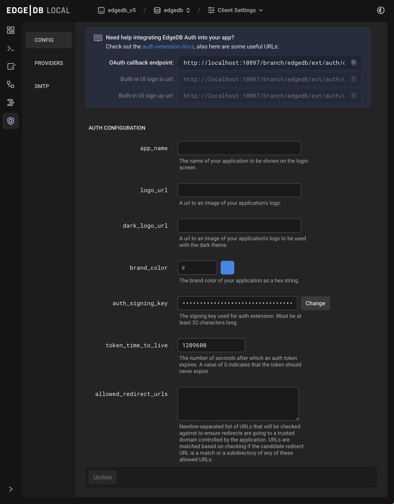

.. _ref_ui_auth_admin:

==========
Auth Admin
==========

The Auth page inside the EdgeDB is used to set up authentication for
your app built into the EdgeDB server. The details for setting up auth
admin via are in their own guide :ref:`here <ref_guide_auth>`.

          icon in the left-hand toolbar. The icon is two nested shield
          outlines, the inner being a light pink color and the outer being
          a light blue when selected.
    :width: 100%
