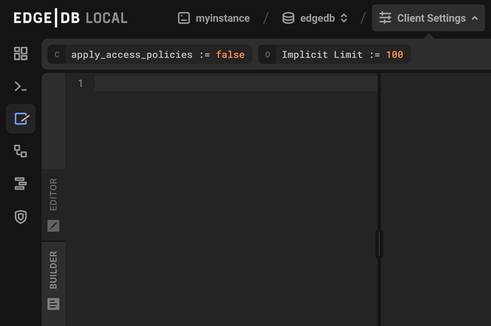

===============
Client settings
===============

          that can be set: apply access policies, and implicit limit. Apply
          access policies is set to false, and implicit limit is set to 100.
    :width: 100%

The UI exposes a number of :ref:`configuration parameters <ref_std_cfg>`
in a dropdown bar at the top of all database dashboard screens when the
Client Settings button is clicked. They can be modified by double
clicking on the bar.

The parameters are as follows:

Globals
-------

- Nothing by default. Any globals defined in your schema will show up and
  can be modified here.

Config
------

- ``allow_bare_ddl``: Whether DDL is allowed to be executed outside a
  migration. Default: ``NeverAllow``, can be set to ``AlwaysAllow``.
  Note: This parameter accepts enum values, not booleans.
- ``allow_user_specified_id``: Whether inserts are allowed to set the 
  'id' property. Default: ``false``.
- ``apply_access_policies``: Whether access policies will be applied
  when running queries. Default: ``true``. When set to ``false``, any
  and all operations can be used on any object in the database.
- ``force_database_error``: A hook to force all queries to produce an error.
  Default: ``'false'``. This parameter takes a ``str`` instead of a ``bool``
  to allow more verbose messages. The database will attempt to deserialize
  this ``str`` into a JSON object that must include a ``type`` (which must
  be an EdgeDB error type name), and may also include ``message``, ``hint``,
  and ``details`` which can be set ad-hoc by the user. For example, the
  following is valid input: ``'{ "type": "QueryError", "message": "Did not
  work", "hint": "Try doing something else", "details": "Indeed, something
  went really wrong" }'``
- ``query_execution_timeout``: How long an individual query can run before
  being aborted. Disabled when set to zero seconds (``<datetime>'PT0S'``),
  which is the default.
- ``session_idle_transaction_timeout``: How long client connections can
  stay active while in a transaction. Disabled when set to zero seconds
  (``<datetime>'PT0S'``). Default: 10 seconds.

Query Options
-------------

- Implicit Limit (``int64``): The number of results to display per query.
  Default: 100