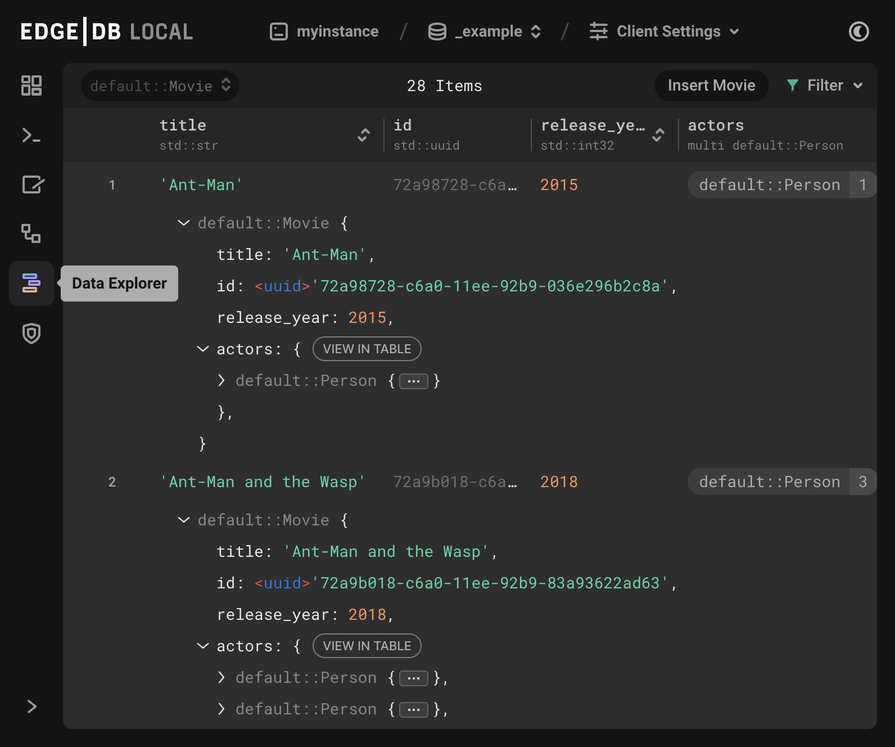

.. _ref_ui_data_explorer:

=============
Data Explorer
=============

          stacked on top of each other: blue, purple, and orange. A sample
          query via the Data Explorer shows information about a user-defined
          object type called a Booking.
    :width: 100%

The data explorer is similar to the UI editor in facilitating queries on
database objects, but involves no direct query building. Instead, the
data explorer gives point-and-click access to the database's objects,
including inserting new objects and modifying existing ones.

This makes the data explorer the ideal solution for any users of an EdgeDB
database who lack a technical background or the time needed to learn
the ins and outs of a new database. It is also useful for skilled users
who are looking to explore the links between multiple object types in
possible multiple levels of depth without having to continually modify a
query to do so.