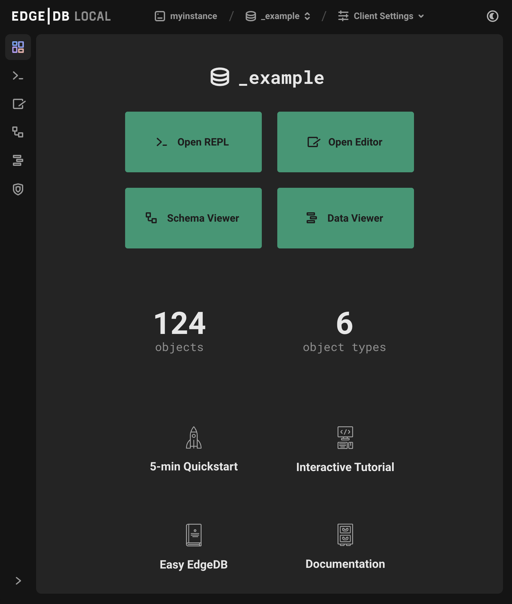

.. _ref_ui_dashboard:

=========
Dashboard
=========

          give access to other pages such as the REPL, editor, and
          schema viewer. The total number of objects and object types in
          the database are displayed below, along with links to parts of the
          EdgeDB website such as the Quickstart, Tutorial, and Easy EdgeDB
          book.
    :width: 100%

The dashboard for each database displays the number of object types and
total number of objects contained within.

Besides this, the dashboard is simply a minimal set of buttons leading to the
other parts of the UI (the REPL, editor, schema viewer, and data viewer),
and some parts of the EdgeDB documentation that a new user will find
most useful.