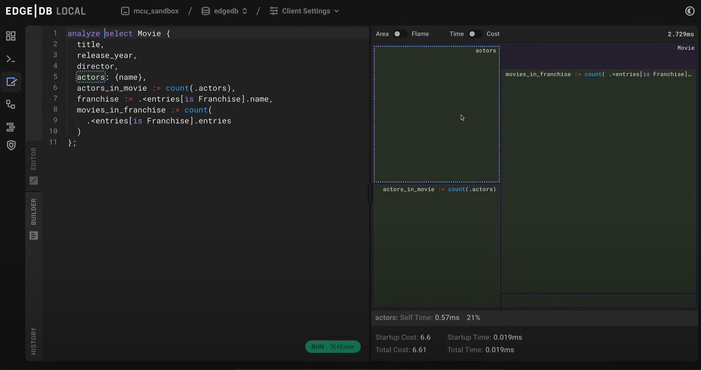

.. _ref_ui_overview:

==
UI
==

EdgeDB's UI is a beautiful, feature-rich admin panel baked directly into all 
EdgeDB instances.

The UI automatically opens in your default browser on a ``localhost`` page
via a single command:

.. code-block:: bash

  $ edgedb ui

Alternatively, you can print a url to paste into the browser instead of
automatically opening the UI:

.. code-block:: bash

  $ edgedb ui --print-url

The UI for :ref:`EdgeDB Cloud <ref_cli_edgedb_cloud>` is nearly
identical to non-Cloud EdgeDB UI, aside from extra pages on Cloud-related
items such as org settings, billing, and usage metrics.

The command to open the EdgeDB UI is a CLI command, documented
:ref:`here <ref_cli_edgedb_ui>`.

The UI is served by default by development instances. To enable the UI on a
production instance, use the ``--admin-ui`` option with ``edgedb-server``
or set the ``EDGEDB_SERVER_ADMIN_UI`` :ref:`environment variable
<ref_reference_envvar_admin_ui>` to ``enabled``.

The UI has three similar pages that each allow users to query the database:
the REPL, the editor, and the data explorer. Which one to use can generally
be decided based on your use case.

The *data explorer* offers simple point-and-click access to objects without
needing any EdgeQL, making it the recommended for:

- Outright new users to EdgeDB who lack a technical background or the time
  to familiarize themself with EdgeQL
- Existing users of EdgeDB looking to "walk" the database's objects without
  needing to construct a new query each time
- Users with a desire to double- or triple-check inserts, updates, and
  deletions, as as the data explorer will first collect and display all user
  changes in a double-confirm dialog before allowing an operation to proceed.

.. image:: images/data_explorer.png
    :alt: The data explorer page in the EdgeDB UI. The icon is three bars
          stacked on top of each other: blue, purple, and orange. A sample
          query via the Data Explorer shows information about a user-defined
          object type called a Booking.
    :width: 100%

The Editor page's *query builder* is recommended for:

- Users who are learning EdgeQL but still lacking the muscle memory to compose
  queries on the fly,
- Users querying objects with a large number of properties or links, as the
  query builder displays all properties and links by default. This makes
  visualizing an object's structure easier compared to using a command like
  ``describe type <TypeName>`` to see its internals.

          is shown as the user puts together a query to see the name property
          for a user-defined type called Book. A filter on the object's id
          and a limit to the number of object types returned are being set.
          The Editor icon is a blue square resembling a pad, with an orange
          line resembling a pencil on top.
    :width: 100%

The Editor page's *query editor* is recommended for:

- Users experimenting with various raw queries who want quick visual
  point-and-click access to past queries in order to call them up again
  and refine them.

          appended with the analyze keyword to analyze performance. The
          performance results show up in a graph on the right, with separate
          colored rectangles for each link traversed by the query.
    :width: 100%

The UI's REPL is recommended for:

- Users comfortable with EdgeQL.

.. image:: images/ui_repl.png
    :alt: The REPL page in the EdgeDB UI. The icon is a blue right-facing
          angle bracket followed by an orange underscore, representing a
          cursor awaiting user input. The output for a query on a
          user-defined type called Person is displayed.
    :width: 100%

Additionally, users who spend a lot of time comparing raw queries may
wish to give the CLI's REPL a try. A general rule of thumb is that the
UI's REPL provides a slicker experience and more verbose output, while
the CLI's REPL is a more performant tool that usually returns query results
instantaneously.

For example, the output from selecting objects of a type in the UI's REPL will
show more information on a scalar object's type name:

.. code-block:: edgeql-repl
    :caption: CLI REPL

    db> select Sailor {*};
    default::Sailor {
      id: f0b4aaf0-be4c-11ee-b84b-6b87ec260333,
      cents: 0,
      dollars: 0,
      pence: 149,
      pounds: 14,
      shillings: 28,
      total_cents: 0,
      total_pence: 4069,
      approx_wealth_in_pounds: 17,
    },

.. code-block:: edgeql-repl
    :caption: UI REPL

    db> select Sailor {*};
    default::Sailor {
      id: <uuid>'f0b4aaf0-be4c-11ee-b84b-6b87ec260333',
      cents: <default::Money>0,
      dollars: <default::Money>0,
      pence: <default::Money>149,
      pounds: <default::Money>14,
      shillings: <default::Money>28,
      total_cents: 0,
      total_pence: 4069,
      approx_wealth_in_pounds: 17,
    },

One more example of CLI vs. UI output, showing a user-defined function:

.. code-block:: edgeql-repl
    :caption: CLI REPL

  # CLI REPL output
  'function default::get_url() ->  std::str using
  (<std::str>\'https://geohack.toolforge.org/geohack.php?params=\');'}

.. code-block:: edgeql-repl
    :caption: UI REPL

  # UI REPL output
  function default::get_url() -> std::str {
  volatility := 'Immutable';
  using (<std::str>'https://geohack.toolforge.org/geohack.php?params=');
  }

.. toctree::
  :maxdepth: 1

  instance_dashboard
  database_dashboard
  client_settings
  ui_repl
  query_editor
  schema_viewer
  data_explorer
  auth_admin

`UI souce code <https://github.com/edgedb/edgedb-ui>`_