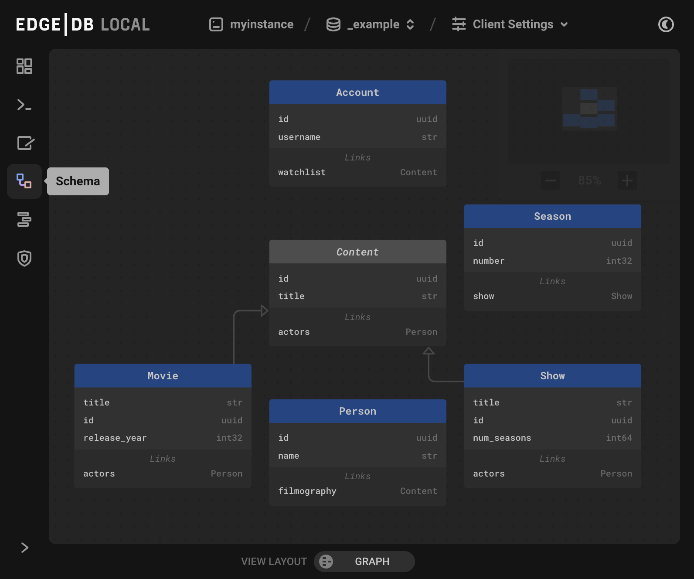

.. _ref_ui_schema_viewer:

=============
Schema Viewer
=============

          squares of blue and orange, connected by a purple line. A small
          user-defined sample schema is shown with two concrete types
          called Book and Library, along with an abstract type called
          HasAddress that is extended by the Library type.
    :width: 100%

The UI schema viewer allows you to see your schema either as text, graph,
or both.

Text view
---------

The UI's text view is similar to what is produced in the CLI through the
``describe schema as sdl`` command, but includes inherited properties and
links.

The schema viewer shows the user's defined schema by default under the
name ``User``, and also includes ``Stdlib`` and ``System`` as a convenience.
Along with the schema viewer's built-in search function, this makes
the schema viewer often even more convenient than searching through EdgeDB's
online documentation.

For example, a search for 'max val' immediately shows the following output:

.. code-block:: sdl

    abstract constraint std::max_value(max: anytype) {
    using ((__subject__ <= max));
    }  errmessage := 
        'Maximum allowed value for {__subject__} is {max}.';
    annotation std::description := 
        'Specifies the maximum value for the subject.';
    ;

    abstract constraint std::max_ex_value(max: anytype) {
    using ((__subject__ < max));
    }  errmessage := 
        '{__subject__} must be less than {max}.';
    annotation std::description := 
        'Specifies the maximum value (as an open interval) for the subject.';
    ;

    abstract constraint std::max_len_value(max: std::int64) on (std::len(<std::str>__subject__)) {
    using ((__subject__ <= max));
    }  errmessage := 
        '{__subject__} must be no longer than {max} characters.';
    annotation std::description := 
        'Specifies the maximum length of subject string representation.';
    ;

Graph view
----------

- Types are shown as boxes with 
- Links are shown as arrows from one type to another, with any link
  properties shown tucked inside the arrow.