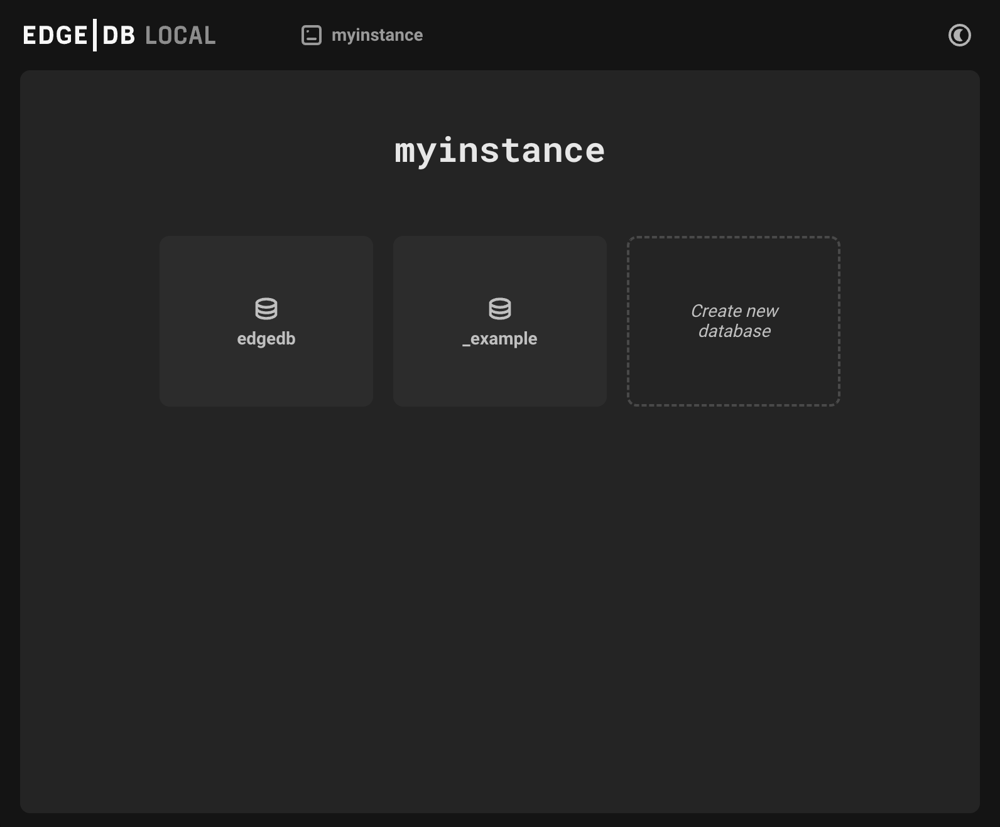

=======
UI Home
=======

          myinstance, is shown on the top. One button gives access to a
          database known as edgedb, another button to create an example
          database, and a third button allows for the creation of a
          new database.
    :width: 100%

The UI homepage displays one button per database inside the instance.
New instances will contain a database called ``edgedb`` by default.

A new database can be added to the current instance by clicking on
``Create new database`` and choosing a name.

The UI homepage also includes a ``Create example database`` option for
those new to EdgeDB. Clicking on this will create a database called
``_example`` that contains the same schema and objects as those in the
EdgeDB tutorial.

As such, the quickest way for newcomers to EdgeDB to start interacting with
a working database via the UI in EdgeDB is by doing the following:

- ``edgedb project init`` on the command line to start an instance,
- ``edgedb ui`` on the command line to open the UI,
- Clicking on ``Create example database`` to create the example database.

Clicking on any of the databases on the UI homepage will take you to its
dashboard.