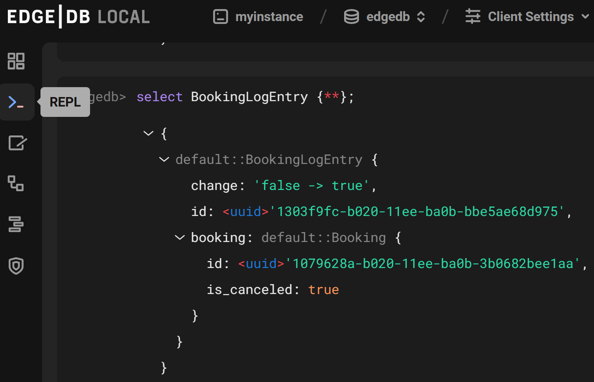

.. _ref_ui_repl:

====
REPL
====

          angle bracket followed by an orange underscore, representing a
          cursor awaiting user input. The output for a query on a
          user-defined type called Person is displayed.
    :width: 100%

The REPL available in the EdgeDB UI is largely the same as the CLI REPL,
so most of the :ref:`CLI REPL commands <ref_cheatsheet_repl>` will pertain to
the UI REPL as well.

Some behavior differs from that of the CLI REPL:

- The UI REPL currently does not support transactions,
- Slash commands may differ slightly inside the CLI REPL. See the 
  `source code <slash_command_>`_ for more details (note: the UI REPL
  has its own ``\retro`` slash command to change the UI layout to a 1980s
  classic green-on-black feel!)

Shortcuts
---------

- ``Ctrl+Enter``: Run query
- ``Ctrl+ArrowUp/ArrowDown``: Navigate query history

Backslash commands
------------------

- ``\l`` or ``\list databases``: List databases
- ``\ls`` or ``\list scalars``: List scalar types
- ``\lt`` or ``\list types``: List scalar types
- ``\lr`` or ``\list roles``: List roles
- ``\lm`` or ``\list modules``: List modules
- ``\la`` or ``\list aliases``: List expression aliases
- ``\lc`` or ``\list casts``: List casts
- ``\li`` or ``\list indexes``: List indexes 
- ``\c DBNAME`` or ``\connect DBNAME``: Connect to database DBNAME
- ``\?``, ``\h``, or ``\help``: Show help on backslash commands

.. lint-off

.. _slash_command: https://github.com/edgedb/edgedb-ui/blob/e1b63d9395d8ea8cfac4069811f9d6ffb0bf8a8d/shared/studio/tabs/repl/state/commands.ts#L31

.. lint-on