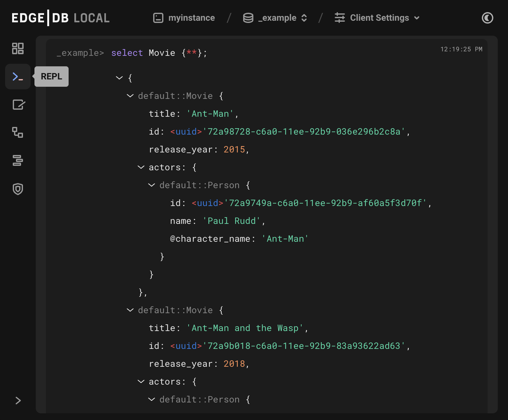

.. _ref_ui_repl:

====
REPL
====

          angle bracket followed by an orange underscore, representing a
          cursor awaiting user input. The output for a query on a
          user-defined type called a Booking Log Entry is displayed.
    :width: 100%

The REPL used in the EdgeDB UI is largely the same as the CLI REPL,
so most of the commands :ref:`here <ref_cheatsheet_repl>` will pertain to the
UI REPL as well.

Some behavior differs from that of the CLI REPL:

- The UI REPL currently does not support transactions,
- Slash commands may differ slightly inside the CLI REPL. See the 
  `source code <slash_command_>`_ for more details (note: the UI REPL
  has its own ``\retro`` slash command to change the UI layout to a 1980s
  classic green-on-black feel!)

.. lint-off

.. _slash_command: https://github.com/edgedb/edgedb-ui/blob/e1b63d9395d8ea8cfac4069811f9d6ffb0bf8a8d/shared/studio/tabs/repl/state/commands.ts#L31

.. lint-on